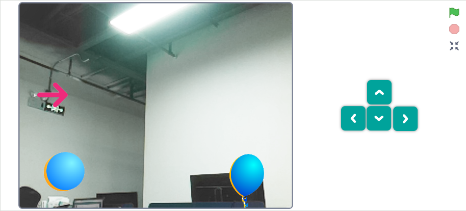

.. note::

    Hello, welcome to the SunFounder Raspberry Pi & Arduino & ESP32 Enthusiasts Community on Facebook! Dive deeper into Raspberry Pi, Arduino, and ESP32 with fellow enthusiasts.

    **Why Join?**

    - **Expert Support**: Solve post-sale issues and technical challenges with help from our community and team.
    - **Learn & Share**: Exchange tips and tutorials to enhance your skills.
    - **Exclusive Previews**: Get early access to new product announcements and sneak peeks.
    - **Special Discounts**: Enjoy exclusive discounts on our newest products.
    - **Festive Promotions and Giveaways**: Take part in giveaways and holiday promotions.

    👉 Ready to explore and create with us? Click [|link_sf_facebook|] and join today!

Lesson 13: Complete Mars Rover Control
=======================================

You've mastered all the pieces - now let's put them together! Combine everything you've learned to create your fully functional Mars Rover with live camera view, movement controls, and camera tilt.

Bring together three amazing systems:

- :ref:`camera_system`: See through your rover's eyes with live video
- :ref:`rgb_move`: Drive around with colorful signal lights  
- :ref:`tilt_system`: Look up and down with camera controls

The result? Complete control of your GalaxyRVR! Click buttons for camera controls and use arrow keys to drive.

Camera System
----------------------------------

Repeat the camera setup from your previous lesson: :ref:`camera_system`.

1. Create four control sprites and arrange them neatly.

   .. image:: img/11_camera_4.png

2. Program each button's function:

   - Ball 1: Camera OFF
   
   .. image:: img/11_camera_1sp.png
   
   - Ball 2: Camera ON with correct orientation
   
   .. image:: img/11_camera_2sp.png
   
   - Balloon 1: LED light ON
   
   .. image:: img/11_camera_3sp.png
   
   - Balloon 2: LED light OFF
   
   .. image:: img/11_camera_4sp.png

3. Stack the controls to save space - they'll unfold when you need them!

   .. image:: img/11_camera_fold.png

4. Add ``go to back layer`` to create a cool toggle effect between buttons.

   .. image:: img/11_camera_layer.png

Movement & Lighting System
----------------------------------

Let's add colorful lights to your rover's movements!  We have already coded these in the :ref:`rgb_move` section.

We recommend placing this code in the Backdrops section - this keeps it separate from your sprite code and makes everything more organized.

   .. image:: img/13.ccc_code_in_stage.png

1. Make your rover glow GREEN when moving forward.

   .. image:: img/13.ccc_light_forward.png

2. Make your rover glow RED when moving backward.

   .. image:: img/13.ccc_light_backfwd.png

3. Make your rover glow YELLOW when turning left or right.

   .. image:: img/13.ccc_light_left_right.png

4. Create a breathing blue light effect when your rover is stopped.

   .. image:: img/13.ccc_light_breath.png

Your complete backdrop code should look like this:

   .. image:: img/11_camera_backdrops.png

Camera Tilt Control
------------------------

Let's add camera controls! This part is the same as the :ref:`tilt_system`. Simply repeat the steps.

1. Add an **Arrow** sprite to control your camera's tilt.

   .. image:: img/10_servo_arrow.png

2. Start with a ``when this sprite clicked`` block.

   .. image:: img/6_animate_when_touch.png
       :width: 200

3. Create a loop that runs while you're touching the arrow.

   .. image:: img/6_animate_repeat_touching.png
       :width: 400

4. Make the arrow point toward your finger as you drag.

   .. image:: img/10_servo_arrow_point_toward.png
       :width: 400

5. Connect the arrow's direction to the camera angle - rotate the arrow to move the camera!

   .. image:: img/10_servo_arrow_angle_direction.png
       :width: 800

6. Set limits to keep the camera between 0-135 degrees.

   .. image:: img/10_servo_arrow_135.png
       :width: 400

   .. image:: img/10_servo_arrow_0.png
       :width: 400

Touch and drag the arrow to aim your rover's camera! Make the arrow bigger if it's hard to control.

Complete Control of Your GalaxyRVR
------------------------------------

Now you have full control of your Mars Rover! Here's how to operate your complete GalaxyRVR:

**Control Your Rover:**

- Use the arrow keys to drive forward, backward, and turn
- Click the Ball sprites to turn the live camera video on and off
- Click the Balloon sprites to control the camera LED light on and off
- Drag the arrow sprite to tilt the camera up and down

**Test All Features Together:**

- Drive around while watching the live camera feed from your rover
- Notice the colored lights that signal each movement
- Practice tilting the camera to look at objects from different angles
- Try exploring in both bright and dark conditions using the LED light

Congratulations! You have successfully combined all the systems to create a fully functional Mars Rover. You've learned how to program movement, lighting, camera controls, and tilt mechanisms - all the skills needed to operate a real exploration robot.

Your Mars mission is now ready to begin. Happy exploring!

