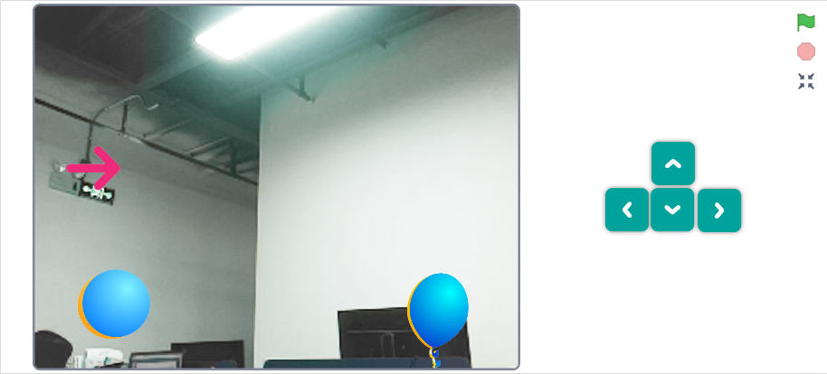

.. include:: /index.rst
   :start-after: start_hello_message
   :end-before: end_hello_message

Lektion 13: Komplette Mars-Rover-Steuerung
===========================================================

Sie haben alle Einzelteile gemeistert – jetzt setzen wir alles zusammen! Kombinieren Sie alles, was Sie gelernt haben, um Ihren voll funktionsfähigen Mars Rover mit Live-Kamerabild, Bewegungssteuerung und Kameraneigung zu erschaffen.

Vereinen Sie drei fantastische Systeme:

- :ref:`camera_system`: Sehen Sie durch die Augen Ihres Rovers mit Live-Video
- :ref:`rgb_move`: Fahren Sie mit bunten Signalleuchten umher
- :ref:`tilt_system`: Schauen Sie mit der Kamerasteuerung auf und ab

Das Ergebnis? Die vollständige Kontrolle über Ihren GalaxyRVR! Klicken Sie auf Tasten für die Kamerasteuerung und verwenden Sie die Pfeiltasten zum Fahren.

Kamera-System
------------------------------

Wiederholen Sie den Kameraaufbau aus Ihrer vorherigen Lektion: :ref:`camera_system`.

1. Erstellen Sie vier Steuerungs-Sprites und ordnen Sie sie ordentlich an.

   .. image:: img/11_camera_4.png

2. Programmieren Sie die Funktion jeder Taste:

   - Ball 1: Kamera AUS

   .. image:: img/11_camera_1sp.png

   - Ball 2: Kamera EIN mit korrekter Ausrichtung

   .. image:: img/11_camera_2sp.png

   - Balloon 1: LED-Licht EIN

   .. image:: img/11_camera_3sp.png

   - Balloon 2: LED-Licht AUS

   .. image:: img/11_camera_4sp.png

3. Stapeln Sie die Steuerungen, um Platz zu sparen – sie entfalten sich, wenn Sie sie brauchen!

   .. image:: img/11_camera_fold.png

4. Fügen Sie ``go to back layer`` hinzu, um einen coolen Umschalteffekt zwischen den Tasten zu erzeugen.

   .. image:: img/11_camera_layer.png

Bewegungs- und Beleuchtungssystem
------------------------------------------

Fügen wir nun bunte Lichter zu den Bewegungen Ihres Rovers hinzu! Wir haben diese bereits im Abschnitt :ref:`rgb_move` programmiert.

Wir empfehlen, diesen Code im Bereich „Backdrops" zu platzieren – dies hält ihn getrennt von Ihrem Sprite-Code und sorgt für mehr Übersichtlichkeit.

   .. image:: img/13.ccc_code_in_stage.png

1. Lassen Sie Ihren Rover GRÜN leuchten, wenn er sich vorwärts bewegt.

   .. image:: img/13.ccc_light_forward.png

2. Lassen Sie Ihren Rover ROT leuchten, wenn er sich rückwärts bewegt.

   .. image:: img/13.ccc_light_backfwd.png

3. Lassen Sie Ihren Rover GELB leuchten, wenn er nach links oder rechts abbiegt.

   .. image:: img/13.ccc_light_left_right.png

4. Erstellen Sie einen atmenden blauen Lichteffekt, wenn Ihr Rover angehalten ist.

   .. image:: img/13.ccc_light_breath.png

Ihr vollständiger Backdrop-Code sollte wie folgt aussehen:

   .. image:: img/11_camera_backdrops.png

Kameraneigungssteuerung
-----------------------------

Fügen wir die Kamerasteuerung hinzu! Dieser Teil ist derselbe wie im Abschnitt :ref:`tilt_system`. Wiederholen Sie einfach die Schritte.

1. Fügen Sie ein **Pfeil**-Sprite zur Steuerung der Kameraneigung hinzu.

   .. image:: img/10_servo_arrow.png

2. Beginnen Sie mit einem ``when this sprite clicked``-Block.

   .. image:: img/6_animate_when_touch.png
       :width: 200

3. Erstellen Sie eine Schleife, die läuft, während Sie den Pfeil berühren.

   .. image:: img/6_animate_repeat_touching.png
       :width: 400

4. Lassen Sie den Pfeil beim Ziehen in Richtung Ihres Fingers zeigen.

   .. image:: img/10_servo_arrow_point_toward.png
       :width: 400

5. Verbinden Sie die Richtung des Pfeils mit dem Kamerawinkel – drehen Sie den Pfeil, um die Kamera zu bewegen!

   .. image:: img/10_servo_arrow_angle_direction.png
       :width: 800

6. Setzen Sie Grenzen, um die Kamera zwischen 0 und 135 Grad zu halten.

   .. image:: img/10_servo_arrow_135.png
       :width: 400

   .. image:: img/10_servo_arrow_0.png
       :width: 400

Berühren und ziehen Sie den Pfeil, um die Kamera Ihres Rovers auszurichten! Vergrößern Sie den Pfeil, falls er schwer zu steuern ist.

Komplette Steuerung Ihres GalaxyRVR
-------------------------------------------

Jetzt haben Sie die volle Kontrolle über Ihren Mars Rover! So bedienen Sie Ihren vollständigen GalaxyRVR:

**Steuerung Ihres Rovers:**

- Verwenden Sie die Pfeiltasten zum Vorwärts-, Rückwärtsfahren und Abbiegen
- Klicken Sie auf die Ball-Sprites, um das Live-Kamerabild ein- oder auszuschalten
- Klicken Sie auf die Ballon-Sprites, um das Kamera-LED-Licht ein- oder auszuschalten
- Ziehen Sie das Pfeil-Sprite, um die Kamera nach oben und unten zu neigen

**Alle Funktionen gemeinsam testen:**

- Fahren Sie umher, während Sie das Live-Kamerabild von Ihrem Rover beobachten
- Beachten Sie die farbigen Lichter, die jede Bewegung signalisieren
- Üben Sie das Neigen der Kamera, um Objekte aus verschiedenen Winkeln zu betrachten
- Versuchen Sie die Erkundung sowohl bei hellen als auch bei dunklen Bedingungen mit dem LED-Licht

Herzlichen Glückwunsch! Sie haben erfolgreich alle Systeme kombiniert, um einen voll funktionsfähigen Mars Rover zu erschaffen. Sie haben gelernt, wie man Bewegung, Beleuchtung, Kamerasteuerung und Neigungsmechanismen programmiert – alle Fähigkeiten, die für den Betrieb eines echten Erkundungsroboters erforderlich sind.

Ihre Mars-Mission kann nun beginnen. Viel Spaß bei der Erkundung!
