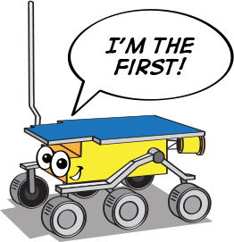
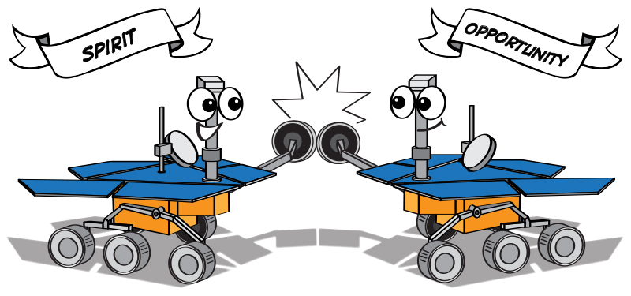
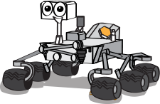

.. note::

    Bonjour, bienvenue dans la communauté des passionnés de SunFounder Raspberry Pi, Arduino et ESP32 sur Facebook ! Plongez au cœur de Raspberry Pi, Arduino et ESP32 avec d'autres passionnés.

    **Pourquoi nous rejoindre ?**

    - **Support d'experts** : Résolvez les problèmes après-vente et les défis techniques grâce à l'aide de notre communauté et de notre équipe.
    - **Apprendre & Partager** : Échangez des conseils et des tutoriels pour améliorer vos compétences.
    - **Aperçus exclusifs** : Accédez en avant-première aux annonces de nouveaux produits et à des aperçus privilégiés.
    - **Réductions spéciales** : Profitez de réductions exclusives sur nos produits les plus récents.
    - **Promotions festives et concours** : Participez à des concours et à des promotions pendant les fêtes.

    👉 Prêt à explorer et à créer avec nous ? Cliquez sur [|link_sf_facebook|] et rejoignez-nous dès aujourd'hui !

Leçon 1 : Découverte du Rover Martien
========================================

Bienvenue à la leçon 1 : Comprendre le rover martien. Aujourd'hui, nous plongeons dans le monde fascinant des rovers martiens—nos explorateurs télécommandés sur la planète rouge. Nous allons découvrir leur évolution, leurs fonctions et les merveilles technologiques qu'ils représentent. Ensuite, vous pourrez laisser libre cours à votre créativité pour concevoir votre propre rover et perfectionner vos compétences en présentation en expliquant votre design unique. Préparez-vous à explorer Mars depuis votre classe !

Objectifs d'apprentissage
-------------------------
* Comprendre l'évolution et l'objectif des rovers martiens
* Exprimer sa créativité en concevant son propre rover martien
* Améliorer ses compétences de présentation en partageant et expliquant son design de rover

Matériel
-----------
* Images de rovers martiens et spécifications techniques pour référence
* Vidéo documentaire sur l'histoire des rovers martiens
* Ordinateur avec accès à Internet pour la recherche et la visualisation du documentaire
* Diapositives de présentation ou tableau blanc interactif pour la leçon
* Feuilles de dessin, crayons et matériel de coloriage pour l'activité de conception de rover
* Fiches de travail pour la prise de notes guidée, la réflexion et la planification du design

Étapes
--------------

**Étape 1 : Qu'est-ce qu'un rover martien ?**

Avant de plonger dans les rovers martiens, familiarisons-nous d'abord avec Mars elle-même. Comme on peut le voir sur les images et modèles, 
la surface de Mars est marquée par des cratères, des montagnes, des vallées et des tempêtes de poussière, offrant une image d'un paysage 
à la fois fascinant et difficile.

    .. image:: ../img/mars_surface.jpg
        :width: 600
    .. image:: ../img/mars_surface.png
        :width: 600

Pouvez-vous imaginer ce que ce serait de naviguer dans un tel terrain accidenté ? 
Maintenant, supposons que vous ayez la tâche de concevoir un rover pour Mars.

* Quels aspects prendrez-vous en compte étant donné le terrain et les conditions martiennes ?
* Quelles caractéristiques allez-vous lui donner pour qu'il accomplisse ses missions efficacement ?
* Quelles tâches imaginez-vous que votre rover martien devra accomplir ?

Rappelez-vous, un rover martien est un robot conçu pour explorer Mars, étudier son environnement et envoyer des données vers la Terre. 
Réfléchissez donc à des aspects tels que le déplacement, la communication, l'alimentation, les capacités de recherche scientifique et la durabilité 
face aux conditions extrêmes de Mars.

Prenons un moment pour réfléchir et partager nos idées. Penser comme des ingénieurs et des scientifiques, c'est intéressant, non ? 
Nous approfondirons les conceptions réelles des rovers martiens et leurs fonctions dans les étapes suivantes, 
alors gardez vos idées créatives à l'esprit pendant que nous progressons.

**Étape 2 : Explorer l'histoire des rovers martiens**

Ensuite, nous allons entreprendre un voyage dans le temps en regardant un documentaire qui retrace l'histoire des rovers martiens. 
Le documentaire nous emmène depuis la première tentative de déploiement d'un rover sur Mars, le rover soviétique Mars 3, qui n'a malheureusement pas 
réussi à atterrir en 1971, jusqu'au premier rover martien réussi de la NASA, Sojourner, en 1997.

Notre voyage ne s'arrête pas là, car nous découvrirons ensuite les aventures des rovers les plus avancés à ce jour : Spirit, Opportunity, Curiosity et Perseverance.

.. raw:: html

    <iframe width="600" height="400" src="https://www.youtube.com/embed/OO5CTBBgtXs" title="YouTube video player" frameborder="0" allow="accelerometer; autoplay; clipboard-write; encrypted-media; gyroscope; picture-in-picture; web-share" allowfullscreen></iframe>

Ce documentaire présente non seulement un contexte historique, mais aussi une compréhension complète des avancées scientifiques 
et des jalons technologiques qui ont conduit à l'ère actuelle de l'exploration martienne.

**Étape 3 : Résumer les rovers martiens**

Après avoir visionné le documentaire, récapitulons les différents rovers envoyés sur la planète rouge.

* **Sojourner** (1997)

    **Sojourner**, le pionnier des rovers martiens, a commencé son aventure dans le cadre de la mission Mars Pathfinder. 
    Il a réussi à atterrir dans la région d'Ares Vallis le 4 juillet 1997. En tant que premier véhicule à roues à parcourir 
    une autre planète que la Terre, Sojourner a marqué un jalon important dans l'exploration martienne. 
    Bien qu'il n'ait fonctionné que pendant 92 jours martiens, ou sols, il a ouvert la voie aux futurs rovers exploratoires.

    .. image:: ../img/mars_sojourner.jpg

* **Spirit** (2004–2010) et **Opportunity** (2004–2018)

    **Spirit** et **Opportunity** sont des rovers jumeaux de la mission Mars Exploration Rover (MER) de la NASA. **Spirit**, également connu sous le nom de MER-A, 
    a fonctionné sur Mars de 2004 à 2010.
    
    En revanche, **Opportunity**, ou MER-B, a eu une durée de vie remarquablement longue de 2004 à 2018. 
    Ensemble, ils ont considérablement enrichi notre compréhension de la surface et de l'histoire géologique de Mars.

    .. image:: ../img/mars_opportunity.jpg

* **Curiosity** (2012–présent) :

    **Curiosity**, un rover de la taille d'une voiture, a été conçu pour explorer le cratère Gale sur Mars dans le cadre de la mission 
    Mars Science Laboratory (MSL) de la NASA. Depuis son arrivée en 2012, **Curiosity** a fait de nombreuses découvertes importantes, 
    dont des preuves de la présence passée d'eau liquide sur Mars.

    .. image:: ../img/mars_curiosity.jpg

* **Perseverance** (2021–présent) :

    **Perseverance**, également connu sous le nom de Percy, est le rover le plus récent arrivé sur Mars. Il est conçu pour explorer le cratère Jezero 
    dans le cadre de la mission Mars 2020 de la NASA. En plus de ses instruments scientifiques, **Perseverance** transporte également Ingenuity, un petit hélicoptère expérimental martien, marquant une autre première dans l'exploration martienne.

    .. image:: ../img/mars_perseverance.jpg

Maintenant, discutons ensemble. Réfléchissez à l'évolution de ces rovers.

* En quoi les conceptions de ces rovers diffèrent-elles ? Qu'ont-ils en commun ?
* Comment les objectifs des missions ont-ils influencé la conception de chaque rover ?
* Quels progrès technologiques pouvez-vous identifier entre chaque rover ?
* Quelles caractéristiques pensez-vous que le prochain rover martien devrait avoir ?
* Partagez vos réflexions et questions !

**Étape 4 : Activité artistique : Dessinez votre propre rover martien**

.. image:: ../img/perseverance_rover.png

Pour notre prochaine activité, mettons à profit nos connaissances et notre créativité en concevant notre propre rover martien. Tenez compte des caractéristiques clés des rovers que nous avons étudiés jusqu'à présent, mais pensez aussi aux attributs uniques que vous souhaiteriez incorporer dans votre design.

Matériel nécessaire :

* Feuilles de dessin
* Crayons et gommes
* Crayons de couleur, crayons cire ou marqueurs

Instructions de dessin :

#. Commencez par le corps du rover. Quelle forme aura-t-il ? Quelle taille ?
#. Pensez aux roues. Combien de roues aura votre rover ? De quelle taille et de quelle forme seront-elles ?
#. N'oubliez pas les instruments. Quel équipement scientifique portera votre rover ? Des caméras, des forets, des spectromètres ou quelque chose de totalement nouveau ?
#. Enfin, pensez aux caractéristiques uniques. Votre rover a-t-il des panneaux solaires ou utilise-t-il une autre source d'énergie ? Peut-il communiquer directement avec la Terre ou a-t-il besoin d'un satellite relais ?

Une fois que tout le monde a terminé ses dessins, nous les partagerons en classe. Expliquez vos choix de conception et la mission que vous envisagez pour votre rover.

**Étape 5 : Présentez vos conceptions de rovers martiens**

Maintenant que tout le monde a terminé ses dessins de rovers martiens, il est temps de les présenter ! Pendant votre présentation, discutez du processus de réflexion derrière votre conception. Quelle est la mission de votre rover ? Comment la conception soutient-elle cette mission ?

Rappelez-vous, il n'y a pas de mauvaises réponses dans cette activité. L'objectif est de stimuler votre créativité et d'approfondir votre compréhension de la technologie des rovers martiens.

**Étape 6 : Réflexion et conclusion**

En conclusion de notre leçon sur les rovers martiens, prenons quelques minutes pour réfléchir à ce que nous avons appris. En quoi nos conceptions de rovers reflètent-elles les progrès technologiques et les objectifs scientifiques ? Comment les véritables rovers martiens pourraient-ils évoluer à l'avenir ?

Rappelez-vous, l'exploration spatiale, comme dans tout domaine STEAM, consiste à poser des questions, résoudre des problèmes et utiliser sa créativité. Continuez d'explorer, continuez de poser des questions, et restez curieux !

