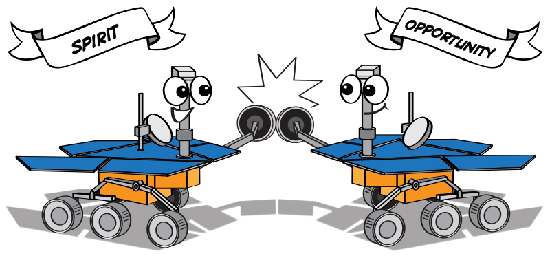
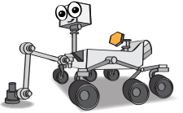

第1课 揭秘火星车
========================================

欢迎来到第1课：了解火星车。今天，我们将深入探索火星车的激动人心的世界——火星车是我们人类在红色星球上的远程探测器。我们将了解它们的演变、功能以及它们所代表的科技奇迹。此外，你还可以发挥创意设计自己的火星车，并通过讲解你的独特设计来锻炼你的演讲技巧。准备好从你的教室里探索火星吧！

学习目标
-------------------------
* 了解火星车的演变历程和探索目的
* 通过设计自己的火星车来发挥创意
* 通过分享和讲解火星车设计来提升演讲技巧

所需材料
-----------
* 火星车图片和技术规格资料作为参考
* 关于火星车历史的纪录片视频
* 可上网的电脑，用于查阅资料和观看纪录片
* 用于教学的演示幻灯片或互动白板
* 绘画纸、铅笔和彩色材料，用于火星车设计活动
* 用于引导式笔记、反思和设计规划的工作表

步骤
--------------

**步骤 1：什么是火星车？**

在深入了解火星车之前，让我们先认识一下火星本身。从图片和模型中我们可以看到，
火星表面布满了陨石坑、山脉、山谷和沙尘暴，描绘出一幅既迷人又充满挑战的地貌画面。

    .. image:: img/mars_surface.jpg
        :width: 600
    .. image:: img/mars_surface.png
        :width: 600

你能想象在如此崎岖的地形上行驶会是什么样子吗？
现在，假设你的任务是设计一辆火星车。

* 考虑到火星的地形和环境，你会考虑哪些因素？
* 你会为它配备哪些功能，以确保它能有效执行任务？
* 你想象中你的火星车需要完成哪些任务？

请记住，火星车是一种旨在探索火星、研究其环境并将数据传回地球的机器人。
因此，请考虑运动、通信、电源供应、科学研究能力以及在火星极端条件下的耐久性等方面。

让我们花一点时间进行头脑风暴，分享我们的想法。像工程师和科学家一样思考，是不是很有趣？
我们将在接下来的步骤中更深入地了解真实的火星车设计及其功能，
所以请在接下来的学习中记下你的创意想法。

**步骤 2：探索火星车的历史**

接下来，我们将通过观看一部详细介绍火星车历史的纪录片，踏上一段穿越时空的旅程。
这部纪录片从人类首次尝试在火星上部署火星车——苏联火星3号（遗憾的是它在1971年着陆时未能成功），
一直讲到1997年美国宇航局首次成功的火星车——旅居者号。

我们的旅程不止于此，我们还将进一步了解迄今最先进火星车——勇气号、机遇号、好奇号和毅力号的探险故事。

.. raw:: html

    <iframe width="600" height="400" src="https://www.youtube.com/embed/OO5CTBBgtXs" title="YouTube video player" frameborder="0" allow="accelerometer; autoplay; clipboard-write; encrypted-media; gyroscope; picture-in-picture; web-share" allowfullscreen></iframe>

这部纪录片不仅提供了历史背景，还全面介绍了逐步推动当前火星探索时代的科学和工程里程碑。

**步骤 3：总结火星车**

观看完纪录片后，让我们总结一下已被送往红色星球的不同火星车。

* **Sojourner** （旅居者号，1997年）

    **Sojourner** （旅居者号）是火星车的先驱，作为火星探路者任务的一部分开始了它的旅程。
    它于1997年7月4日成功降落在阿瑞斯谷地区。作为第一辆在地球以外的行星上行进的轮式车辆，
    旅居者号在火星探索史上标志着一个重要的里程碑。
    尽管它在火星上只运行了92个火星日（即太阳日），但它为未来的探测火星车奠定了基础。

    .. image:: img/mars_sojourner.jpg

* **Spirit** （勇气号，2004–2010年）和 **Opportunity** （机遇号，2004–2018年）

    **Spirit** （勇气号）和 **Opportunity** （机遇号）是美国宇航局火星探测漫游者（MER）任务的双胞胎火星车。 **Spirit** （勇气号），也称为MER-A，
    从2004年到2010年在火星上运行。

    另一方面， **Opportunity** （机遇号），即MER-B，从2004年到2018年运行了相当长的时间。
    它们共同极大地扩展了我们对火星表面和地质历史的了解。

    .. image:: img/mars_opportunity.jpg

* **Curiosity** （好奇号，2012年至今）

    **Curiosity** （好奇号）是一辆汽车大小的火星车，旨在探索火星上的盖尔陨石坑，作为美国宇航局
    火星科学实验室（MSL）任务的一部分。自2012年抵达以来， **Curiosity** （好奇号）取得了许多重大发现，
    包括火星上曾经存在液态水的证据。

    .. image:: img/mars_curiosity.jpg

* **Perseverance** （毅力号，2021年至今）

    **Perseverance** （毅力号），也被称为Percy，是最近抵达火星的火星车。它旨在探索杰泽罗陨石坑，
    作为美国宇航局火星2020任务的一部分。除了科学仪器外， **Perseverance** （毅力号）还携带着Ingenuity（机智号），
    一架小型实验型火星直升机，这标志着火星探索中的又一个首次。

    .. image:: img/mars_perseverance.jpg

现在，让我们进行讨论。反思这些火星车的演变过程。

* 这些火星车的设计有何不同？又有哪些相似之处？
* 任务目标如何影响了每个火星车的设计？
* 你能从每个火星车之间识别出哪些技术进步？
* 你认为下一辆火星车应该具备哪些功能？
* 分享你的想法和反思，以及你可能有的任何问题！

**步骤 4：艺术活动：绘制你自己的火星车**

.. image:: img/sojourner-first.jpg

.. image:: img/curiosity.png

对于下一个活动，让我们运用所学知识和创造力，设计我们自己的火星车。思考我们研究过的火星车的关键特征，同时也要考虑你希望在设计中融入的独特属性。

你需要的材料：

* 绘画纸
* 铅笔和橡皮擦
* 彩色铅笔、蜡笔或马克笔

绘画指导：

#. 从火星车的车身开始。它应该是什么形状？多大尺寸？
#. 考虑轮子。你的火星车会有几个轮子？它们的大小和形状如何？
#. 别忘了仪器设备。你的火星车将携带哪些科学设备？摄像头、钻头、光谱仪，还是全新的设备？
#. 最后，考虑任何独特的功能。你的火星车有太阳能板，还是使用不同的电源？它能直接与地球通信，还是需要中继卫星？

当每个人都完成绘画后，我们将与全班分享。解释你的设计选择以及你为火星车设想的任务。

**步骤 5：展示你的火星车设计**

现在每个人都完成了火星车绘画，是时候分享了！在展示时，讨论你设计背后的思考过程。你的火星车任务是什么？设计如何支持这个任务？

请记住，这个活动中没有错误的答案。目的是激发你的创造力并加深你对火星车技术的理解。

**步骤 6：反思与总结**

当我们结束火星车课程时，让我们花几分钟反思我们所学到的东西。我们的火星车设计如何反映技术的进步和科学目标？真实的火星车在未来会如何继续发展？

请记住，太空探索，就像任何STEAM领域一样，都是关于提出问题、解决问题和发挥创造力。保持探索，保持提问，保持好奇心！
