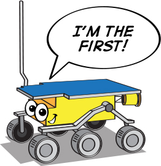
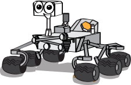

.. include:: /index.rst
   :start-after: start_hello_message
   :end-before: end_hello_message

Lección 1: Presentando el Mars Rover
==========================================

¡Bienvenidos a la Lección 1: Comprendiendo el Rover de Marte! Hoy nos sumergimos en el apasionante mundo de los rovers marcianos —nuestros exploradores remotos en el Planeta Rojo. Aprenderemos sobre su evolución, sus funciones y las maravillas tecnológicas que representan. Además, canalizarás tu creatividad para diseñar tu propio rover y perfeccionarás tus habilidades de presentación al explicar tu diseño único. ¡Prepárate para explorar Marte desde tu aula!

Objetivos de Aprendizaje
-------------------------
* Comprender la evolución y el propósito de los rovers marcianos
* Expresar la creatividad diseñando tu propio rover de Marte
* Mejorar las habilidades de presentación compartiendo y explicando tu diseño de rover

Materiales
-----------
* Imágenes de rovers marcianos y especificaciones técnicas como referencia
* Video documental sobre la historia de los rovers marcianos
* Computadora con acceso a internet para investigación y visualización del documental
* Diapositivas de presentación o pizarra interactiva para el desarrollo de la lección
* Papel de dibujo, lápices y materiales de coloreado para la actividad de diseño del rover
* Hojas de trabajo para toma de notas guiada, reflexión y planificación del diseño

Pasos
--------------

**Paso 1: ¿Qué son los Rovers de Marte?**

Antes de sumergirnos en los rovers marcianos, primero familiaricémonos con Marte mismo. Como podemos ver en las imágenes y modelos,
la superficie de Marte está marcada por cráteres, montañas, valles y tormentas de polvo, pintando un panorama
que es a la vez fascinante y desafiante.

    .. image:: img/mars_surface.jpg
        :width: 600
    .. image:: img/mars_surface.png
        :width: 600

Puedes imaginar cómo sería navegar por un terreno tan accidentado?
Ahora, supón que tienes la tarea de diseñar un rover para Marte.

* ¿Qué consideraciones tendrás en cuenta dado el terreno y las condiciones de Marte?
* ¿Con qué características lo equiparás para asegurar que pueda realizar sus funciones de manera efectiva?
* ¿Qué tareas crees que tu rover de Marte necesitaría cumplir?

Recuerda, un rover de Marte es un robot diseñado para explorar Marte, estudiar su entorno y enviar datos de vuelta a la Tierra.
Así que piensa en aspectos como el movimiento, la comunicación, la fuente de energía, las capacidades de investigación científica y la durabilidad
bajo las condiciones extremas de Marte.

Tomemos un momento para hacer una lluvia de ideas y compartir nuestras ideas. Es interesante pensar como ingenieros y científicos, ¿verdad?
Profundizaremos en los diseños reales de rovers marcianos y sus funciones en los siguientes pasos,
así que mantén tus ideas creativas en mente mientras avanzamos.

**Paso 2: Explorando la Historia de los Rovers de Marte**

A continuación, emprenderemos un viaje a través del tiempo viendo un documental que detalla la historia de los rovers marcianos.
El documental nos lleva desde el primer intento de desplegar un rover en Marte, el rover soviético Mars 3 que lamentablemente
no tuvo éxito al aterrizar en 1971, hasta el primer rover marciano exitoso de la NASA, Sojourner, en 1997.

Nuestro viaje no se detiene ahí, ya que avanzamos para comprender las aventuras de los rovers más avanzados hasta ahora: Spirit, Opportunity, Curiosity y Perseverance.

.. raw:: html

    <iframe width="600" height="400" src="https://www.youtube.com/embed/OO5CTBBgtXs" title="YouTube video player" frameborder="0" allow="accelerometer; autoplay; clipboard-write; encrypted-media; gyroscope; picture-in-picture; web-share" allowfullscreen></iframe>

Este documental no solo presenta un contexto histórico, sino que también proporciona una comprensión integral de los hitos
científicos y de ingeniería progresivos que han llevado a la era actual de exploración de Marte.

**Paso 3: Resumen de los Rovers de Marte**

Después de ver el documental, resumamos los diferentes rovers marcianos que han sido enviados al planeta rojo.

* **Sojourner** (1997)

    **Sojourner**, el pionero de los rovers marcianos, emprendió su viaje como parte de la misión Mars Pathfinder.
    Aterrizó con éxito en la región de Ares Vallis el 4 de julio de 1997. Como el primer vehículo con ruedas en desplazarse
    sobre un planeta distinto a la Tierra, Sojourner marcó un hito significativo en la exploración marciana.
    Aunque estuvo operativo en Marte solo durante 92 días marcianos, o soles, sentó las bases para futuros rovers de exploración.

    .. image:: img/mars_sojourner.jpg

* **Spirit** (2004—010) y **Opportunity** (2004—018)

    **Spirit** y **Opportunity** son rovers gemelos de la misión Mars Exploration Rover (MER) de la NASA. **Spirit**, también conocido como MER-A,
    operó en Marte desde 2004 hasta 2010.

    Por otro lado, **Opportunity**, o MER-B, tuvo una trayectoria notablemente larga desde 2004 hasta 2018.
    Juntos, expandieron enormemente nuestro conocimiento de la superficie marciana y su historia geológica.

    .. image:: img/mars_opportunity.jpg

* **Curiosity** (2012–presente):

    **Curiosity**, un rover marciano del tamaño de un automóvil, fue diseñado para explorar el cráter Gale en Marte como parte de la
    misión Mars Science Laboratory (MSL) de la NASA. Desde su llegada en 2012, **Curiosity** ha realizado numerosos descubrimientos significativos,
    incluyendo evidencia de la presencia pasada de agua líquida en Marte.

    .. image:: img/mars_curiosity.jpg

* **Perseverance** (2021–presente):

    **Perseverance**, también conocido como Percy, es el rover más reciente en llegar a Marte. Está diseñado para explorar el cráter Jezero
    como parte de la misión Mars 2020 de la NASA. Además de sus instrumentos científicos, **Perseverance** también transporta a Ingenuity,
    un pequeño helicóptero marciano experimental, marcando otro hito en la exploración de Marte.

    .. image:: img/mars_perseverance.jpg

Ahora, hagamos una discusión. Reflexiona sobre la evolución de estos rovers.

* ¿En qué se diferencian los diseños de estos rovers? ¿En qué se parecen?
* ¿Cómo influyeron los objetivos de la misión en el diseño de cada rover?
* ¿Qué avances tecnológicos puedes identificar entre cada rover?
* ¿Qué características crees que debería tener el próximo rover de Marte?
* ¡Comparte tus pensamientos y reflexiones, así como cualquier pregunta que puedas tener!

**Paso 4: Actividad Artística: Dibuja Tu Propio Rover de Marte**

.. image:: img/spirit-opportunity.jpg
    :width: 500

.. image:: img/perseverance_rover.png

Para nuestra siguiente actividad, pongamos nuestro conocimiento y creatividad a trabajar diseñando nuestro propio rover de Marte. Considera las características clave de los rovers que hemos estudiado hasta ahora, pero también piensa en los atributos únicos que te gustaría incorporar en tu diseño.

Materiales que necesitarás:

* Papel de dibujo
* Lápices y gomas de borrar
* Lápices de colores, crayones o marcadores

Instrucciones de Dibujo:

#. Comienza con el cuerpo del rover. ¿Qué forma tendrá? ¿Qué tan grande será?
#. Considera las ruedas. ¿Cuántas tendrá tu rover? ¿De qué tamaño y forma serán?
#. No olvides los instrumentos. ¿Qué equipo científico llevará tu rover? ¿Cámaras, taladros, espectrómetros o algo completamente nuevo?
#. Por último, considera cualquier característica única. ¿Tu rover tiene paneles solares o utiliza una fuente de energía diferente? ¿Puede comunicarse directamente con la Tierra o necesita un satélite de retransmisión?

Una vez que todos hayan completado sus dibujos, los compartiremos con la clase. Explica tus decisiones de diseño y la misión que imaginas para tu rover.

**Paso 5: Presenta Tus Diseños de Rover de Marte**

Ahora que todos han completado sus dibujos del Rover de Marte, ¡es hora de compartirlos! Al presentar, discute el proceso de pensamiento detrás de tu diseño. ¿Cuál es la misión de tu rover? ¿Cómo apoya el diseño esta misión?

Recuerda, no hay respuestas incorrectas en esta actividad. El propósito es estimular tu creatividad y profundizar tu comprensión de la tecnología de los rovers marcianos.

**Paso 6: Reflexión y Conclusión**

Al concluir nuestra lección sobre el Rover de Marte, tomemos unos minutos para reflexionar sobre lo que hemos aprendido. ¿Cómo reflejan nuestros diseños de rover los avances tecnológicos y los objetivos científicos? ¿Cómo podrían continuar evolucionando los rovers marcianos reales en el futuro?

Recuerda, la exploración del espacio, como cualquier campo STEAM, se trata de hacer preguntas, resolver problemas y usar la creatividad. ¡Sigue explorando, sigue haciendo preguntas y sigue siendo curioso!
