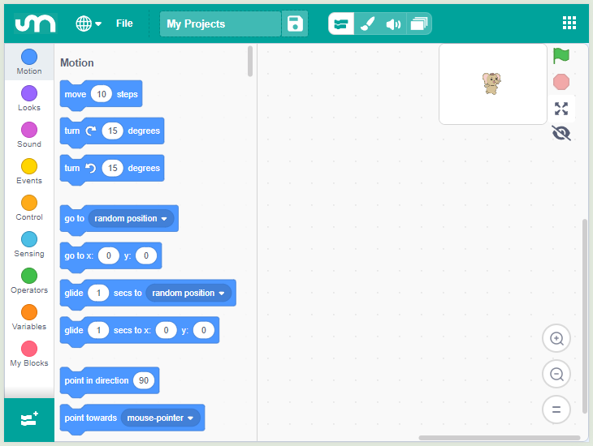

.. note:: 

    你好，欢迎加入 SunFounder 树莓派、Arduino 和 ESP32 爱好者社区！与其他爱好者一起，深入探索树莓派、Arduino 和 ESP32。

    **为什么加入？**

    - **专家支持**：通过社区和团队的帮助解决售后问题和技术挑战。
    - **学习与分享**：交流技巧和教程，提升你的技能。
    - **独家预览**：提前体验新产品发布和独家内容。
    - **专属折扣**：享受最新产品的专属优惠。
    - **节庆促销与赠品**：参与赠品活动和节日促销。

    👉 准备好与我们一起探索和创造了吗？点击 [|link_sf_facebook|] 即刻加入！

第二课 开始使用 Mammoth 编程 APP
======================================================

让我们一起深入了解 Mammoth 编程的世界，创建你的第一个项目！ 
为了获得最佳体验，建议使用屏幕较大的设备。

学习目标
--------------------

* 理解 APP 编程环境和基本操作。
* 学习如何在角色中编写事件脚本，使用绿色旗帜、重复、滑行和更换服装等功能。
* 创建一个模拟火星探测车的简单动画。

所需材料
-----------

* 智能手机或平板电脑
* Mammoth 编程 APP

安装 Mammoth 编程 APP
-----------------------------

首先，在 Google Play 或 Apple Store 中搜索 Mammoth Coding，下载并安装。

.. image:: img/mammoth_download.jpg
    :align: center

了解 Mammoth 编程 APP 界面
------------------------------------------------------------

Mammoth 编程设计简单、富有教育意义且易于学习。 
它提供了用于创建互动故事、游戏、艺术作品、模拟等的工具，使用基于块的编程方式。 
此外，它还包括自己的绘图和声音编辑器。

以下是界面的展示：

.. image:: img/2_app_ui_001.png
    :align: center

对于较小屏幕的设备，界面如下所示：

**顶部区域**

Mammoth 编程的顶部区域包含一些基本选项。

.. image:: img/2_app_ui_1.png
    :align: center

* 从左侧第一个选项是语言设置，可以选择不同的语言。
* 第二个选项是文件菜单，你可以在此创建新文件、加载本地文件或保存当前文件。
* 第三个选项用于重命名你的项目。

**导航**

在顶部区域下方是导航栏， 
它允许你在“代码”、“服装”和“声音”编辑页面之间切换。

.. image:: img/2_app_ui_3.png
    :align: center

在较小屏幕设备上，导航栏位于顶部。

.. image:: img/2_app_ui_2.png
    :align: center

这些选项分别是：代码、服装、声音和舞台。
舞台页面在较大屏幕的界面上位于右侧，而在小设备上被单独分开以避免界面拥挤。

.. image:: img/2_app_ui_4.png
    :align: center

**代码**

.. image:: img/2_app_ui_code.png
    :align: center

“代码”（以及舞台）页面是你编程活动的主要区域。

**服装**

.. image:: img/2_app_ui_custom.png
    :align: center

“服装”页面用于编辑角色和背景，为你的程序提供视觉元素。

**声音**

.. image:: img/2_app_ui_sound.png
    :align: center

“声音”页面用于处理音频，为你的程序提供多媒体元素。

首次使用 Mammoth 编程 APP
------------------------------------------------

拖动一个代码块到中心区域。

.. image:: img/2_drag.png
    :align: center

点击代码块并观察发生了什么。

.. image:: img/2_click.png
    :align: center

你会看到舞台上的角色稍微移动一下。 
如果继续点击代码块，它会持续移动。

.. image:: img/2_show.png
    :align: center

注意这些代码块的形状暗示它们可以连接，就像乐高积木一样。
当你连接代码块时，舞台上的角色将按顺序执行连接的代码块（例如，先移动再旋转）。

.. image:: img/2_click2.png
    :align: center

.. note:: 这是在 APP 中的基本编程过程。从左侧区域拖动代码块，连接它们，然后点击运行，使舞台上的角色执行相应动作。

**选择角色**

在界面的右下角，你会看到“选择角色”按钮。
点击它，你将看到四个弹出选项。

.. image:: img/2_create_sp.png
    :align: center

在较小的屏幕上，你需要进行导航才能看到该按钮。

.. image:: img/2_create_sp0.png
    :align: center

这四个选项分别是：

* **上传角色**：从设备存储中加载一个角色。
* **惊喜**：从素材库中随机选择一个角色。
* **绘画**：自己绘制一个角色。
* **选择角色**：打开素材库选择一个角色。

点击“选择角色”进入素材库，提供多种舞台素材。

.. image:: img/2_sp_list.png
    :align: center

找到并选择“GalaxyRVR”。

.. image:: img/2_sprite_rvr.png
    :align: center

**你的第一个示例**

让我们使用这个 APP 创建一个简单的动画，让 GalaxyRVR 随机移动。

.. raw:: html

   <video width="600" loop autoplay muted>
      <source src="../_static/video/sc_animate_app.mp4" type="video/mp4">
      Your browser does not support the video tag.
   </video>

**1. 从黄色“事件”类别开始。**

虽然我们之前通过点击中心区域的代码块来执行代码，但大多数情况下，代码应由事件触发。事件充当守卫，监控诸如角色点击或键盘按键等操作，并告诉程序在这些事件发生时应该做什么。

拖动出“当点击绿色旗帜时”代码块。

.. image:: img/2_first_flag.png

绿色旗帜就像比赛的发令枪，代表程序的开始。当你点击舞台旁的绿色旗帜时，这个代码块会触发，启动所有角色和代码。

**2. “控制”类别是程序的指挥官。**

这些代码块帮助控制程序的流程，决定何时以及多长时间执行某些动作。

拖出“重复 10 次”代码块，并将其连接到绿色旗帜代码块下方。

.. image:: img/2_first_repeat.png

这意味着点击绿色旗帜后，某些操作会发生 10 次。

**3. “运动”类别为舞台上的角色（角色）提供指令。**

拖出“滑行 1 秒到随机位置”代码块，并将其嵌套在“重复 10 次”代码块中。

.. image:: img/2_first_glide.png

这将使你的角色滑行到随机位置。

**4. “外观”类别为角色添加动画和视觉效果。**

拖出“下一个服装”代码块，并将其放入“重复 10 次”代码块中。

.. image:: img/2_first_custom.png

这样，每次操作时你的角色就会更换服装，看起来像是在走动。

现在，点击舞台旁的绿色旗帜，看看你的 GalaxyRVR 是如何随机移动的。
