.. note::

    Hello, welcome to the SunFounder Raspberry Pi & Arduino & ESP32 Enthusiasts Community on Facebook! Dive deeper into Raspberry Pi, Arduino, and ESP32 with fellow enthusiasts.

    **Why Join?**

    - **Expert Support**: Solve post-sale issues and technical challenges with help from our community and team.
    - **Learn & Share**: Exchange tips and tutorials to enhance your skills.
    - **Exclusive Previews**: Get early access to new product announcements and sneak peeks.
    - **Special Discounts**: Enjoy exclusive discounts on our newest products.
    - **Festive Promotions and Giveaways**: Take part in giveaways and holiday promotions.

    👉 Ready to explore and create with us? Click [|link_sf_facebook|] and join today!

Lesson 2 Getting Started with the Mammoth Coding APP
======================================================

Let's dive into the world of Mammoth Coding and create your first project! 
For an optimal experience, it is recommended to use a device with a larger screen.

Learning Objectives
--------------------

* Understand the APP programming environment and basic operations.
* Learn how to script events in sprites, use the green flag, repeat, glide, and switch costumes.
* Create a simple animation simulating a Mars rover.

Materials
-----------

* Smartphone or tablet
* Mammoth Coding APP

Installing the Mammoth Coding APP
--------------------------------------

First, search for Mammoth Coding on Google Play or the Apple Store and download it.

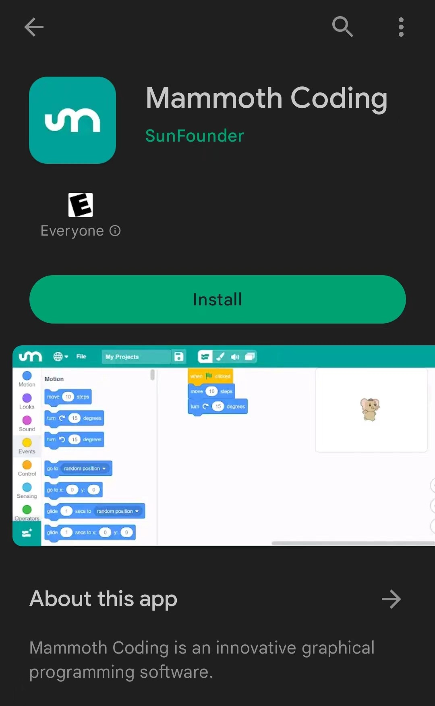

Understanding the Mammoth Coding APP Interface
------------------------------------------------------------

Mammoth Coding is designed to be fun, educational, and easy to learn. 
It provides tools for creating interactive stories, games, art, 
simulations, and more using block-based coding. 
It also includes its own drawing and sound editors.

Here is what the interface looks like:

For smaller screen devices, the interface looks like this:

.. image:: img/2_app_ui_002.png
    :align: center

**Top Section**

The top section of Mammoth Coding includes several basic options.

* The first option from the left is the language setting, allowing you to choose different languages.
* The second option is the file menu, where you can create new files, load local files, and save the current file.
* The third option is for renaming your project.

**Navigation**

Just below the top section is the navigation bar, 
which allows you to switch between the Code, Costumes, 
and Sounds editing pages.

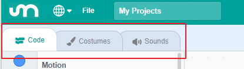

On smaller screens, the navigation bar appears at the top.

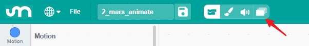

The options are Code, Costumes, Sounds, and Stage. 
The Stage page is actually the right-hand side of the interface on larger screens, 
separated out on smaller devices to avoid clutter.

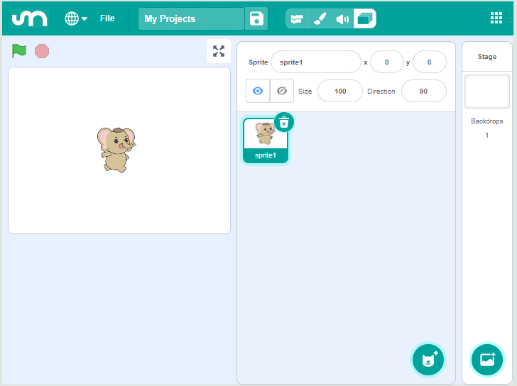

**Code**

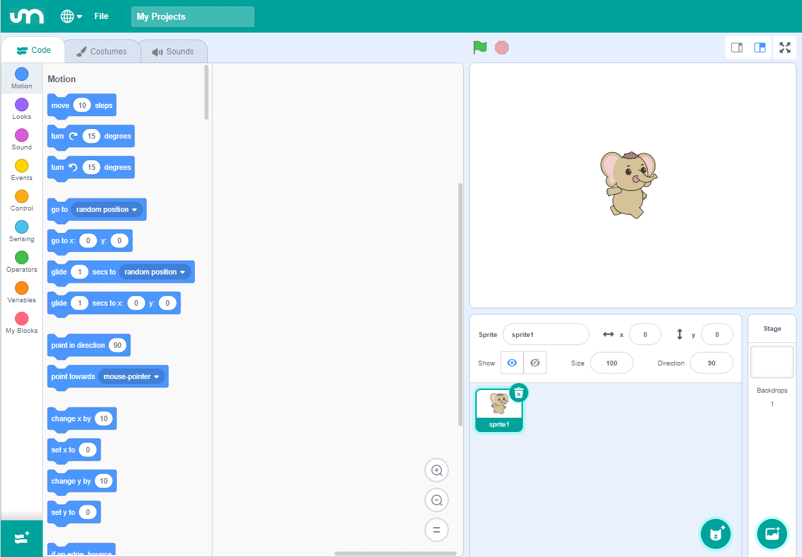

The Code (and Stage) page is where most of your programming 
activities will take place.

**Costumes**

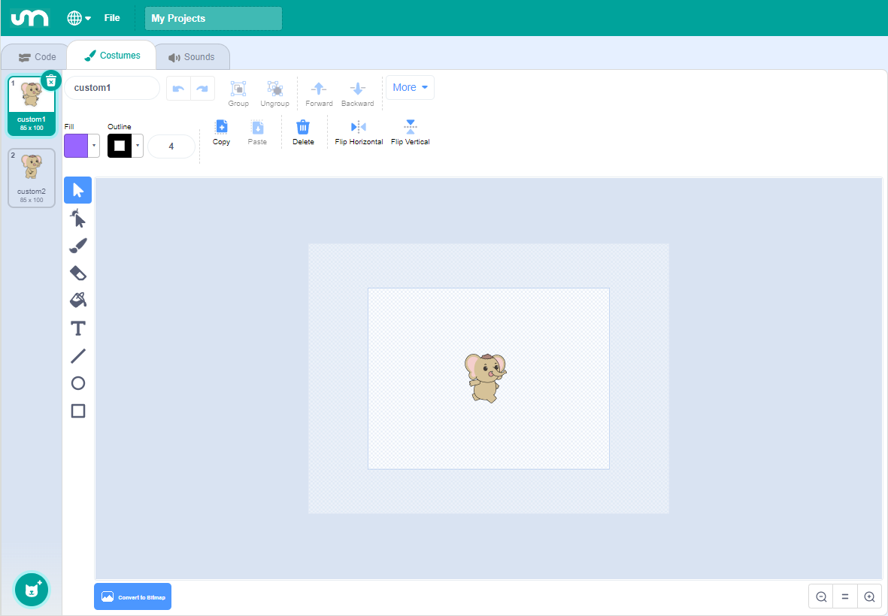

The Costumes page is used to edit sprites and backdrops, 
providing visual elements for your programs.

**Sounds**

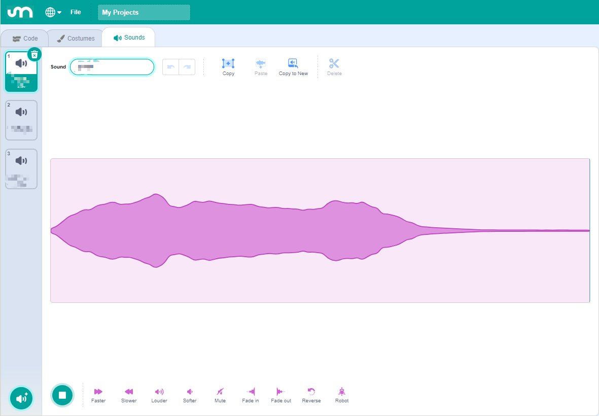

The Sounds page handles audio, providing multimedia elements for your programs.

First Time Using the Mammoth Coding APP
------------------------------------------------

Drag a block to the center area.

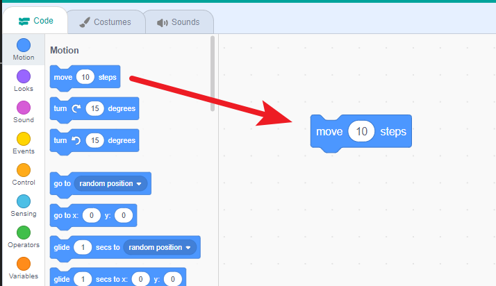

Click the block and observe what happens.

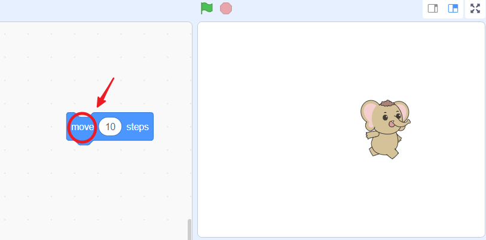

You'll see the sprite in the center of the stage move a bit. 
If you keep clicking the block, it will continue to move.

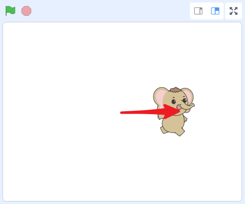

Notice how the shapes of these blocks suggest that they can be connected, 
similar to LEGO bricks. When you connect the blocks, 
the sprite on the stage will execute the connected code 
blocks in sequence (e.g., move and then rotate).

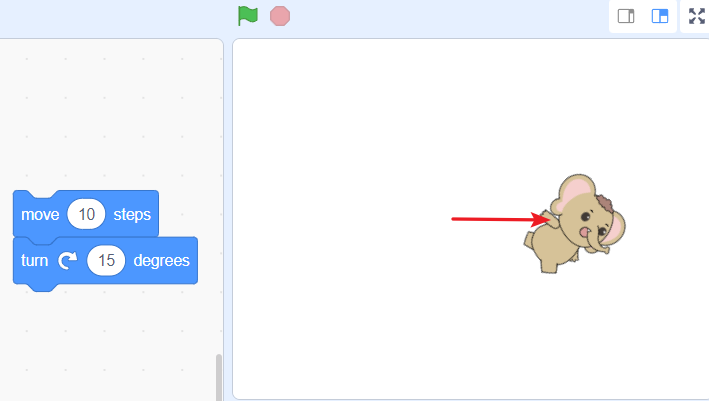

.. note:: This is the basic programming process in the APP. Drag blocks from the left area, connect them together, and click them to make the stage sprite perform actions.

**Choosing a Sprite**

In the lower right corner of the interface, 
you’ll find the "choose a sprite" button. Tap it to see four pop-up options.

.. image:: img/2_create_sp.png
    :align: center

On smaller screens, you need to navigate to see this button.

.. image:: img/2_create_sp0.png
    :align: center

The four options are:

* **Upload Sprite**: Load a sprite from your device's storage.
* **Surprise**: Select a random sprite from the asset library.
* **Paint**: Draw a sprite.
* **Choose a Sprite**: Open the asset library to choose a sprite.

Tap "choose a sprite" to enter the asset library, which provides a variety of materials for your stage.

.. image:: img/2_sp_list.png
    :align: center

Find and select "GalaxyRVR".

.. image:: img/2_sprite_rvr.png
    :align: center

**Your First Example**

Let's create a simple animation using the APP to make GalaxyRVR move randomly.

.. raw:: html

   <video width="600" loop autoplay muted>
      <source src="../_static/video/sc_animate_app.mp4" type="video/mp4">
      Your browser does not support the video tag.
   </video>

**1. Start with the yellow Events category.**

While we've previously executed code by clicking blocks in the central area, most of the time our code should be triggered by events. Events act like guards, monitoring actions such as sprite clicks or key presses, and tell the program what to do when these events occur.

Drag out the "when green flag clicked" block.

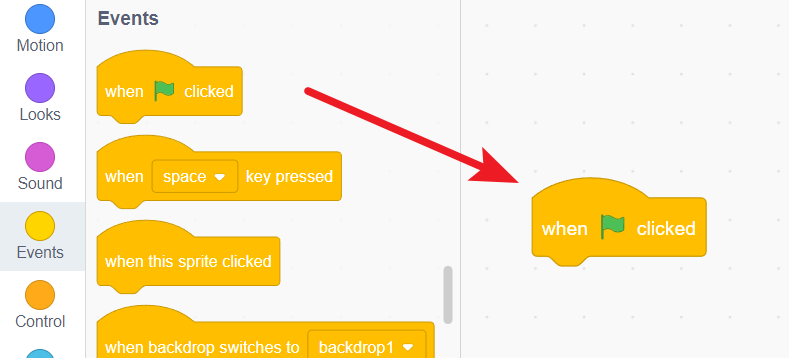

The green flag acts like a starter's gun, representing the beginning of the program. This block triggers when you click the green flag next to the stage, starting all characters and code.

**2. The Control category is the program's conductor.**

These blocks help control the program's flow, deciding when and how often actions should occur.

Drag out a "repeat 10" block and attach it below the green flag block.

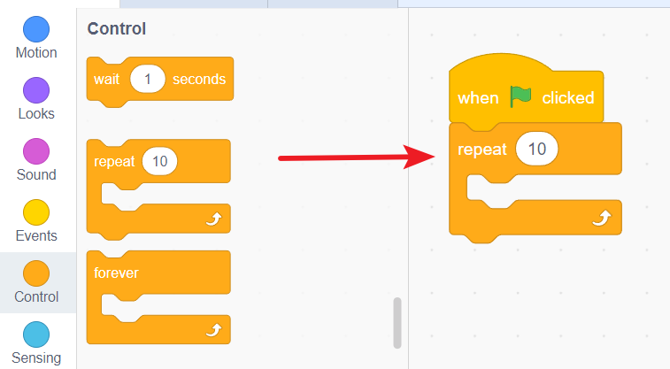

This means that after you click the green flag, something will happen ten times.

**3. The Motion category provides instructions for the stage's actors (sprites).**

Drag out a "glide 1 secs to random position" block and nest it inside the "repeat 10" block.

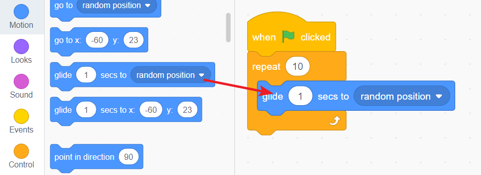

This will make your sprite glide to a random position.

**4. The Looks category adds animation and visual interest to your characters.**

Drag out a "next costume" block and place it inside the "repeat 10" block.

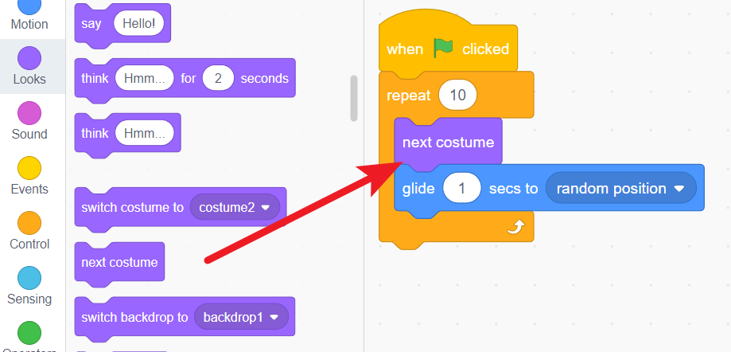

This makes your sprite change costumes with each action, making it look like it’s walking.

Now, click the green flag next to the stage and watch your GalaxyRVR move around randomly.