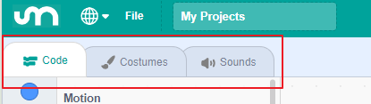
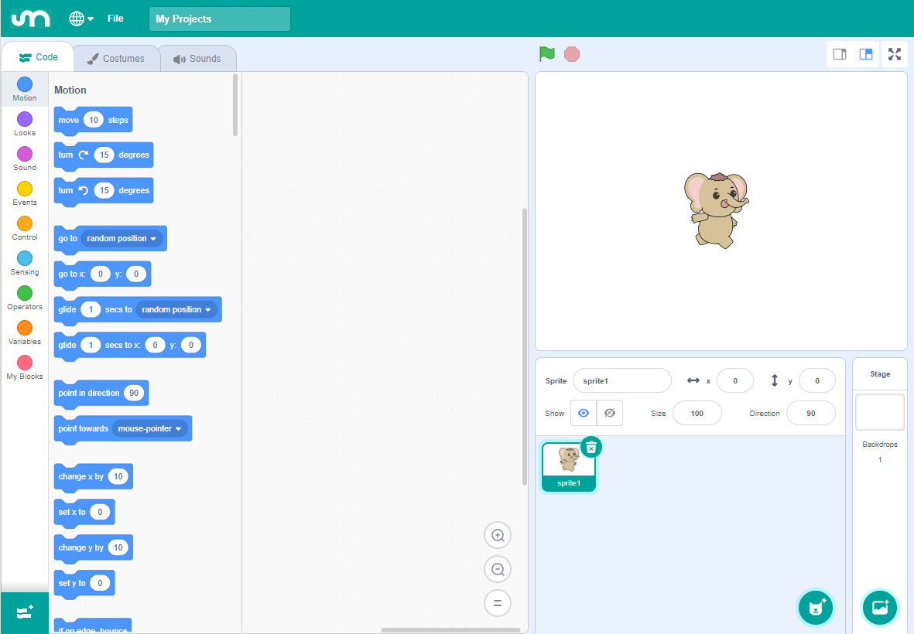
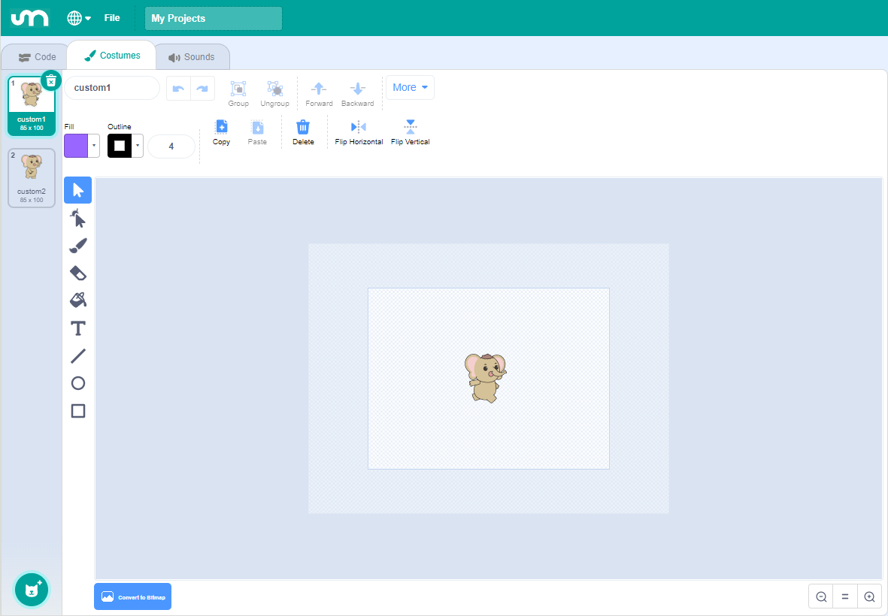
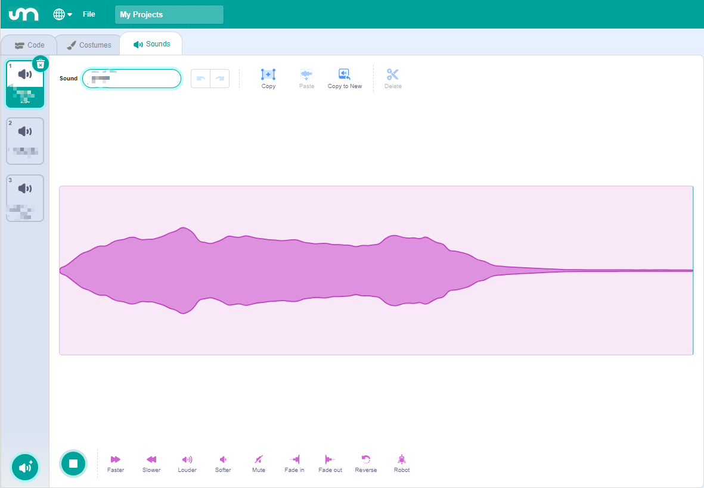

第2课 开始使用 Mammoth Coding 应用
===========================================================

让我们进入 Mammoth Coding 的世界，创建你的第一个项目！为了获得最佳体验，建议使用屏幕较大的设备。

学习目标
----------------------

* 搭建 Mammoth Coding 编程环境。
* 了解 Mammoth Coding 中的基本编程概念。
* 编写并运行你的第一个程序。

安装应用
----------------------

1. 在 Google Play 或 Apple App Store 中搜索 **Mammoth Coding** 并安装。

   .. image:: img/1_app_install.png
      :width: 600
      :align: center

2. 安装完成后即可打开。以下是大屏设备上的界面效果：

   .. image:: img/1_app_ui_001.png
      :width: 600
      :align: center

3. 对于屏幕较小的设备，界面如下所示：

   .. image:: img/1_app_ui_002.png
      :width: 600
      :align: center

了解应用
-----------------------------------

Mammoth Coding 的设计宗旨是寓教于乐、易于学习。它提供了使用积木块式编程创建互动故事、游戏、艺术、模拟等项目所需的工具。它还内置了绘图和声音编辑器。

顶部区域
^^^^^^^^^^^^^^

Mammoth Coding 的顶部区域包含几个基本选项。

* **语言设置** ：左侧第一个选项允许你选择不同语言。目前支持英语和简体中文。
* **文件菜单** ：第二个选项是 **文件** 菜单，你可以在这里创建新项目、打开已有项目以及保存当前项目。
* **项目名称** ：第三个选项允许你重命名项目。

导航栏
^^^^^^^^^^^^^^^^^^^^^

顶部区域下方是导航栏，允许你在不同的编辑页面之间切换。

在小屏设备上：

* 导航栏显示在顶部，包含 **代码** 、 **造型** 、 **声音** 和 ** 舞台** 选项。

  .. image:: img/1_app_ui_2.png

* **舞台** 页面实际上就是大屏设备上界面右侧的部分，在小屏设备上被分离出来，以避免界面拥挤。

  .. image:: img/1_app_ui_4.png
     :width: 600

代码区域
^^^^^^^^^^^^^^

**代码** 页面是你进行大部分编程活动的地方。

造型
^^^^^^^^^^^^^^^

**造型** 页面用于编辑精灵和背景，为你的程序提供视觉元素。

声音
^^^^^^^^^^^^^

**声音** 页面用于处理音频，为你的程序提供多媒体元素。

创建你的第一个程序
----------------------------------------

1. 创建或打开一个项目
^^^^^^^^^^^^^^^^^^^^^^^^^^^^^^^^^^^

* 每次打开 Mammoth Coding 应用时，都会自动创建一个新项目。

  .. image:: img/1_open_new.png
     :width: 600

* 将默认项目名称"My Project"改为有意义的名称。

  .. image:: img/1_new_name.png
     :width: 600

* 你也可以打开之前保存在设备上的项目。

  .. image:: img/1_new_save.png
     :width: 600

2. 选择一个精灵
^^^^^^^^^^^^^^^^^^^^^^^^^

* 当你开始一个新项目时，会提供一个默认精灵。你可以：

  * 使用默认精灵。
  * 从库中选择一个新精灵。
  * 自己绘制一个精灵。
  * 从设备上传一个精灵。

  .. image:: img/1_choose_sprite.png

* 选择新精灵：点击 **"选择一个精灵"** ，然后选择 **"GalaxyRVR"** 。

  .. image:: img/1_choose_galaxyrvr.png

3. 编写程序
^^^^^^^^^^^^^^^^^^^^^^^^^^^^

在左侧边栏中，你会发现包含不同类别积木块的各种分类。你可以将这些积木块从分类中拖到脚本区来构建你的程序。

例如，要让 **GalaxyRVR** 精灵在被点击绿旗时向前移动10步，然后切换到下一个造型：

1. 从 **事件** 类别中，将 **"当绿旗被点击"** 积木块拖入脚本区。

     .. image:: img/1_code_flag.png
        :width: 600

2. 从 **运动** 类别中，将 **"移动(10)步"** 积木块拖出，并连接到事件积木块下方。

     .. image:: img/1_code_move10.png
        :width: 600

3. 从 **外观** 类别中，将 **"下一个造型"** 积木块拖出，并连接到运动积木块下方。

     .. image:: img/1_code_next.png
        :width: 600

4. 运行程序
^^^^^^^^^^^^^^^^^^^^^^^^^^^

运行程序有两种方式：

1. 直接点击你在脚本区中组装好的积木块组。积木块会呈现黄色高亮，表示脚本正在运行。

     .. image:: img/1_code_run.png
        :width: 30%

2. 如果你的脚本以 **"当绿旗被点击"** 积木块开头，你可以点击 ** 舞台** 左上角的绿旗来运行程序。对于包含多个精灵或更复杂代码的项目，建议使用此方法。

     .. image:: img/1_code_green_flag.png
        :width: 70%

5. 保存你的项目
^^^^^^^^^^^^^^^^^^^^^^^^^

测试代码并确保一切运行正确后，保存你的项目非常重要。

1. 点击项目名称右侧的保存图标。

     .. image:: img/1_code_save.png
        :width: 600

2. 将会显示"项目已保存"消息。项目将被保存在 Mammoth Coding 应用内。你可以通过点击最右侧的菜单按钮访问已保存的项目。

     .. image:: img/1_code_save_app.png
        :width: 600

3. 要分享你的代码或保存到设备，请点击 **文件 > 保存到设备** ，然后选择一个应用进行分享，或将项目保存到你的移动设备。

     .. image:: img/1_code_save_device.png

**恭喜！**

你已成功在 Mammoth Coding 中创建并运行了第一个程序。继续尝试和探索，发现更多功能，释放你的创造力！

