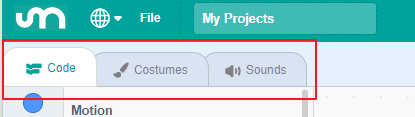
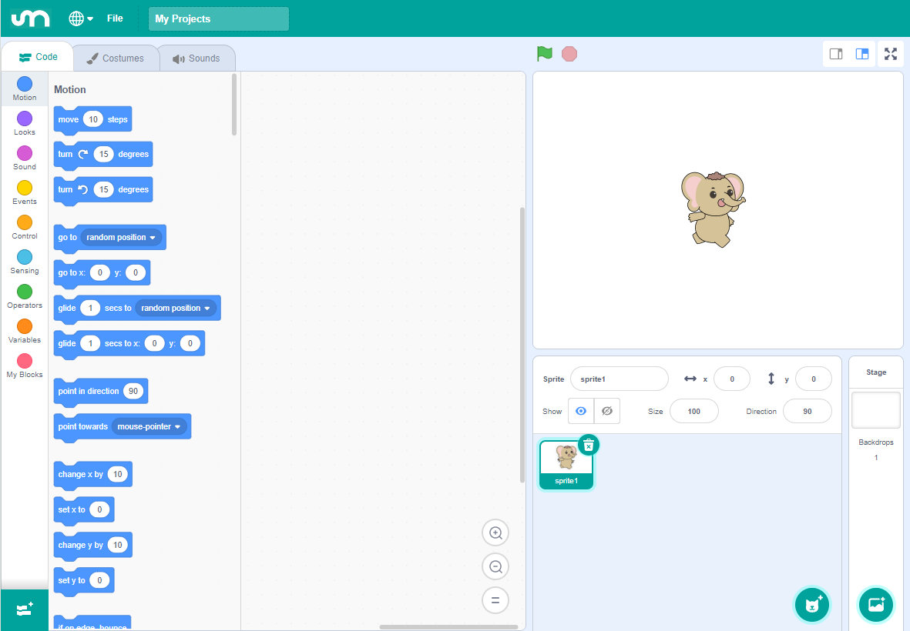
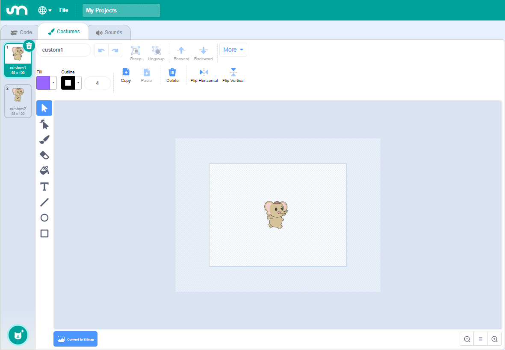
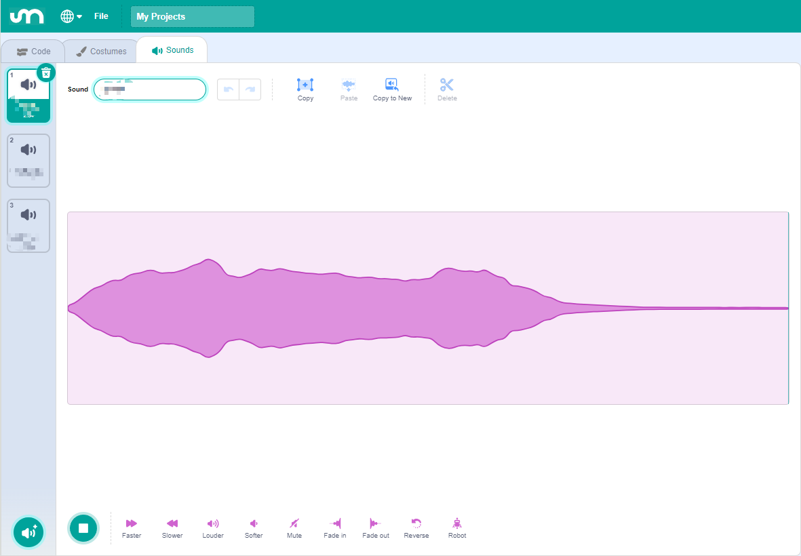

.. include:: /index.rst
   :start-after: start_hello_message
   :end-before: end_hello_message

Lección 2: Primeros Pasos con la Aplicación Mammoth Coding
===========================================================

¡Adéntrate en el mundo de Mammoth Coding y crea tu primer proyecto! Para una experiencia óptima, se recomienda utilizar un dispositivo con una pantalla más grande.

Objetivos de Aprendizaje
---------------------------

* Configurar el entorno de programación de Mammoth Coding.
* Comprender los conceptos básicos de programación en Mammoth Coding.
* Escribir y ejecutar tu primer programa.

Instalación de la Aplicación
--------------------------------

1. Busca **Mammoth Coding** en Google Play o en la App Store de Apple e instálalo.

   .. image:: img/1_app_install.png
      :width: 600
      :align: center

2. Después de la instalación, puedes abrirlo. Así es como se ve la interfaz en pantallas grandes:

   .. image:: img/1_app_ui_001.png
      :width: 600
      :align: center

3. En dispositivos con pantallas más pequeñas, la interfaz se ve así:

   .. image:: img/1_app_ui_002.png
      :width: 600
      :align: center

Cómo Funciona la Aplicación
-----------------------------------

Mammoth Coding está diseñado para ser divertido, educativo y fácil de aprender. Proporciona herramientas para crear historias interactivas, juegos, arte, simulaciones y más, utilizando programación basada en bloques. También incluye editores de dibujo y sonido integrados.

Sección Superior
^^^^^^^^^^^^^^^^^^^^^^

La sección superior de Mammoth Coding incluye varias opciones esenciales.

* **Configuración de Idioma**: La primera opción a la izquierda te permite elegir diferentes idiomas. Actualmente, están disponibles inglés y chino simplificado.
* **Menú de Archivo**: La segunda opción es el menú **Archivo**, donde puedes crear nuevos proyectos, abrir existentes y guardar tu proyecto actual.
* **Nombre del Proyecto**: La tercera opción te permite renombrar tu proyecto.

Barra de Navegación
^^^^^^^^^^^^^^^^^^^^^

Justo debajo de la sección superior se encuentra la barra de navegación, que te permite cambiar entre diferentes páginas de edición.

En pantallas pequeñas:

* La barra de navegación aparece en la parte superior con opciones para **Código**, **Disfraces**, **Sonidos** y **Escenario**.

  .. image:: img/1_app_ui_2.png

* La página del **Escenario** es en realidad el lado derecho de la interfaz en pantallas grandes, separado en dispositivos más pequeños para evitar la saturación.

  .. image:: img/1_app_ui_4.png
     :width: 600

Área de Código
^^^^^^^^^^^^^^

La página de **Código** es donde se llevará a cabo la mayoría de tus actividades de programación.

Disfraces
^^^^^^^^^^^^^^^

La página de **Disfraces** se utiliza para editar objetos y fondos, proporcionando elementos visuales para tus programas.

Sonidos
^^^^^^^^^^^^^

La página de **Sonidos** maneja el audio, proporcionando elementos multimedia para tus programas.

Creación de tu Primer Programa
----------------------------------------

1. Crear o Abrir un Proyecto
^^^^^^^^^^^^^^^^^^^^^^^^^^^^^^^^^^^

* Cada vez que abres la aplicación Mammoth Coding, se crea automáticamente un nuevo proyecto.

  .. image:: img/1_open_new.png
     :width: 600

* Cambia el nombre de proyecto predeterminado "My Project" por algo con significado.

  .. image:: img/1_new_name.png
     :width: 600

* También puedes abrir un proyecto que hayas guardado anteriormente en tu dispositivo.

  .. image:: img/1_new_save.png
     :width: 600

2. Elegir un Objeto
^^^^^^^^^^^^^^^^^^^^^^^^^

* Al iniciar un nuevo proyecto, se proporciona un objeto predeterminado. Puedes:

  * Usar el objeto predeterminado.
  * Elegir un nuevo objeto de la biblioteca.
  * Dibujar tu propio objeto.
  * Subir un objeto desde tu dispositivo.

  .. image:: img/1_choose_sprite.png

* Para elegir un nuevo objeto: Toca **"Elegir un Objeto"** y selecciona **"GalaxyRVR"**.

  .. image:: img/1_choose_galaxyrvr.png

3. Escribir el Programa
^^^^^^^^^^^^^^^^^^^^^^^^^^^^

En la barra lateral izquierda, encontrarás varias categorías que contienen diferentes tipos de bloques. Puedes arrastrar bloques desde estas categorías al área de programación para construir tu programa.

Por ejemplo, para hacer que el objeto **GalaxyRVR** avance 10 pasos y luego cambie al siguiente disfraz cuando se haga clic en la bandera verde:

1. Desde la categoría **Eventos**, arrastra el bloque **"Al hacer clic en bandera verde"** al área de programación.

     .. image:: img/1_code_flag.png
        :width: 600

2. Desde la categoría **Movimiento**, arrastra el bloque **"Mover (10) pasos"** y encájalo debajo del bloque de evento.

     .. image:: img/1_code_move10.png
        :width: 600

3. Desde la categoría **Apariencia**, arrastra el bloque **"Siguiente disfraz"** y adjúntalo debajo del bloque de movimiento.

     .. image:: img/1_code_next.png
        :width: 600

4. Ejecutar el Programa
^^^^^^^^^^^^^^^^^^^^^^^^^^^

Hay dos formas de ejecutar tu programa:

1. Simplemente toca la pila de bloques que has ensamblado en el área de programación. Aparecerá un resaltado amarillo, indicando que el script se está ejecutando.

     .. image:: img/1_code_run.png
        :width: 30%

2. Si tu script comienza con el bloque **"Al hacer clic en bandera verde"**, puedes hacer clic en la bandera verde en la parte superior izquierda del **Escenario** para ejecutar tu programa. Esto se recomienda para proyectos con múltiples objetos o código más complejo.

     .. image:: img/1_code_green_flag.png
        :width: 70%

5. Guardar tu Proyecto
^^^^^^^^^^^^^^^^^^^^^^^^^

Después de probar tu código y asegurarte de que todo funciona correctamente, es importante guardar tu proyecto.

1. Haz clic en el icono de guardar ubicado a la derecha del nombre de tu proyecto.

     .. image:: img/1_code_save.png
        :width: 600

2. Aparecerá un mensaje de "Proyecto guardado". El proyecto se guardará dentro de la aplicación Mammoth Coding. Puedes acceder a tus proyectos guardados haciendo clic en el botón de menú en el extremo derecho.

     .. image:: img/1_code_save_app.png
        :width: 600

3. Para compartir tu código o guardarlo en tu dispositivo, haz clic en **Archivo > Guardar en tu equipo**, luego elige una aplicación para compartir o guarda el proyecto en tu dispositivo móvil.

     .. image:: img/1_code_save_device.png

**¡Felicidades!**

Has creado y ejecutado exitosamente tu primer programa en Mammoth Coding. ¡Sigue experimentando y explorando para descubrir más funciones y liberar tu creatividad!
