.. note:: 

    你好，欢迎加入 SunFounder 树莓派、Arduino 和 ESP32 爱好者社区！在这里，你可以与其他爱好者一起深入探索树莓派、Arduino 和 ESP32。

    **为什么要加入？**

    - **专家支持**：通过社区和团队的帮助，解决售后问题和技术挑战。
    - **学习与分享**：交流技巧和教程，提升自己的技术水平。
    - **独家预览**：抢先体验新产品发布和独家内容。
    - **专属折扣**：享受最新产品的专属优惠。
    - **节日促销与赠品**：参与赠品活动和节日促销。

    👉 准备好与我们一起探索和创造了吗？点击 [|link_sf_facebook|] 立即加入！

.. _rvr_move:

第三课 远程控制你的 GalaxyRVR
============================================

在本课中，我们将让火星探测车焕发活力！

利用我们的编程技能，我们将引导探测车穿越想象中的火星景观。

这将是我们课堂上的一场火星冒险。让我们开始吧！

.. raw:: html

   <video width="600" loop autoplay muted>
      <source src="../_static/video/car_move.mp4" type="video/mp4">
      Your browser does not support the video tag.
   </video>

学习目标
-----------------------

* 引导学生下载并上传相应的 Arduino 代码，通过 APP 控制探测车。
* 学习使用 Mammoth 编程中的箭头键来控制探测车的运动。
* 实现探测车的基本运动控制：前进、后退、左转、右转。

所需材料
-------------

* 智能手机或平板电脑
* Mammoth 编程 APP
* GalaxyRVR
* 计算机

将基础程序上传到 GalaxyRVR
-------------------------------------------------

要通过 APP 控制 GalaxyRVR，你需要使用 Arduino IDE 上传一个特定的程序。

请按照以下步骤在计算机上操作：

下载 Arduino IDE
^^^^^^^^^^^^^^^^^^^^^^^^

#. 访问 https://www.arduino.cc/en/software#future-version-of-the-arduino-ide 。

#. 下载适合你操作系统的 IDE 版本。

    .. image:: img/sp_001.png

#. 安装 Arduino IDE。

    .. image:: img/sp_005.png

上传适配代码
^^^^^^^^^^^^^^^^^^^^^^^^^^^^^^^^^^^^^^^^^^

1. 打开 GalaxyRVR 的电源开关。

    .. raw:: html

        <video width="600" loop autoplay muted>
            <source src="../_static/video/play_start.mp4" type="video/mp4">
            Your browser does not support the video tag.
        </video>

2. 使用 USB 数据线将 Arduino 与计算机连接，然后将车载设备的 **上传** 开关切换到上传位置。

    .. image:: ../img/camera_upload.png
        :width: 500
        :align: center

.. note:: 连接到 Arduino 的 USB 接口是 Type B，而不是用于充电的 Type C 接口。

3. 打开下载的 galaxy-rvr-1.2.0 文件夹。（该文件已在 :ref:`update_firmware` 部分下载并安装），双击运行 ``update-arduino-firmware.bat`` 脚本，命令提示符窗口将会打开。

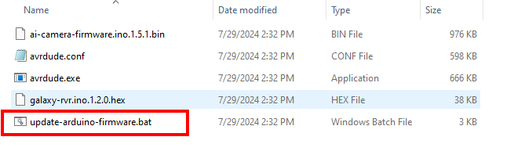

4. 在命令提示符窗口中，你将看到一个串口列表，显示当前计算机连接的串口。根据串口列表中的序号选择 Arduino Uno 的串口，按下回车键即可自动开始上传。

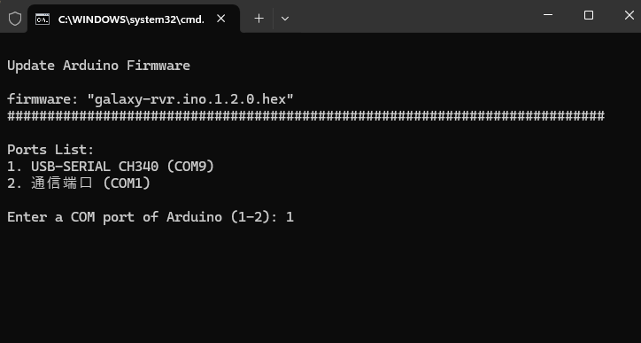

5. 上传完成后，你可以拔掉 USB 数据线。

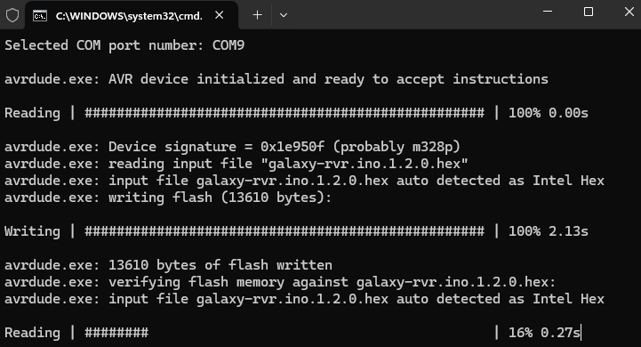

6. 将上传开关切换回原位，并按下重置按钮，车载设备即可准备使用。

.. note:: 此代码使 GalaxyRVR 能够响应 APP 命令。在后续章节中使用 Mammoth 编程 APP 时，你无需再上传其他代码。

.. _app_connect:

将 APP 连接到 GalaxyRVR
-------------------------------------------

1. 为了激活 ESP32 CAM，将模式开关切换到 **运行** 位置，并按下 **重置** 按钮以重新启动 R3 板。你将看到底部条形灯闪烁成青色。

    .. raw:: html

        <video width="600" loop autoplay muted>
            <source src="_static/video/play_reset.mp4" type="video/mp4">
            Your browser does not support the video tag.
        </video>

2. 将你的移动设备（如手机或平板电脑）连接到 GalaxyRVR 提供的 WiFi 热点。通常，它的 SSID 是 ``GalaxyRVR``，密码是 ``12345678``。

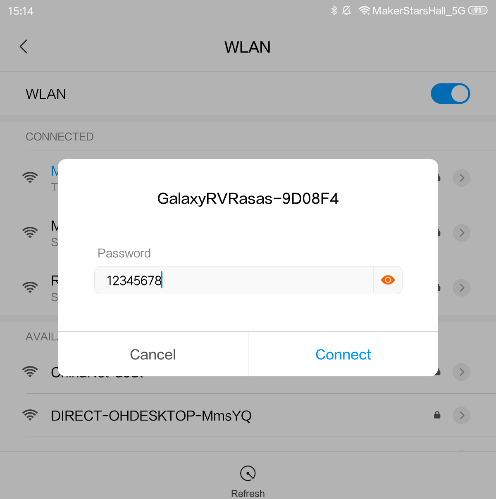

.. note:: 默认的连接模式是 **AP 模式**。连接后，可能会弹出提示，表示该网络没有互联网连接。如果是这样，选择“保持连接”。

    .. image:: ../img/app/camera_stay.png

3. 打开 APP，点击这里。

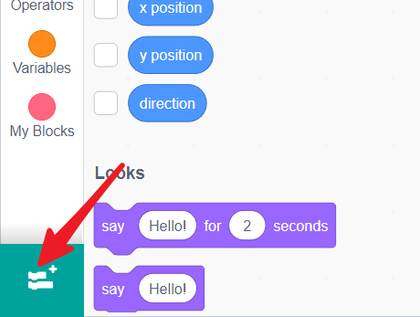

4. 加载 GalaxyRVR 模块。

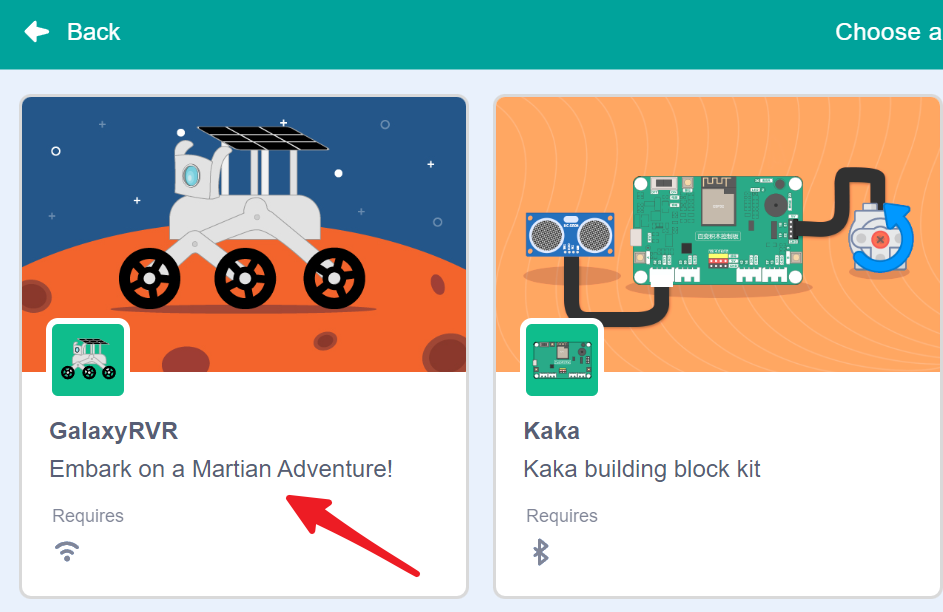

5. APP 将会搜索你的机器人。

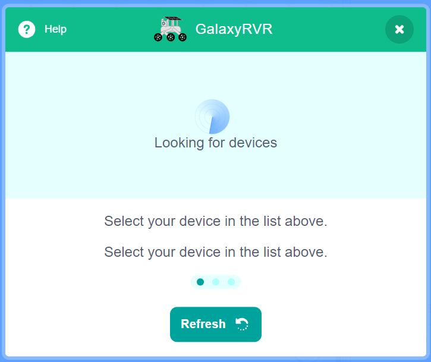

6. 连接 GalaxyRVR。

.. note:: GalaxyRVR 上的呼吸灯可以帮助指示连接状态。闪烁的黄色灯表示没有设备连接，稳定的蓝色灯表示已连接。

重新连接 APP
-------------------------------------

当你的设备与 GalaxyRVR 断开连接时，界面上会弹出一个窗口，点击重新连接。

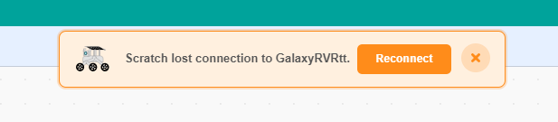

如果你关闭了弹出窗口，你也可以通过点击 GalaxyRVR 类别中的这个按钮重新连接。

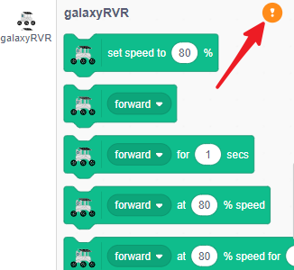

找到你的 GalaxyRVR 并点击连接。

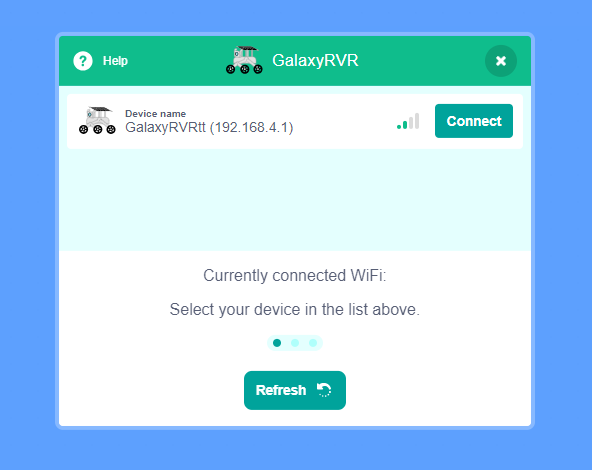

通过 APP 控制 GalaxyRVR
-----------------------------------------

1. 在代码界面，你会看到 GalaxyRVR 类别。

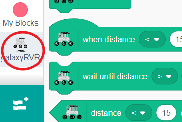

2. 我们之前已经使用绿色旗帜来启动程序。 
在这一过程中，你会发现 “事件” 类别中有多个块可以触发代码执行。 
找到 ``当上箭头键按下`` 代码块。

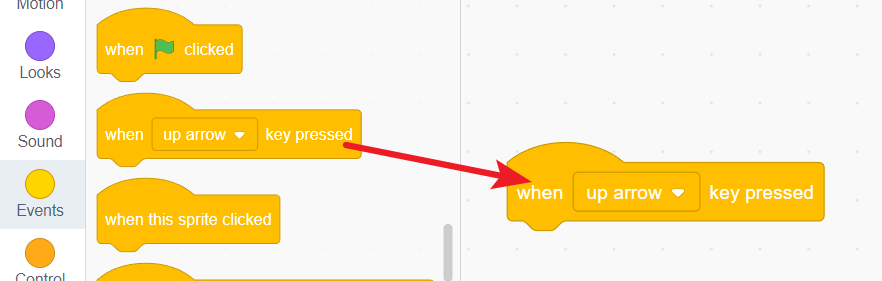

3. 拖出四个这样的代码块，分别用于四个箭头键事件（上、下、左、右）。

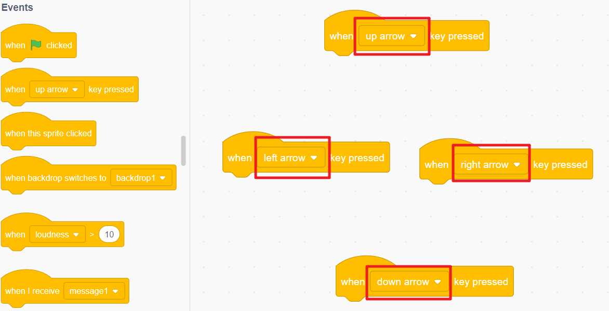

.. note:: 你可以点击绿色旗帜下方的眼睛图标来隐藏舞台区域，从而获得更多的编程空间。

4. 完成这些事件的代码块。当按下上箭头时，让 GalaxyRVR 向前移动；按下左箭头时，让其左转，依此类推。

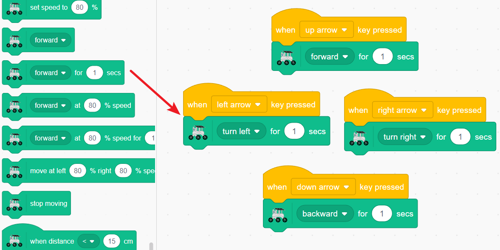

5. 点击此按钮展开舞台。

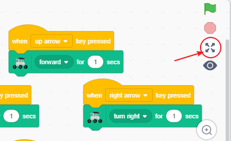

6. 你将进入一个舞台放大的界面，并显示一组方向键。

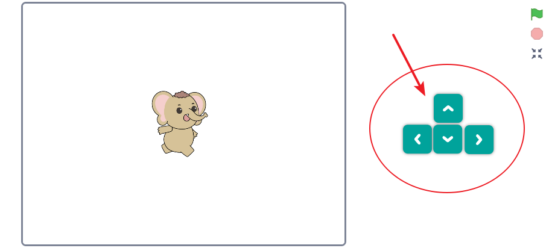

按下这些方向键，你会惊喜地发现你可以直接控制 GalaxyRVR。

与运动相关的代码块
-----------------------------

.. image:: img/block/move_forward.png 
..    :align: center

执行此代码块后，GalaxyRVR 将向前移动。你可以：

    * 从下拉菜单中选择参数来进行左转、右转或倒退。

.. image:: img/block/move_set_speed.png 
..    :align: center

此代码块用于设置 GalaxyRVR 的移动速度，但本身不会启动移动。

.. image:: img/block/move_forward_1s.png 
..    :align: center

执行此代码块后，GalaxyRVR 将向前移动 1 秒。你可以：

    * 从下拉菜单中选择参数来进行左转、右转或倒退。
    * 调整代码块中的数字来设置移动的持续时间。

.. image:: img/block/move_forward_80.png 
..    :align: center

执行此代码块后，GalaxyRVR 将以 80% 的速度向前移动。你可以：

    * 从下拉菜单中选择参数来进行左转、右转或倒退。
    * 修改代码块中的数字以调整移动时的速度。

.. image:: img/block/move_forward_80_1s.png 
..    :align: center

执行此代码块后，GalaxyRVR 将以 80% 的速度向前移动 1 秒。你可以：

    * 从下拉菜单中选择参数来进行左转、右转或倒退。
    * 调整代码块中的时间来设置移动的持续时间。
    * 修改速度参数来调整移动过程中的速度。

.. image:: img/block/move_lr_sp_1s.png 
..    :align: center

执行此代码块后，你可以独立设置 GalaxyRVR 左右轮的速度，并按照指定时间移动。你可以：

    * 修改左轮速度来设置 GalaxyRVR 左轮的运动速度。
    * 修改右轮速度来设置右轮的运动速度。
    * 调整时间来确定运动的持续时间。

.. image:: img/block/move_stop.png
..    :align: center

停止 GalaxyRVR 的运动。
