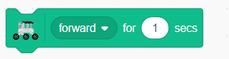
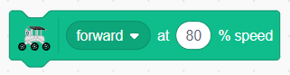
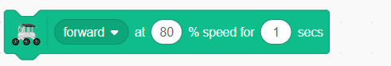
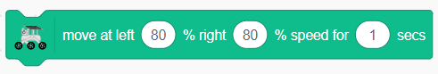
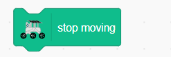

.. note::

    ¡Hola! Bienvenido a la comunidad de entusiastas de SunFounder Raspberry Pi, Arduino y ESP32 en Facebook. Sumérgete en el mundo de Raspberry Pi, Arduino y ESP32 junto a otros entusiastas.

    **¿Por qué unirse?**

    - **Soporte experto**: Resuelve problemas postventa y desafíos técnicos con la ayuda de nuestra comunidad y equipo.
    - **Aprende y comparte**: Intercambia consejos y tutoriales para mejorar tus habilidades.
    - **Vistas exclusivas**: Obtén acceso anticipado a nuevos anuncios de productos y adelantos exclusivos.
    - **Descuentos especiales**: Disfruta de descuentos exclusivos en nuestros productos más recientes.
    - **Promociones festivas y sorteos**: Participa en sorteos y promociones durante las festividades.

    👉 ¿Listo para explorar y crear con nosotros? Haz clic en [|link_sf_facebook|] y únete hoy mismo.

.. _rvr_move:

Lección 3 Control remoto de tu GalaxyRVR
==============================================

¡En esta lección, daremos vida al Mars Rover!

Usando nuestras habilidades de programación, guiaremos nuestro Rover a través de paisajes imaginarios de Marte.

Es una aventura marciana en nuestro salón de clases. ¡Empecemos!

.. raw:: html

   <video width="600" loop autoplay muted>
      <source src="../_static/video/car_move.mp4" type="video/mp4">
      Your browser does not support the video tag.
   </video>

Objetivos de aprendizaje
---------------------------

* Guiar a los estudiantes para descargar y cargar el código correspondiente en Arduino para controlar el rover con la APP.
* Aprender a usar las teclas de flecha en Mammoth Coding para controlar los movimientos del rover.
* Implementar controles básicos de movimiento para el rover: avanzar, retroceder, girar a la izquierda, girar a la derecha.

Materiales
------------

* Teléfono inteligente o tableta
* APP de Mammoth Coding
* GalaxyRVR
* Computadora

Subir el programa básico a GalaxyRVR
---------------------------------------

Para controlar el GalaxyRVR con la APP, es necesario subir un programa específico utilizando Arduino IDE.

Sigue estos pasos en tu computadora:

Descargar Arduino IDE
^^^^^^^^^^^^^^^^^^^^^

#. Visita https://www.arduino.cc/en/software#future-version-of-the-arduino-ide.

#. Descarga el IDE para la versión de tu sistema operativo.

    .. image:: img/sp_001.png

#. Instálalo.

    .. image:: img/sp_005.png

Cargar el código adaptado
^^^^^^^^^^^^^^^^^^^^^^^^^^^^

1. Enciende el interruptor de encendido del GalaxyRVR.

    .. raw:: html

        <video width="600" loop autoplay muted>
            <source src="../_static/video/play_start.mp4" type="video/mp4">
            Your browser does not support the video tag.
        </video>

2. Conecta el Arduino a la computadora con un cable USB, luego cambia el interruptor de **upload** del coche a la posición de carga.

    .. image:: ../img/camera_upload.png
        :width: 500
        :align: center

.. note:: Es el puerto USB tipo B para conectarse a Arduino, no el puerto USB tipo C para cargar.

3. Abre la carpeta galaxy-rvr-1.2.0 que descargaste. (Ha sido descargada e instalada en la sección :ref:`update_firmware`), haz doble clic para ejecutar el script ``update-arduino-firmware.bat``. Se abrirá una ventana de comandos.

    .. image:: ../img/firmware/updateFirmware.png

4. En la ventana de comandos, verás una lista de puertos serie mostrando los puertos a los que la computadora está conectada. Introduce el número de la izquierda de la lista para seleccionar el puerto del Arduino Uno. Presiona Enter para subir automáticamente.

    .. image:: ../img/firmware/selectCOM.png

5. Después de esperar a que se complete la carga, puedes desconectar el cable USB.

    .. image:: ../img/firmware/UNOupdating.png

6. Cambia el interruptor de carga nuevamente y presiona el botón de reinicio, y el coche estará listo para usar.

.. note:: Este código permite que el GalaxyRVR responda a los comandos de la APP. No necesitarás subir más código en los capítulos siguientes que usen la APP Mammoth Coding.

.. _app_connect:

Conectar la APP a GalaxyRVR
-------------------------------

1. Para activar el ESP32 CAM, mueve el interruptor de modo a la posición **Run** y presiona el botón de **reset** para reiniciar la placa R3. Entonces observarás una luz cian parpadeando en la tira inferior.

    .. raw:: html

        <video width="600" loop autoplay muted>
            <source src="_static/video/play_reset.mp4" type="video/mp4">
            Your browser does not support the video tag.
        </video>

2. Conecta tu dispositivo móvil (por ejemplo, teléfono, tableta) al punto de acceso WiFi proporcionado por GalaxyRVR. Generalmente, su SSID es ``GalaxyRVR`` y la contraseña es ``12345678``.

    .. image:: ../img/firmware/SSID.png

.. note:: El modo de conexión predeterminado es **modo AP**. Después de conectarte, podría aparecer un aviso advirtiendo que no hay acceso a internet en esta red. Si es así, elige "Permanecer conectado".

    .. image:: ../img/app/camera_stay.png

3. Abre la APP. Haz clic aquí.

    .. image:: img/connet_app_04.png

4. Carga el módulo GalaxyRVR.

    .. image:: img/connet_app_05.png

5. La APP buscará tu robot.

    .. image:: img/connet_app_06.png

6. Conéctalo.

.. note:: La luz de respiración en el GalaxyRVR puede ayudar a indicar el estado de conexión. Si parpadea en amarillo, significa que no hay dispositivos conectados. Si la luz es azul constante, significa que está conectado.

Reconectar la APP
-------------------

Cuando tu dispositivo se desconecta de GalaxyRVR, verás que aparece esta ventana emergente en la interfaz. Haz clic en reconectar.

    .. image:: img/reconnect_0.png

Si cierras la ventana emergente, también puedes reconectar haciendo clic en este botón en la categoría GalaxyRVR.

    .. image:: img/reconnect_1.png

Encuentra tu GalaxyRVR y haz clic en conectar.

    .. image:: img/reconnect_2.png

Controlar el GalaxyRVR con la APP
-----------------------------------

1. En la interfaz de Código, encontrarás la categoría GalaxyRVR.

    .. image:: img/3_rvr_catego.png

2. Hemos usado la bandera verde para iniciar programas anteriormente. 
Durante este proceso, notarás varios bloques en la categoría Eventos que activan la ejecución del código. 
Encuentra el bloque ``cuando se presione la tecla flecha arriba``.

    .. image:: img/3_rvr_when_arrow.png

3. Arrastra cuatro de estos bloques, uno para cada evento de tecla de flecha (arriba, abajo, izquierda, derecha).

    .. image:: img/3_rvr_4_arrow.png

.. note:: Puedes hacer clic en el icono de ojo debajo de la bandera verde para ocultar el área del escenario y obtener más espacio para programar.

4. Completa los bloques de código para estos cuatro eventos. Cuando se presiona la flecha arriba, haz que el GalaxyRVR avance; cuando se presiona la flecha izquierda, haz que gire a la izquierda, etc.

    .. image:: img/3_rvr_4_dir.png

5. Expande el escenario haciendo clic en este botón.

    .. image:: img/3_rvr_stage.png

6. Entrarás en una interfaz con un escenario ampliado y un conjunto de teclas de dirección.

    .. image:: img/3_rvr_stage2.png

Presiona estas teclas de dirección y te encantará ver que puedes controlar directamente el GalaxyRVR.

Bloques relacionados con el movimiento
------------------------------------------

.. image:: img/block/move_forward.png 
..    :align: center

Al ejecutar este bloque, el GalaxyRVR avanzará. Puedes:

    * Cambiar el parámetro en el menú desplegable para girar a la izquierda, girar a la derecha o retroceder.

.. image:: img/block/move_set_speed.png 
..    :align: center

Este bloque se usa para establecer la velocidad de movimiento del GalaxyRVR. No inicia el movimiento por sí solo.

..    :align: center

Al ejecutar este bloque, el GalaxyRVR avanzará durante 1 segundo. Puedes:
    
    * Cambiar el parámetro en el menú desplegable para girar a la izquierda, girar a la derecha o retroceder.
    * Ajustar el número en el bloque para establecer la duración del movimiento del GalaxyRVR.

..    :align: center

Al ejecutar este bloque, el GalaxyRVR avanzará al 80% de velocidad. Puedes:
    
    * Cambiar el parámetro en el menú desplegable para girar a la izquierda, girar a la derecha o retroceder.
    * Modificar el número en el bloque para ajustar la velocidad del GalaxyRVR durante este movimiento.

..    :align: center

Al ejecutar este bloque, el GalaxyRVR avanzará al 80% de velocidad durante 1 segundo. Puedes:
    
    * Cambiar el parámetro en el menú desplegable para girar a la izquierda, girar a la derecha o retroceder.
    * Ajustar el tiempo en el bloque para establecer la duración del movimiento.
    * Modificar la velocidad en el bloque para ajustar la velocidad del GalaxyRVR durante este movimiento.

..    :align: center

Al ejecutar este bloque, puedes establecer de forma independiente las velocidades de las ruedas izquierda y derecha del GalaxyRVR y moverte durante el tiempo especificado. Puedes:
    
    * Modificar la velocidad izquierda para establecer la velocidad de la rueda izquierda del GalaxyRVR.
    * Modificar la velocidad derecha para establecer la velocidad de la rueda derecha del GalaxyRVR.
    * Ajustar el tiempo para determinar la duración del movimiento.

..    :align: center

Detiene el movimiento del GalaxyRVR.

