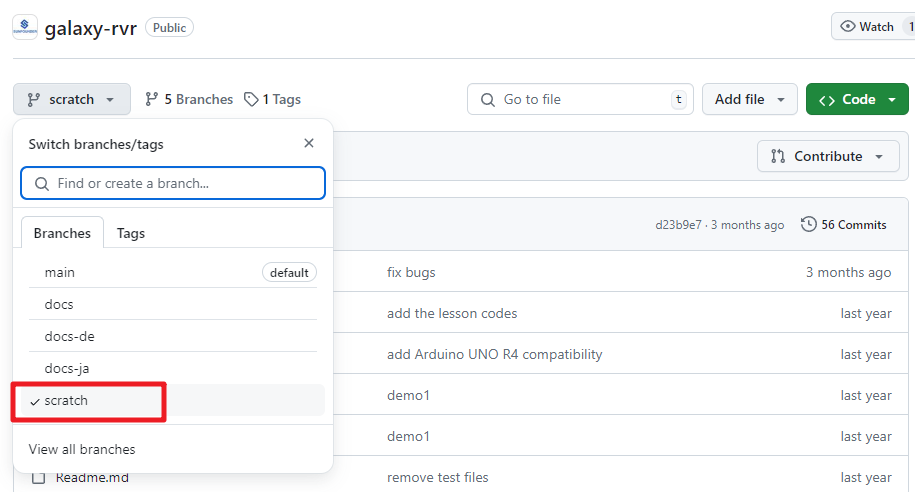
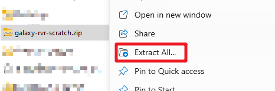
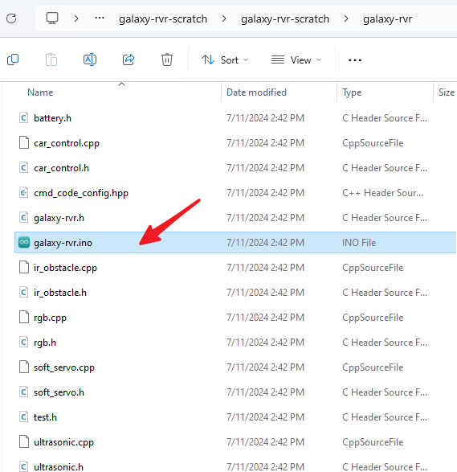
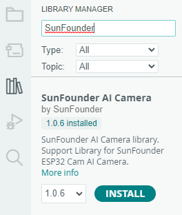
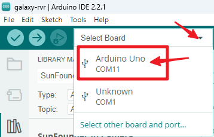
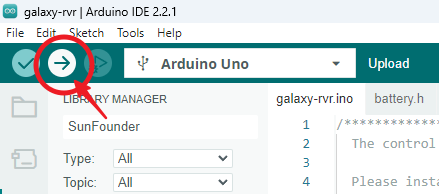
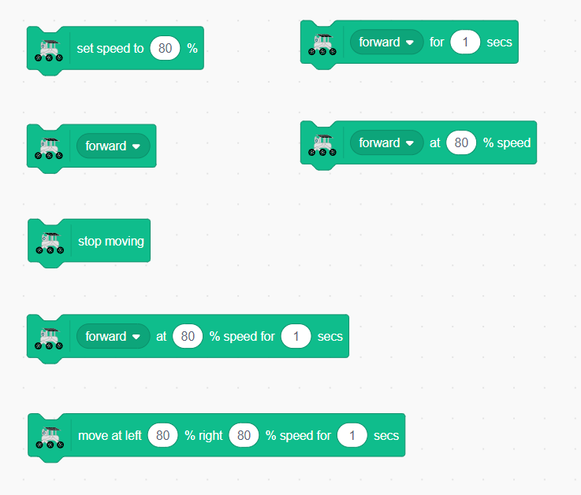

.. note::

    Hello, welcome to the SunFounder Raspberry Pi & Arduino & ESP32 Enthusiasts Community on Facebook! Dive deeper into Raspberry Pi, Arduino, and ESP32 with fellow enthusiasts.

    **Why Join?**

    - **Expert Support**: Solve post-sale issues and technical challenges with help from our community and team.
    - **Learn & Share**: Exchange tips and tutorials to enhance your skills.
    - **Exclusive Previews**: Get early access to new product announcements and sneak peeks.
    - **Special Discounts**: Enjoy exclusive discounts on our newest products.
    - **Festive Promotions and Giveaways**: Take part in giveaways and holiday promotions.

    👉 Ready to explore and create with us? Click [|link_sf_facebook|] and join today!

.. _rvr_move:

Lesson 3: Remote Control Your GalaxyRVR
============================================

In this lesson, we're bringing the Mars Rover to life!

Using our coding skills, we'll guide our Rover across imagined Martian landscapes.

It's a Martian adventure in our classroom. Let's get started!

.. raw:: html

   <video width="600" loop autoplay muted>
      <source src="../_static/video/car_move.mp4" type="video/mp4">
      Your browser does not support the video tag.
   </video>

Learning Objectives
-----------------------

* Guide students to download and upload the corresponding Arduino code to control the rover with the APP.
* Learn to use the arrow keys in Mammoth Coding to control the rover's movements.
* Implement basic movement controls for the rover: forward, backward, left turn, right turn.

Materials
-------------

* Smartphone or tablet
* Mammoth Coding APP
* GalaxyRVR
* Computer

Uploading the Basic Program to GalaxyRVR
-------------------------------------------------

To control the GalaxyRVR with the APP, you need to upload a specific program using the Arduino IDE.

Follow these steps on your computer:

Download Arduino IDE
^^^^^^^^^^^^^^^^^^^^^^^^

#. Visit https://www.arduino.cc/en/software#future-version-of-the-arduino-ide .

#. Download the IDE for your OS version.

    .. image:: img/sp_001.png

#. Install it.

    .. image:: img/sp_005.png

Uploading the Adapted Code
^^^^^^^^^^^^^^^^^^^^^^^^^^^^^^^

1. Visit https://github.com/sunfounder/galaxy-rvr.git .

2. Switch the branch to ``scratch``.

4. Download the ZIP file.

.. image:: img/download_scratch_02.png

5. Extract the files.

6. Double-click to open the code.

7. Download the SunFounder AI Camera library.

8. Connect the GalaxyRVR to your computer via USB.

9. Select the port and board. The number on your COMxx may vary.

10. Click here to upload the code.

.. note:: This code enables the GalaxyRVR to respond to APP commands. You won’t need to upload any more code in the subsequent chapters that use the Mammoth Coding APP.

.. _app_connect:

Connecting the APP to GalaxyRVR
-------------------------------------------

1. Turn on the GalaxyRVR's power switch.

2. After a moment, you'll see it flash red and purple, indicating it's broadcasting a hotspot signal.

3. Connect your device with the Mammoth Coding APP to the GalaxyRVR's WiFi.

4. Open the APP. Click here.

.. image:: img/connet_app_04.png

5. Load the GalaxyRVR module.

.. image:: img/connet_app_05.png

6. The APP will search for your robot.

.. image:: img/connet_app_06.png

7. Connect it.

.. note:: The breathing light on the GalaxyRVR can help indicate the connection status. Flashing yellow means no devices are connected. A steady blue light means it’s connected.

Controlling the GalaxyRVR with the APP
-----------------------------------------

1. In the Code interface, you'll find the GalaxyRVR category.

.. image:: img/3_rvr_catego.png

2. We've previously used the green flag to start programs. 
During this process, you'll notice several blocks in the Events category that trigger code execution. 
Find the ``when up arrow key pressed`` block.

.. image:: img/3_rvr_when_arrow.png

3. Drag out four of these blocks, one for each arrow key event (up, down, left, right).

.. image:: img/3_rvr_4_arrow.png

.. note:: You can click the eye icon below the green flag to hide the stage area and gain more coding space.

4. Complete the code blocks for these four events. When the up arrow is pressed, make the GalaxyRVR move forward; when the left arrow is pressed, make it turn left, etc.

.. image:: img/3_rvr_4_dir.png

5. Expand the stage by clicking this button.

.. image:: img/3_rvr_stage.png

6. You'll enter an interface with an enlarged stage and a set of direction keys.

.. image:: img/3_rvr_stage2.png

Press these direction keys and you'll be delighted to see you can directly control the GalaxyRVR.

Blocks Related to Movement
-----------------------------

