.. note::

    ¡Hola! Bienvenido a la comunidad de entusiastas de SunFounder Raspberry Pi, Arduino y ESP32 en Facebook. Sumérgete en el fascinante mundo de Raspberry Pi, Arduino y ESP32 junto a otros apasionados.

    **¿Por qué unirse?**

    - **Soporte experto**: Resuelve problemas postventa y desafíos técnicos con la ayuda de nuestra comunidad y equipo.
    - **Aprende y comparte**: Intercambia consejos y tutoriales para mejorar tus habilidades.
    - **Preestrenos exclusivos**: Obtén acceso anticipado a nuevos anuncios de productos y adelantos exclusivos.
    - **Descuentos especiales**: Disfruta de descuentos exclusivos en nuestros productos más recientes.
    - **Promociones festivas y sorteos**: Participa en sorteos y promociones durante las festividades.

    👉 ¿Listo para explorar y crear con nosotros? Haz clic en [|link_sf_facebook|] y únete hoy mismo.

Lección 4 Ultrasonido
===========================

En nuestra última aventura, equipamos nuestro Mars Rover con "ojos" en sus lados, creando un sistema básico de evasión de obstáculos. Sin embargo, hay un punto ciego justo al frente, ¡un reto que estamos listos para superar!

Hoy, en esta lección, le daremos a nuestro Rover un nuevo sentido de "vista". Instalaremos un módulo sensor de ultrasonido, que actuará como un par de ojos centrales, ayudando a nuestro rover a detectar obstáculos directamente delante de él.

Profundizaremos en los fascinantes mecanismos de las ondas ultrasónicas y exploraremos cómo mejoran la capacidad de nuestro Rover para navegar en terrenos complejos. Con esta adición, nuestro Mars Rover será más perceptivo y ágil, listo para embarcarse en misiones de exploración más ambiciosas.

¡Únete a nosotros mientras damos un paso más en este emocionante viaje STEAM, haciendo que nuestro Mars Rover sea aún más capaz de explorar territorios inexplorados!

.. raw:: html

   <video width="600" loop autoplay muted>
      <source src="../_static/video/ultrasonic_avoid.mp4" type="video/mp4">
      Your browser does not support the video tag.
   </video>

Objetivos de aprendizaje
---------------------------

* Comprender el principio de medición de distancia por ultrasonido.
* Aprender a usar la APP Mammoth Coding y el módulo de ultrasonido para la medición de distancias.
* Practicar la aplicación del módulo de ultrasonido para evitar obstáculos en el GalaxyRVR.

Materiales
-------------

* Teléfono inteligente o tableta
* APP Mammoth Coding
* GalaxyRVR

Explorando el Módulo Ultrasonido
--------------------------------------------

Conozcamos el HC-SR04, un poderoso sensor de distancia ultrasónico. Este pequeño dispositivo puede medir con precisión distancias desde 2 cm hasta 400 cm, ¡sin tocar nada! Asombroso, ¿verdad? ¡Es como tener un superpoder! Puede "ver" distancias usando ondas sonoras, al igual que un murciélago navega por la noche.

Utiliza cuatro superpoderes, o mejor dicho, cuatro pines para hacer su magia:

.. image:: ../img/ultrasonic_pic.png
    :width: 400
    :align: center

* **TRIG (Entrada de pulso de disparo)** - Es el botón de inicio de nuestro superhéroe. Le dice: "¡Es hora de enviar una onda sónica!"
* **ECHO (Salida de pulso de eco)** - Así es como nuestro superhéroe escucha el eco de la onda sonora que envió.
* **VCC** - Incluso los superhéroes necesitan energía. Lo conectamos a una fuente de alimentación de 5V.
* **GND** - Es la conexión a tierra. ¡Igual que los superhéroes necesitan mantenerse conectados a la realidad!

Imagina a nuestro superhéroe, el Sensor Ultrasónico HC-SR04, jugando un juego de eco en las montañas.

.. image:: ../img/ultrasonic_prin.jpg
    :width: 800

* Primero, el cerebro de nuestro superhéroe, el MCU, dice "¡Listo, prepárate, ya!" enviando una señal de alto nivel durante al menos 10 microsegundos. Es como cuando reunimos nuestra energía antes de gritar en un valle.
* Al oír "¡Ya!", nuestro superhéroe grita fuerte 8 veces rápidamente. Este grito súper sónico se envía a una velocidad de 40 kHz. El superhéroe también inicia un cronómetro y espera el eco.
* Si hay un obstáculo al frente, el grito chocará contra él y rebotará. Al escuchar el eco, nuestro superhéroe detiene el cronómetro y anota el tiempo. También envía una señal de alto nivel al MCU para avisar que ha escuchado el eco.
* Finalmente, para averiguar qué tan lejos está el obstáculo, nuestro superhéroe usa una fórmula simple. Toma el tiempo registrado en el cronómetro, lo divide por 2 y lo multiplica por la velocidad del sonido (340m/s). ¡El resultado es la distancia al obstáculo!

Así es como nuestro sensor superhéroe puede determinar si hay un obstáculo en su camino y a qué distancia se encuentra. Increíble, ¿verdad? A continuación, aprenderemos cómo podemos usar este superpoder en nuestro Mars Rover.

Valores de Detección del Módulo de Distancia Ultrasónico
-----------------------------------------------------------

1. Vamos a ver cuáles son los valores de detección del módulo de distancia ultrasónico. Primero, :ref:`app_connect`.

2. Encuentra el bloque "distancia en cm" en la categoría GalaxyRVR. Marca su casilla.

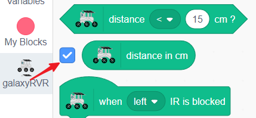

3. Esto mostrará su valor en el escenario.

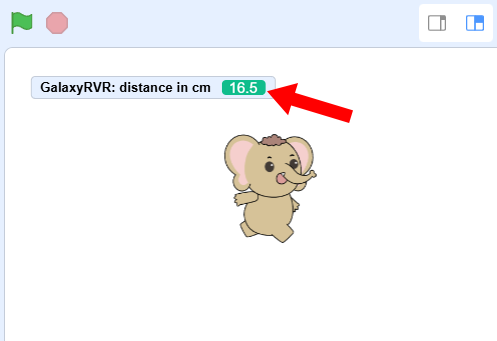

4. Mueve tu mano hacia adelante y hacia atrás frente al módulo ultrasónico, y verás la distancia entre tu mano y el módulo mostrada en el escenario. La unidad es cm.

Respondiendo al Módulo de Distancia Ultrasónico
---------------------------------------------------

Podemos usar el módulo de evasión de obstáculos por infrarrojos para hacer que el GalaxyRVR evite automáticamente los obstáculos al frente.

1. Arrastra un bloque de bandera verde pequeña.

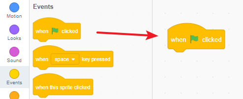

2. Establece la velocidad. Aquí la configuramos al 30%, para que no sea demasiado rápido, facilitando la depuración.

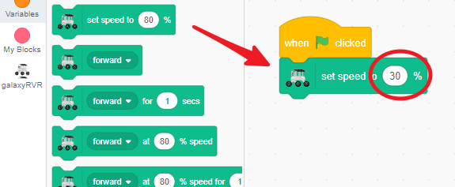

3. Coloca un bloque de avanzar para mantenerlo en movimiento cuando no haya obstáculos.

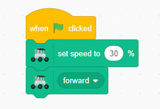

4. Encuentra el bloque ``when distance < 15 cm``.

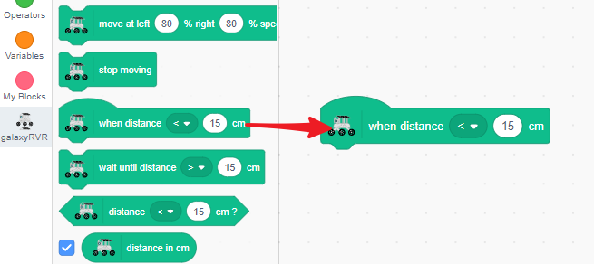

5. Cuando se detecta un obstáculo, el GalaxyRVR deja de moverse y retrocede.

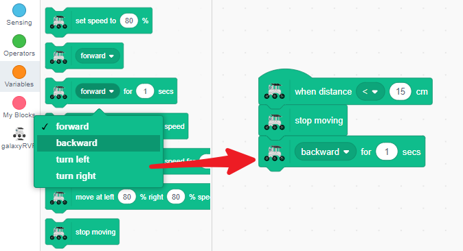

6. Gira ligeramente (a la izquierda o a la derecha).

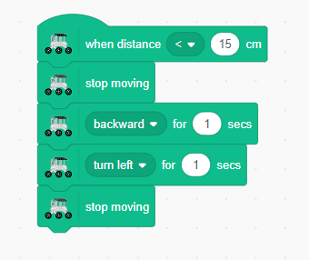

7. Después de completar el giro, avanza de nuevo.

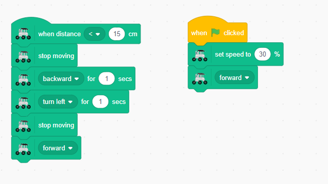

Ahora, coloca el GalaxyRVR en el suelo y continuará avanzando hasta que encuentre un obstáculo directamente al frente, momento en el que cambiará de dirección.

Bloques Relacionados con el Módulo Ultrasonido
---------------------------------------------------

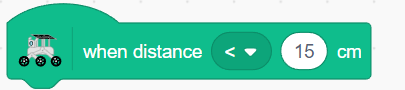

Este es un bloque de evento que se activa cuando el sensor ultrasónico detecta un obstáculo a menos de 15 cm. Puedes:

    * Cambiar ``<`` por ``>`` en el menú desplegable
    * Modificar el número para ajustar la condición del umbral

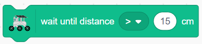

Este bloque pausa el programa hasta que el sensor ultrasónico detecte un obstáculo a más de 15 cm, y luego continúa el programa. Puedes:

    * Cambiar ``<`` por ``>`` en el menú desplegable
    * Modificar el número para ajustar la condición del umbral

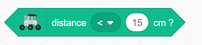

Este es un bloque condicional que devuelve VERDADERO si la distancia detectada por el sensor ultrasónico es menor de 15 cm, de lo contrario FALSO. Se usa comúnmente en bloques condicionales como ``si``. Puedes:

    * Cambiar ``<`` por ``>`` en el menú desplegable
    * Modificar el número para ajustar la condición del umbral

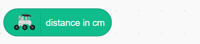

Este bloque muestra la distancia actual medida por el sensor ultrasónico.

Bloques Relacionados con el Servo
--------------------------------------

.. image:: img/block/servo_set_angle.png

Este bloque se utiliza para establecer el ángulo del servo. El rango es de 0 a 180 grados (sin embargo, debido a limitaciones estructurales, el rango utilizable real es de 0 a 135 grados).

.. image:: img/block/servo_increase_angle.png

Este bloque incrementa (o disminuye) el ángulo del servo. El valor puede ser negativo.

.. image:: img/block/servo_value.png

El ángulo actual del servo.

