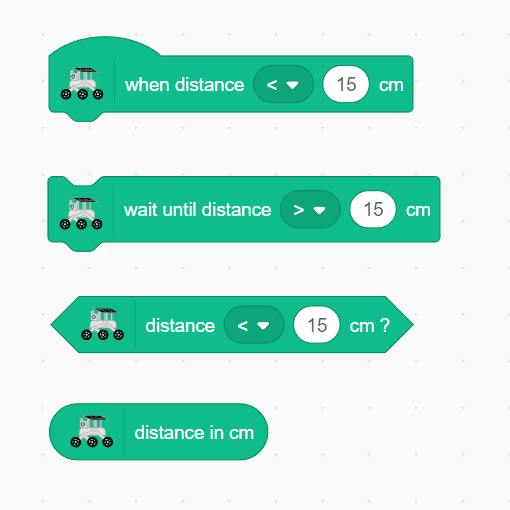

.. note::

    Hello, welcome to the SunFounder Raspberry Pi & Arduino & ESP32 Enthusiasts Community on Facebook! Dive deeper into Raspberry Pi, Arduino, and ESP32 with fellow enthusiasts.

    **Why Join?**

    - **Expert Support**: Solve post-sale issues and technical challenges with help from our community and team.
    - **Learn & Share**: Exchange tips and tutorials to enhance your skills.
    - **Exclusive Previews**: Get early access to new product announcements and sneak peeks.
    - **Special Discounts**: Enjoy exclusive discounts on our newest products.
    - **Festive Promotions and Giveaways**: Take part in giveaways and holiday promotions.

    👉 Ready to explore and create with us? Click [|link_sf_facebook|] and join today!

Lesson 4 Ultrasonic
===========================

In our last adventure, we equipped our Mars Rover with "eyes" on its sides, creating a basic obstacle avoidance system. Yet, there's a blind spot right in front – a challenge we're ready to overcome!

Today, in this lesson, we're going to give our Rover a new sense of "sight." We'll install an ultrasonic sensor module, acting as a pair of central eyes, which will help our rover detect obstacles directly ahead.

We will delve into the fascinating mechanics of ultrasonic waves and explore how they enhance our Rover's ability to navigate complex terrains. With this addition, our Mars Rover will be more perceptive and agile, ready to embark on more ambitious exploratory missions.

Join us as we take a step further into this exciting STEAM journey, making our Mars Rover even more adept at exploring the uncharted territories!

.. raw:: html

   <video width="600" loop autoplay muted>
      <source src="_static/video/ultrasonic_avoid.mp4" type="video/mp4">
      Your browser does not support the video tag.
   </video>

Learning Objectives
-------------------------

* Understand the principle of ultrasonic distance measurement.
* Learn how to use Mammoth Coding APP and ultrasonic module for distance measurement.
* Practice applying the ultrasonic module for obstacle avoidance on the GalaxyRVR.

Materials
-----------

* Smartphone or tablet
* Mammoth Coding APP
* GalaxyRVR

Exploring the Ultrasonic Module
--------------------------------------------

Let's get to know the HC-SR04, a powerful ultrasonic distance sensor. This tiny device can accurately measure distances from 2 cm up to 400 cm, all without touching a thing! Amazing, right? It's like having a superhero power! It can "see" distances just by using sound waves, like how a bat navigates at night.

It uses four superpowers, or rather, four pins to do its magic:

.. image:: ../img/ultrasonic_pic.png
    :width: 400
    :align: center

* **TRIG (Trigger Pulse Input)** - It's the start button for our superhero. It tells our superhero, "Hey, it's time to send out a super sonic wave!"
* **ECHO (Echo Pulse Output)** - This is how our superhero listens to the echo of the sound wave it sent out.
* **VCC** - Even superheroes need some energy. We connect it to a 5V power supply.
* **GND** - It's the ground connection. Just like how superheroes need to stay connected to reality!

Imagine our superhero, the HC-SR04 Ultrasonic Sensor, playing a game of echo in the mountains.

.. image:: ../img/ultrasonic_prin.jpg
    :width: 800

* First, our superhero's brain, the MCU, says, "Ready, Set, Go!" by sending out a high-level signal for at least 10 microseconds to our superhero. This is like when we gather our energy before we yell into a valley.
* On hearing "Go!", our superhero shouts out loud 8 times very quickly. This super-sonic shout is sent out at a speed of 40 kHz. The superhero also starts a stopwatch and keeps an ear out for any returning shouts.
* If there is an obstacle in front, the shout will hit it and echo back. On hearing the echo, our superhero stops the stopwatch and notes the time. It also sends out a high-level signal to let the MCU know it heard an echo.
* Lastly, to find out how far away the obstacle is, our superhero uses a simple formula. It takes the time it recorded on the stopwatch, divides it by 2, and multiplies it by the speed of sound (340m/s). The result is the distance to the obstacle!

That's how our superhero sensor can figure out if there's an obstacle in its path and how far away it is. Amazing, isn't it? Next, we'll learn how we can use this superhero power in our Mars Rover!

Ultrasonic Distance Module Detection Values
----------------------------------------------------------

1. Let's see what the detection values of the ultrasonic distance module are. First, :ref:`app_connect` .

2. Find the "distance in cm" block under the GalaxyRVR category. Check its checkbox.

.. image:: img/6_ultrasonic_value.png

3. This will display its value on the stage.

.. image:: img/6_ultrasonic_value2.png

4. Move your hand back and forth in front of the ultrasonic module, and you will see the distance between your hand and the module displayed on the stage. The unit is cm.

Responding to the Ultrasonic Distance Module
--------------------------------------------------------------------

We can use the infrared obstacle avoidance module to make the GalaxyRVR automatically avoid obstacles ahead.

1. Drag in a small green flag block.

.. image:: img/6_ultrasonic_flag.png

2. Set the speed. Here we set the speed to 30%, so it's not too fast, making it easier to debug.

.. image:: img/6_ultrasonic_speed.png

3. Place a forward block to keep it moving when there are no obstacles.

.. image:: img/6_ultrasonic_forward.png

4. Find the ``when distance < 15 cm`` block.

.. image:: img/6_ultrasonic_when.png

5. When an obstacle is detected, the GalaxyRVR stops moving and reverses.

.. image:: img/6_ultrasonic_backward.png

6. Make a slight turn (either left or right).

.. image:: img/6_ultrasonic_turn.png

7. After completing the turn, move forward again.

.. image:: img/6_ultrasonic_forward_again.png

Now, place the GalaxyRVR on the ground, and it will continue moving forward until it encounters an obstacle directly ahead, at which point it will change direction.

Blocks Related to the Ultrasonic Module
-------------------------------------------------

