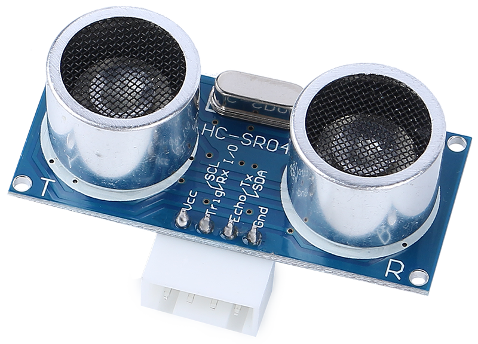

.. note::

    Hello, welcome to the SunFounder Raspberry Pi & Arduino & ESP32 Enthusiasts Community on Facebook! Dive deeper into Raspberry Pi, Arduino, and ESP32 with fellow enthusiasts.

    **Why Join?**

    - **Expert Support**: Solve post-sale issues and technical challenges with help from our community and team.
    - **Learn & Share**: Exchange tips and tutorials to enhance your skills.
    - **Exclusive Previews**: Get early access to new product announcements and sneak peeks.
    - **Special Discounts**: Enjoy exclusive discounts on our newest products.
    - **Festive Promotions and Giveaways**: Take part in giveaways and holiday promotions.

    👉 Ready to explore and create with us? Click [|link_sf_facebook|] and join today!

Lesson 4: Ultrasonic Module
=============================

Give your GalaxyRVR the power to "see" with sound! 

Discover how ultrasonic sensors work like a bat's echolocation - sending out sound waves and listening for echoes to detect obstacles and measure distances.

Make your Mars Rover smarter and safer as it explores!

.. raw:: html

   <video width="600" loop autoplay muted>
      <source src="../_static/video/ultrasonic_avoid.mp4" type="video/mp4">
      Your browser does not support the video tag.
   </video>

Learning Objectives
-------------------

* Discover how ultrasonic sensors use sound waves to measure distance
* Learn to read distance measurements using the Mammoth Coding APP
* Program your GalaxyRVR to avoid obstacles using the ultrasonic sensor

Exploring the Ultrasonic Module
--------------------------------------------

Meet the HC-SR04 ultrasonic sensor - your rover's new "superpower" for seeing distances without touching anything! Just like bats use sound to navigate, this clever device can detect objects from 2cm to 400cm away.

**Meet the Four Important Pins:**

* **TRIG** - The "start button" that tells the sensor to send out sound waves
* **ECHO** - Listens for the returning echo from objects
* **VCC** - Power connection (needs 5V electricity)
* **GND** - Ground connection (completes the circuit)

**How It Works - The Echo Game:**

.. image:: img/ultrasonic_prin.jpg
    :width: 800

1. **START** - The sensor sends out 8 quick sound waves (too high for us to hear!)
2. **LISTEN** - It starts timing and waits for the echo to bounce back
3. **CALCULATE** - Using the echo time, it calculates: Distance = (Time × Speed of Sound) ÷ 2

Think of it like shouting in a canyon and counting how long it takes to hear your echo. The longer the wait, the farther the wall!

Now let's give your Mars Rover this amazing superpower!

Testing the Ultrasonic Sensor
----------------------------------------------------------

#. First, :ref:`app_connect`.

2. Find the "distance in cm" block in the GalaxyRVR category and check its box.

   .. image:: img/6_ultrasonic_value.png

3. The sensor's reading will now show live on the stage.

   .. image:: img/6_ultrasonic_value2.png

4. Wave your hand in front of the ultrasonic sensor and watch the number change - it's measuring the distance in centimeters!

Creating an Obstacle-Avoiding Rover
--------------------------------------------------------------------

Let's program your GalaxyRVR to automatically avoid obstacles using the ultrasonic sensor.

1. Start with the green flag block.

   .. image:: img/6_ultrasonic_flag.png

2. Set a comfortable speed (we recommend 30%) for testing.

   .. image:: img/6_ultrasonic_speed.png

3. Add a "move forward" block so the rover keeps moving when the path is clear.

   .. image:: img/6_ultrasonic_forward.png

4. Use the ``when distance < 15 cm`` block to detect nearby obstacles.

   .. image:: img/6_ultrasonic_when.png

5. When something gets too close, make the rover stop and back up.

   .. image:: img/6_ultrasonic_backward.png

6. Then have it turn slightly (left or right - your choice!).

   .. image:: img/6_ultrasonic_turn.png

7. Finally, tell it to move forward again on its new path.

   .. image:: img/6_ultrasonic_forward_again.png

Now place your GalaxyRVR on the floor and watch it go! It will cruise forward until it detects an obstacle, then smartly change direction and continue exploring.

Ultrasonic Sensor Blocks
-------------------------------------------------

* **Event Trigger Block**
  
  Starts code when an object is detected within a set distance.
  
  - Change the comparison symbol (< or >)
  - Adjust the distance threshold (in cm)

  .. image:: img/block/ultra_when.png

* **Wait Until Block**
  
  Pauses your program until the sensor detects an object at the specified distance.
  
  - Choose < or > for distance comparison
  - Set your desired distance value

  .. image:: img/block/ultra_wait_until.png

* **Condition Check Block**
  
  Returns TRUE or FALSE based on distance detection. Perfect for use with ``if`` statements.
  
  - Switch between < and > as needed
  - Set the distance limit

  .. image:: img/block/ultra_condition.png

* **Distance Value Block**
  
  Shows the current distance reading from the ultrasonic sensor in centimeters.

  .. image:: img/block/ultra_value.png

