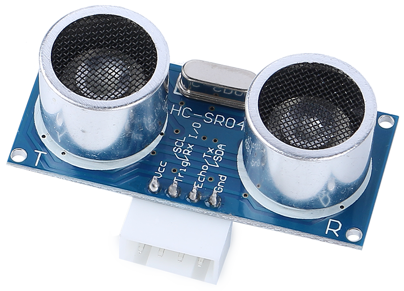
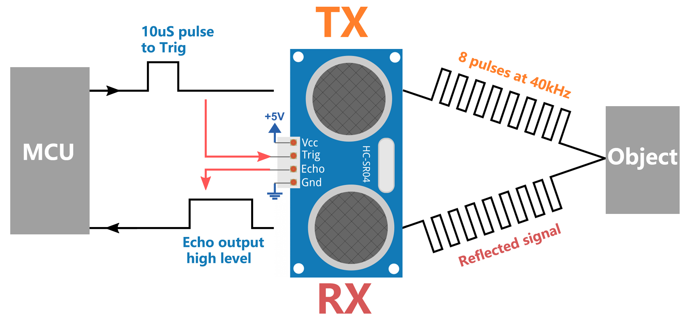

Lección 4: Módulo Ultrasónico
===============================

¡Dale a tu GalaxyRVR el poder de "ver" con sonido!

Descubre cómo los sensores ultrasónicos funcionan como la ecolocalización de los murciélagos: emitiendo ondas sonoras y escuchando los ecos para detectar obstáculos y medir distancias.

¡Haz que tu Mars Rover sea más inteligente y seguro mientras explora!

.. raw:: html

   <video width="600" loop autoplay muted>
      <source src="../_static/video/ultrasonic_avoid.mp4" type="video/mp4">
      Tu navegador no soporta la etiqueta de video.
   </video>

Objetivos de Aprendizaje
------------------------

* Descubrir cómo los sensores ultrasónicos utilizan ondas sonoras para medir distancia
* Aprender a leer mediciones de distancia usando la aplicación Mammoth Coding
* Programar tu GalaxyRVR para evitar obstáculos usando el sensor ultrasónico

Explorando el Módulo Ultrasónico
--------------------------------------------

Conoce el sensor ultrasónico HC-SR04: el nuevo "superpoder" de tu rover para ver distancias sin tocar nada. Al igual que los murciélagos usan el sonido para navegar, este inteligente dispositivo puede detectar objetos desde 2 cm hasta 400 cm de distancia.

**Conoce los Cuatro Pines Importantes:**

* **TRIG** - El "botón de inicio" que le dice al sensor que envíe ondas sonoras
* **ECHO** - Escucha el eco que regresa de los objetos
* **VCC** - Conexión de alimentación (necesita electricidad de 5V)
* **GND** - Conexión a tierra (completa el circuito)

**Cómo Funciona - El Juego del Eco:**

1. **INICIO** - El sensor envía 8 ondas sonoras rápidas (demasiado agudas para que las escuchemos)
2. **ESCUCHA** - Comienza a cronometrar y espera a que el eco regrese
3. **CALCULA** - Usando el tiempo del eco, calcula: Distancia = (Tiempo x Velocidad del Sonido) / 2

Piénsalo como gritar en un cañón y contar cuánto tarda en escuchar tu eco. Cuanto más espere, más lejos está la pared.

Ahora dale a tu Mars Rover este increíble superpoder.

Probando el Sensor Ultrasónico
----------------------------------------------------------

#. Primero, :ref:`app_connect`.

2. Encuentra el bloque "distance in cm" en la categoría GalaxyRVR y marca su casilla.

   .. image:: img/6_ultrasonic_value.png

3. La lectura del sensor se mostrará ahora en vivo en el escenario.

   .. image:: img/6_ultrasonic_value2.png

4. Agita tu mano frente al sensor ultrasónico y observa cómo cambia el número: está midiendo la distancia en centímetros.

Creando un Rover que Evita Obstáculos
--------------------------------------------------------------------

Programemos tu GalaxyRVR para que evite obstáculos automáticamente usando el sensor ultrasónico.

1. Comienza con el bloque de bandera verde.

   .. image:: img/6_ultrasonic_flag.png

2. Establece una velocidad cómoda (recomendamos 30%) para las pruebas.

   .. image:: img/6_ultrasonic_speed.png

3. Agrega un bloque "move forward" para que el rover siga avanzando cuando el camino esté despejado.

   .. image:: img/6_ultrasonic_forward.png

4. Usa el bloque ``when distance < 15 cm`` para detectar obstáculos cercanos.

   .. image:: img/6_ultrasonic_when.png

5. Cuando algo se acerque demasiado, haz que el rover se detenga y retroceda.

   .. image:: img/6_ultrasonic_backward.png

6. Luego haz que gire ligeramente (izquierda o derecha, tu elección).

   .. image:: img/6_ultrasonic_turn.png

7. Finalmente, dile que avance nuevamente en su nuevo camino.

   .. image:: img/6_ultrasonic_forward_again.png

Ahora coloca tu GalaxyRVR en el suelo y mira cómo se mueve. Avanzará hasta que detecte un obstáculo, luego cambiará inteligentemente de dirección y continuará explorando.

Bloques del Sensor Ultrasónico
-------------------------------------------------

* **Bloque de Disparo de Evento**

  Inicia el código cuando se detecta un objeto dentro de una distancia establecida.

  - Cambia el símbolo de comparación (< o >)
  - Ajusta el umbral de distancia (en cm)

  .. image:: img/block/ultra_when.png

* **Bloque de Espera Hasta**

  Pausa tu programa hasta que el sensor detecte un objeto a la distancia especificada.

  - Elige < o > para la comparación de distancia
  - Establece el valor de distancia deseado

  .. image:: img/block/ultra_wait_until.png

* **Bloque de Verificación de Condición**

  Devuelve VERDADERO o FALSO según la detección de distancia. Perfecto para usar con instrucciones ``if``.

  - Cambia entre < y > según sea necesario
  - Establece el límite de distancia

  .. image:: img/block/ultra_condition.png

* **Bloque de Valor de Distancia**

  Muestra la lectura actual de distancia del sensor ultrasónico en centímetros.

  .. image:: img/block/ultra_value.png

