.. note::

    Hello, welcome to the SunFounder Raspberry Pi & Arduino & ESP32 Enthusiasts Community on Facebook! Dive deeper into Raspberry Pi, Arduino, and ESP32 with fellow enthusiasts.

    **Why Join?**

    - **Expert Support**: Solve post-sale issues and technical challenges with help from our community and team.
    - **Learn & Share**: Exchange tips and tutorials to enhance your skills.
    - **Exclusive Previews**: Get early access to new product announcements and sneak peeks.
    - **Special Discounts**: Enjoy exclusive discounts on our newest products.
    - **Festive Promotions and Giveaways**: Take part in giveaways and holiday promotions.

    👉 Ready to explore and create with us? Click [|link_sf_facebook|] and join today!

Lesson 5 Interactive Animation
===============================================

Previously, we used the ultrasonic module to make GalaxyRVR automatically avoid obstacles in its path.

In this activity, we will combine the module with a stage to create an interactive animation of a rover joyfully traversing the surface of Mars.

.. raw:: html

   <video width="600" loop autoplay muted>
      <source src="./_static/video/sc_animate_jump.wmv" type="video/wmv">
      Your browser does not support the video tag.
   </video>

Learning Objectives
-------------------------

* Learn how to draw sprites and edit backgrounds.
* Understand basic programming concepts such as event listeners and loop structures.
* Get familiar with the APP programming environment and basic operations to create a simple animation simulating a Mars rover.

Materials
-----------

* Smartphone or tablet
* Mammoth Coding APP
* GalaxyRVR

Adding New Sprites
----------------------------

In the bottom right corner of the interface, you will see the "choose a sprite" button. Tap it to reveal four pull-up options.

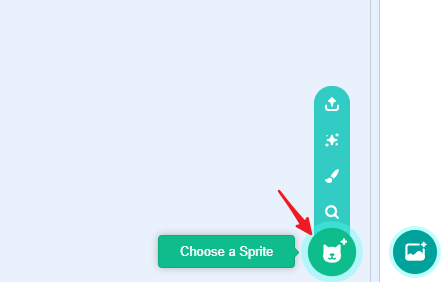

For smaller screens, you might need to navigate to a different screen to see this button.

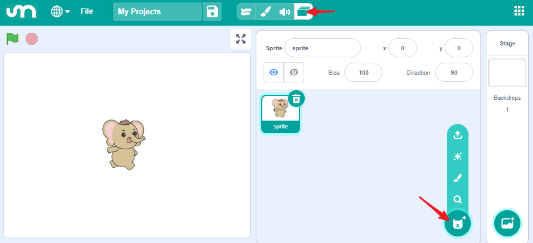

The four options are:

* **Upload Sprite** : Load a sprite from your device storage.
* **Surprise** : Randomly select a sprite from the library.
* **Paint** : Draw a sprite.
* **Choose a Sprite** : Open the library to choose a sprite.

Next, we will use **Choose a Sprite** to select a sprite and **Paint** to draw a sprite.

**Choose a Sprite**

Click "choose a sprite" (magnifier icon) to enter the library, which provides a wealth of resources for your stage.

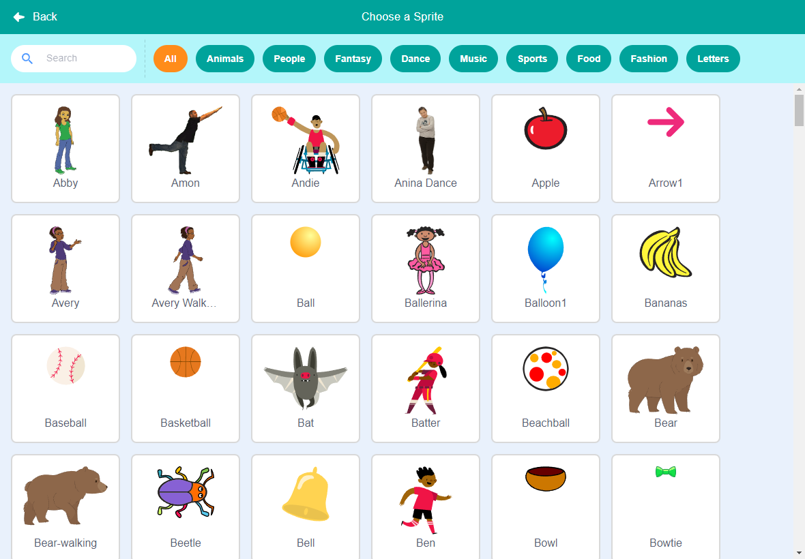

Find and select GalaxyRVR from the library.

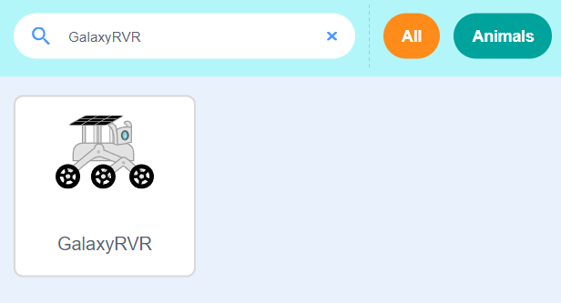

**Paint a New Sprite**

We are going to create a "Mars" sprite, but unfortunately, there is no suitable resource in the library.

Therefore, we will select **Paint** (brush icon) and draw one ourselves.

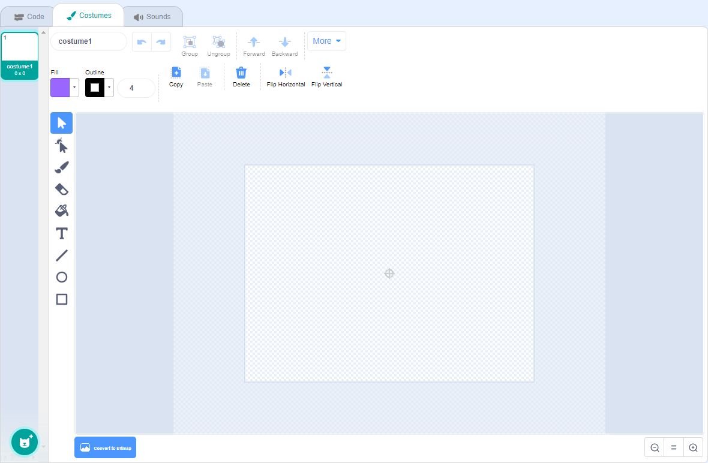

First, use the circle tool to draw a circle representing the planet.

.. image:: img/2_create_custom_circle.png
    :align: center

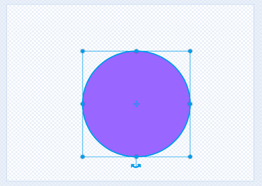

Then, use the pointer tool to move the circle so that it aligns with the center of the canvas.
This step is crucial because the coordinates, direction, and movements of your sprite are based on its center point.

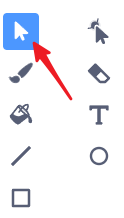

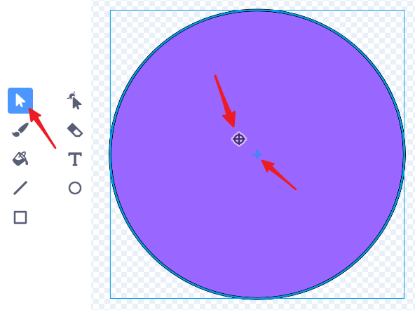

Use the paint bucket tool to color the planet red.

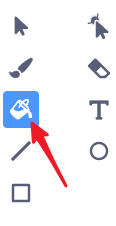

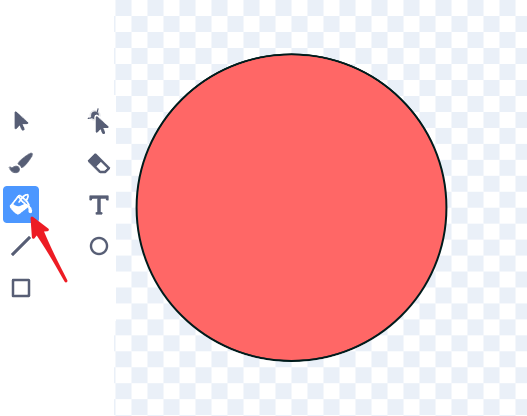

Next, select the brush tool, increase its size, and choose a suitable color from the fill options to add texture to Mars.

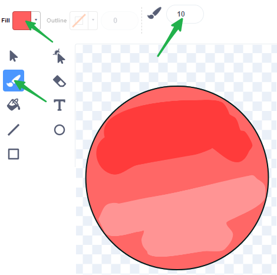

.. image:: img/2_create_custom4.png
    :align: center

If you find the color unsuitable after painting, you can change the fill color and use the paint bucket tool to fill the shape again.

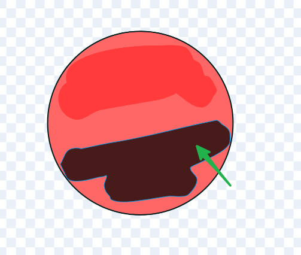

Select the brush again, set the size to 2, and change the color to black. Use your creativity to add craters and details to Mars.

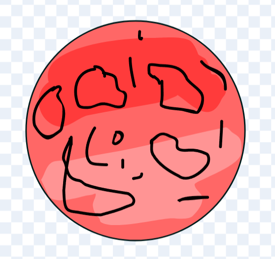

Using the Paint Bucket Tool, choose an appropriate color to fill these craters.

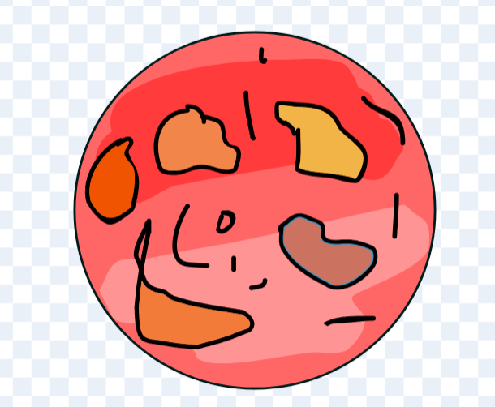

Once finished, switch back to the Code interface. Your Mars sprite is now complete.

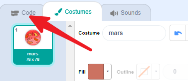

For smaller screens, switch back to the Code interface by clicking here.

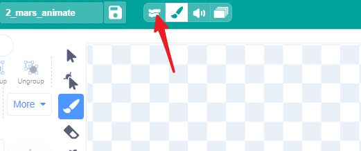

You will see the Mars sprite on the stage. Don't forget to rename it.

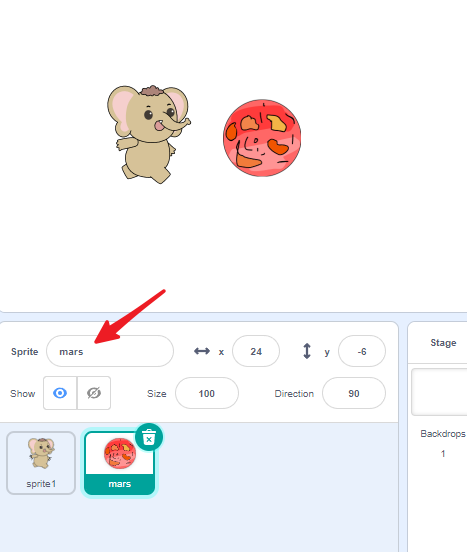

**Stage**

Click on backdrops. The current backdrop is white; we need to make it darker to simulate the night sky.

1. Click on the Backdrops of the stage.

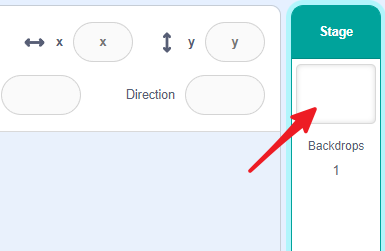

2. Enter the Backdrops interface.

2. Draw a rectangle.

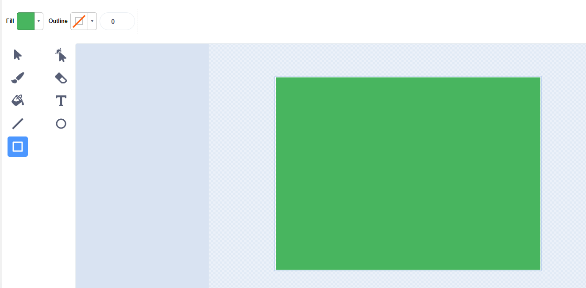

3. Use the paint bucket to fill it with a dark color.

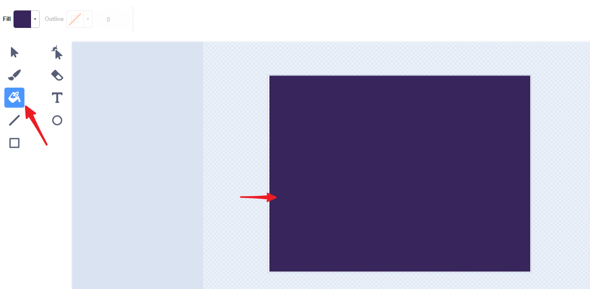

4. Use the brush tool to add some stars.

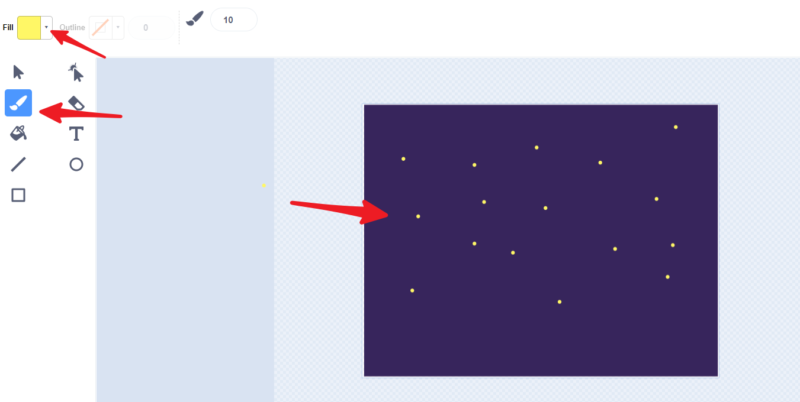

Creating the Animation
-------------------------------

Now that we have Mars and GalaxyRVR, and we know how to animate sprites, let's create an animation of GalaxyRVR moving on Mars.
We can make the sprite appear to move by rotating Mars in the opposite direction, creating the effect of GalaxyRVR moving across its surface.

First, delete any unnecessary sprites.

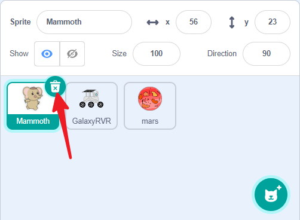

Adjust the size and position of the sprites, set the coordinates of the GalaxyRVR sprite to 0,0, and place it on Mars.

.. image:: img/6_jump_place.png
    :align: center

**Mars Sprite**

Select the Mars sprite. Its task is to rotate counterclockwise, creating the illusion that GalaxyRVR is moving forward.

1. Drag a green flag block. All animation starts with the green flag.

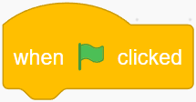

2. Drag a ``forever`` block to keep the animation running continuously.

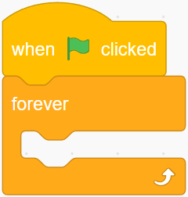

3. Drag a ``turn`` block and a ``wait`` block to make Mars rotate continuously.

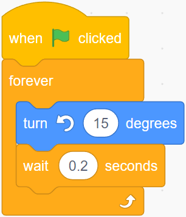

Now click the green flag, and you will see Mars rotating counterclockwise.

**GalaxyRVR Sprite**

Select the GalaxyRVR sprite. Its task is to animate as if it’s moving, even though it isn’t actually moving.

1. Drag a green flag block. All animation starts with the green flag.

2. Drag a ``forever`` block to keep the animation running continuously.

3. Drag a ``next costume`` block and a ``wait`` block to make GalaxyRVR continuously animate.

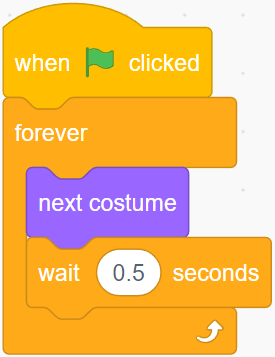

**Adding More Fun**

We can add interactivity to this animation by using the ultrasonic module to make the GalaxyRVR sprite jump to avoid obstacles.

1. Drag a ``when distance`` block. This will trigger when the ultrasonic module detects an obstacle (e.g., your hand).

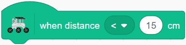

2. Drag two ``glide`` blocks and change the y-value of the first one to make the sprite jump up and then come down, creating a jumping effect.

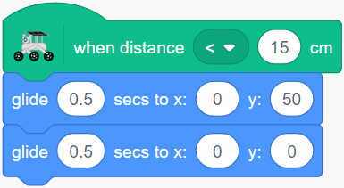

3. The complete code for the GalaxyRVR sprite should look like this:

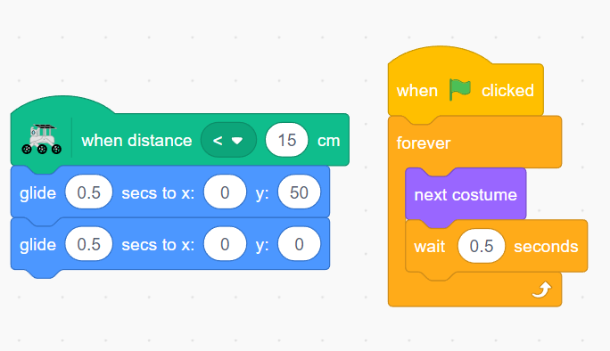

Now, click the green flag to start the animation. Simulate an obstacle by placing your hand in front of the ultrasonic module, and the GalaxyRVR sprite will jump to avoid it.

