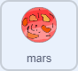
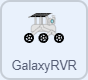

第五课 互动动画
===============================================

之前，我们利用超声波模块使 GalaxyRVR 能够自动避开路径中的障碍物。

在本次活动中，我们将结合模块和舞台，创建一个互动动画，展示火星探测车愉快地穿越火星表面的场景。

.. raw:: html

   <video width="600" loop autoplay muted>
      <source src="../_static/video/sc_animate_jump.mp4" type="video/mp4">
      Your browser does not support the video tag.
   </video>

学习目标
-------------------------

* 学习如何绘制角色和编辑背景。
* 理解基本的编程概念，如事件监听器和循环结构。
* 熟悉 APP 编程环境和基本操作，创建一个简单的模拟火星探测车动画。

所需材料
-----------

* 智能手机或平板电脑
* Mammoth 编程 APP
* GalaxyRVR

添加新角色
----------------------------

删除不需要的角色。

.. image:: img/6_animate_delete.png
..   :align: left

在界面右下角，你会看到“选择角色”按钮。点击它，会弹出四个选项。

.. image:: img/2_create_sp.png
..  :align: left

对于较小的屏幕，可能需要切换到其他屏幕才能看到此按钮。

.. image:: img/2_create_sp0.png
..  :align: left

四个选项分别是：

* **上传角色**：从设备存储中加载角色。
* **惊喜**：从角色库中随机选择一个角色。
* **绘制**：自己绘制一个角色。
* **选择角色**：打开库选择一个角色。

接下来，我们将使用 **选择角色** 选择一个角色，并使用 **绘制** 绘制一个角色。

**选择角色**

点击“选择角色”（放大镜图标）进入角色库，在这里你可以找到丰富的资源来装饰你的舞台。

.. image:: img/2_sp_list.png
.. :align: left

在库中找到并选择 GalaxyRVR。

.. image:: img/2_sprite_rvr.png
.. :align: left

**绘制新角色**

我们打算绘制一个“火星”角色，但库中没有合适的资源。

因此，我们将选择 **绘制** （画笔图标），自己来绘制一个。

.. image:: img/2_create_custom.png
.. :align: left

首先，使用圆形工具绘制一个代表火星的圆形。

.. image:: img/2_create_custom1.png
.. :align: left

然后，使用指针工具移动圆形，使其居中于画布。这一步非常关键，因为角色的坐标、方向和运动都是基于其中心点的。

.. image:: img/2_create_custom2.png
.. :align: left

使用油漆桶工具将火星涂成红色。

.. image:: img/2_create_custom3.png
.. :align: left

接着，选择画笔工具，增大笔刷的大小，从填充选项中选择合适的颜色，给火星添加纹理。

.. image:: img/2_create_custom_pen.png
.. :align: left

如果你觉得颜色不合适，可以修改填充颜色，并再次使用油漆桶工具重新填充形状。

.. image:: img/2_create_custom5.png
.. :align: left

再选一次画笔工具，设置大小为 2，颜色改为黑色。发挥创意，给火星添加陨石坑和细节。

.. image:: img/2_create_custom6.png
.. :align: left

使用油漆桶工具，为这些陨石坑选择合适的颜色填充。

.. image:: img/2_create_custom7.png
.. :align: left

完成后，返回到代码界面。你的火星角色已经完成。

.. image:: img/2_create_custom8.png
.. :align: left

对于较小的屏幕，点击此处返回代码界面。

.. image:: img/2_create_custom8.1.png
.. :align: left

你将在舞台上看到火星角色，别忘了为它命名。

.. image:: img/2_create_custom9.png
.. :align: left

**舞台背景**

点击背景。当前背景为白色，我们需要将其调暗，以模拟夜空。

1. 点击舞台的背景。

.. image:: img/6_jump_backdrop.png
.. :align: left

2. 进入背景界面。

.. image:: img/6_jump_backdrop_page.png
.. :align: left

3. 绘制一个矩形。

.. image:: img/6_jump_rect.png
.. :align: left

4. 使用油漆桶工具填充深色。

.. image:: img/6_jump_fill.png
.. :align: left

5. 使用画笔工具添加一些星星。

.. image:: img/6_jump_paint.png
.. :align: left

创建动画
-------------------------------

现在我们已经有了火星和 GalaxyRVR，并且了解了如何给角色添加动画。接下来，我们将创建一个 GalaxyRVR 在火星上移动的动画。

我们可以通过让火星角色逆时针旋转，制造出 GalaxyRVR 在火星表面移动的效果。

调整角色的大小和位置，将 GalaxyRVR 的坐标设置为 (0, 0)，并将其放置在火星上。

同时调整火星角色的位置和大小，让 GalaxyRVR 角色“站”在火星上。

.. image:: img/6_jump_place.png
.. :align: left

**火星角色**

选择火星角色。它的任务是逆时针旋转，制造出 GalaxyRVR 向前移动的错觉。

.. raw:: html

     

1. 拖动一个绿色旗帜块。所有动画都从绿色旗帜开始。

.. image:: img/6_jump_mar_flag.png
.. :align: left

2. 拖动一个 ``forever`` 块，使动画持续运行。

.. image:: img/6_jump_mar_forever.png
.. :align: left

3. 拖动一个 ``turn`` 块和一个 ``wait`` 块，使火星角色持续旋转。

.. image:: img/6_jump_mar_turn.png
.. :align: left

现在点击绿色旗帜，你将看到火星逆时针旋转。

**GalaxyRVR 角色**

选择 GalaxyRVR 角色。它的任务是像在移动一样进行动画，尽管它实际上并没有移动。

.. raw:: html

     

1. 拖动一个绿色旗帜块。所有动画都从绿色旗帜开始。

.. image:: img/6_jump_mar_flag.png
.. :align: left

2. 拖动一个 ``forever`` 块，使动画持续运行。

.. image:: img/6_jump_mar_forever.png
.. :align: left

3. 拖动一个 ``next costume`` 块和一个 ``wait`` 块，使 GalaxyRVR 持续进行动画。

.. image:: img/6_jump_mar_next.png
.. :align: left

**增加更多乐趣**

我们可以通过使用超声波模块为动画增加互动性，让 GalaxyRVR 角色跳跃以避开障碍物。

请继续在 GalaxyRVR 角色中编程。

1. 拖动一个 ``when distance`` 块。当超声波模块检测到障碍物（例如你的手）时，将触发该块。

.. image:: img/6_jump_when.png
.. :align: left

2. 拖动两个 ``glide`` 块，并改变第一个块的 y 值，使角色跳起来然后再下来，创造跳跃效果。

.. image:: img/6_jump_glide.png
.. :align: left

3. GalaxyRVR 角色的完整代码应该如下所示：

.. image:: img/6_jump_mar_rvr_all.png
.. :align: left

现在，点击绿色旗帜开始动画。通过将手放在超声波模块前方模拟障碍物，GalaxyRVR 角色将跳跃避开它。
