.. note::

    Ciao, benvenuto nella community di SunFounder Raspberry Pi & Arduino & ESP32 Enthusiasts su Facebook! Approfondisci Raspberry Pi, Arduino ed ESP32 insieme agli altri appassionati.

    **Perché unirsi?**

    - **Supporto esperto**: Risolvi i problemi post-vendita e le sfide tecniche con l'aiuto della nostra comunità e del nostro team.
    - **Impara e condividi**: Scambia consigli e tutorial per migliorare le tue competenze.
    - **Anteprime esclusive**: Accedi in anteprima agli annunci di nuovi prodotti e agli sneak peek.
    - **Sconti speciali**: Approfitta di sconti esclusivi sui nostri prodotti più recenti.
    - **Promozioni festive e omaggi**: Partecipa a concorsi e promozioni durante le festività.

    👉 Sei pronto a esplorare e creare con noi? Clicca su [|link_sf_facebook|] e unisciti oggi stesso!

.. _ir_obstacle:

Lezione 6 Ostacolo IR
===========================

Oggi esploreremo il mondo del Modulo di Evasione Ostacoli a Infrarossi. Questi sensori, posizionati ai lati del nostro Rover marziano, fungono da "occhi", aiutando il rover a evitare ostacoli laterali e a navigare in sicurezza nel paesaggio marziano.

Impareremo come integrare questi moduli nel nostro rover, scopriremo la loro logica di funzionamento e svilupperemo del codice per fare in modo che il rover eviti intelligentemente ogni ostacolo che incontra.

Preparati a dotare il nostro rover di intelligenza marziana per schivare gli ostacoli! Partiamo!

.. raw:: html

   <video width="600" loop autoplay muted>
      <source src="../_static/video/car_ir1.mp4" type="video/mp4">
      Your browser does not support the video tag.
   </video>

Obiettivi di Apprendimento
---------------------------------

* Comprendere i principi di funzionamento del Modulo di Evasione Ostacoli a Infrarossi e la sua applicazione nel rover marziano.
* Imparare a leggere e applicare i dati del Modulo di Evasione Ostacoli a Infrarossi in Scratch.
* Creare un gioco a tema esplorazione marziana usando il modulo IR e il palcoscenico di Scratch.

Materiali
------------

* Smartphone o tablet
* APP Mammoth Coding
* GalaxyRVR

Svelare il Modulo
---------------------

Presentiamo il Modulo di Evasione Ostacoli a Infrarossi - il compagno intelligente del nostro rover. Questo piccolo dispositivo è una meraviglia. Facciamo un tour:

.. image:: ../img/ir_avoid.png
    :width: 300
    :align: center

Ecco la definizione dei pin:

* **GND**: È come l'ancora del modulo, collegandolo a terra o a un punto comune nel circuito.
* **+**: Qui il modulo riceve energia, richiedendo una tensione di alimentazione di 3.3-5V DC.
* **Out**: È il comunicatore del modulo. Di default, rimane alto e va basso solo quando rileva un ostacolo.
* **EN**: Questo è il controllore del modulo. Il pin **enable** decide quando il modulo deve funzionare. Di default, è collegato a GND, il che significa che il modulo è sempre attivo.

Curioso di sapere come funziona questo piccolo modulo? È piuttosto interessante! Utilizza una coppia di componenti IR - un trasmettitore e un ricevitore. Il trasmettitore è come una torcia, emettendo luce a infrarossi.
Quando compare un ostacolo, la luce infrarossa rimbalza e viene catturata dal ricevitore. Il modulo poi invia un segnale basso, avvisando il nostro rover della presenza di un ostacolo.

.. image:: ../img/ir_receive.png
    :align: center

Questo modulo è piuttosto robusto, rilevando ostacoli a una distanza di 2-40 cm e vantando eccellenti capacità anti-interferenza.
Tuttavia, il colore degli oggetti influisce sulla sua sensibilità. Gli oggetti più scuri, in particolare quelli neri, vengono rilevati a distanze più brevi.
Su un muro bianco, il sensore è più efficiente, rilevando ostacoli in un raggio di 2-30 cm.

Il pin **EN** attiva il modulo quando è a livello basso, con il ponticello che collega il pin **EN** a GND. Se desideri controllare il pin **EN** via codice, dovrai rimuovere il ponticello.

.. image:: ../img/ir_cap.png
    :width: 400
    :align: center

Il modulo ha due potenziometri, uno per regolare la potenza di trasmissione e uno per regolare la frequenza di trasmissione. Regolando questi due potenziometri puoi modificare la distanza effettiva di rilevamento.

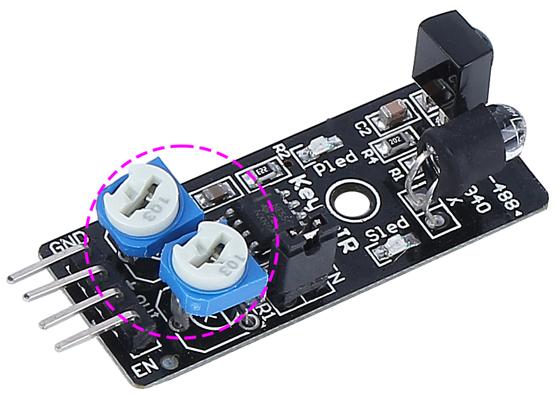

Ecco tutto sul nostro piccolo modulo. Nel prossimo passaggio, impareremo come integrarlo con il nostro rover e controllarlo tramite Arduino. Resta sintonizzato!

Valori di Rilevamento del Modulo IR
--------------------------------------------

1. Accendi il GalaxyRVR.

.. raw:: html

     

2. Abbiamo raggiunto un passaggio essenziale: regolare la distanza di rilevamento dei nostri sensori in base all'ambiente attuale. Le impostazioni di fabbrica potrebbero non essere ottimali. Se la distanza di rilevamento dei due moduli a infrarossi è troppo breve, il Rover marziano potrebbe scontrarsi con gli ostacoli. Se è troppo lunga, il Rover potrebbe iniziare a girare quando è ancora lontano dall'ostacolo, influenzando potenzialmente il suo movimento.

    Ecco come effettuare le regolazioni:

    a. Inizia regolando il modulo di evitamento degli ostacoli destro. Durante il trasporto, le collisioni potrebbero aver inclinato il trasmettitore e il ricevitore del modulo a infrarossi. Pertanto, è necessario raddrizzarli manualmente.

        .. raw:: html

            <video width="600" loop autoplay muted>
                <source src="../_static/video/ir_adjust1.mp4" type="video/mp4">
                Your browser does not support the video tag.
            </video>

    b. Posiziona un ostacolo a circa 20 cm direttamente di fronte al modulo destro. La scatola in cui era contenuto il nostro kit Rover è una buona scelta! Ora, gira il potenziometro sul modulo finché la spia sul modulo non si accende. Poi, continua a spostare l'ostacolo avanti e indietro per controllare se la spia si accende alla distanza desiderata. Se la luce non si accende alla distanza corretta o se rimane accesa senza spegnersi, dovrai regolare l'altro potenziometro.

        .. raw:: html

            <video width="600" loop autoplay muted>
                <source src="../_static/video/ir_adjust2.mp4" type="video/mp4">
                Your browser does not support the video tag.
            </video>

    c. Ripeti lo stesso processo per l'altro modulo.

3. Vediamo quali sono questi due segnali. Prima, :ref:`app_connect`.

.. raw:: html

     

4. Nella categoria GalaxyRVR, trova i blocchi di stato IR sinistro e IR destro. Questi memorizzano i risultati di rilevamento dei moduli IR. Assicurati di selezionare le caselle per questi blocchi.

    .. image:: img/4_ir_statusblock.png

5. I valori saranno ora visualizzati sul palcoscenico.

    .. image:: img/4_ir_statusvalue.png

6. Avvicina la mano ai moduli a infrarossi per attivare il rilevamento e osserva i cambiamenti dei valori sul palcoscenico.

Se i moduli IR rilevano un ostacolo, il valore sarà True; se non rilevano nulla, il valore sarà False.

Rispondere al Modulo di Evasione Ostacoli a Infrarossi
----------------------------------------------------------

Possiamo utilizzare i moduli di evitamento ostacoli a infrarossi per fare in modo che il GalaxyRVR schivi automaticamente gli ostacoli sui lati.

1. Trascina un blocco con la bandiera verde

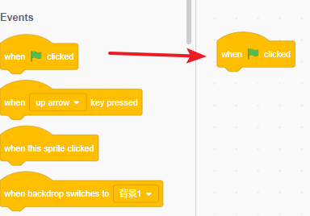

2. Imposta la velocità. Qui la impostiamo al 30%, così da non essere troppo veloce, rendendo più facile il debug.

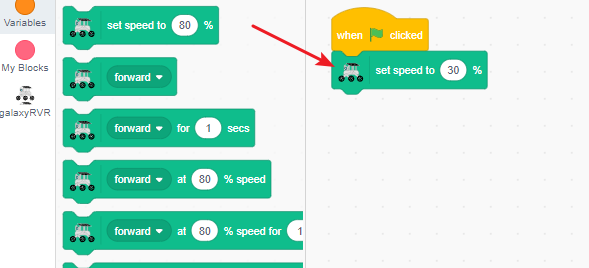

3. Trova il blocco ``quando IR sinistro è bloccato``.

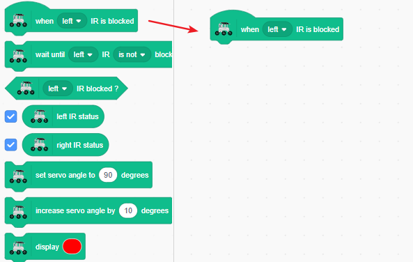

4. Quando il lato sinistro rileva un ostacolo, il GalaxyRVR dovrebbe girare a destra.

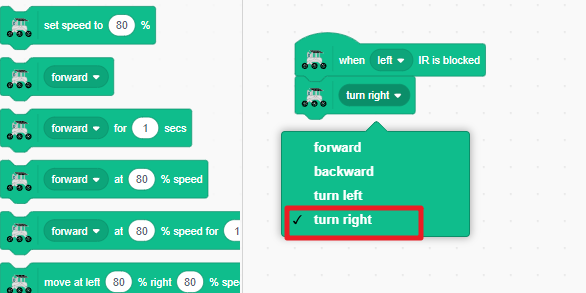

5. Continua a girare a destra finché il lato sinistro non rileva più l'ostacolo.

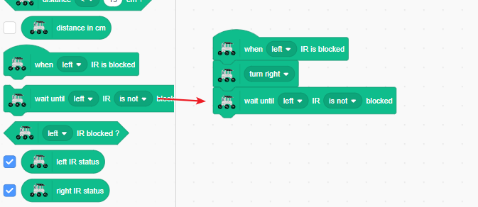

6. Ferma il movimento.

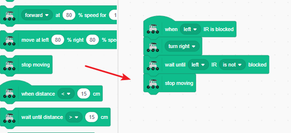

7. Una volta assemblati questi blocchi, prova a attivare il modulo di evitamento ostacoli a infrarossi sinistro con la mano. Il GalaxyRVR girerà intelligentemente a destra per evitare la tua mano.

.. raw:: html

     

8. Tieni premuti questi blocchi per far apparire un menu, da cui puoi duplicare il codice.

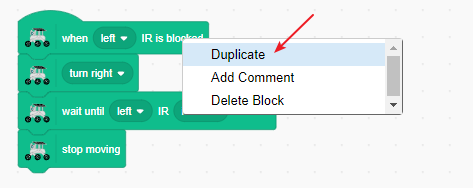

9. Nel codice duplicato, scambia i lati sinistro e destro.

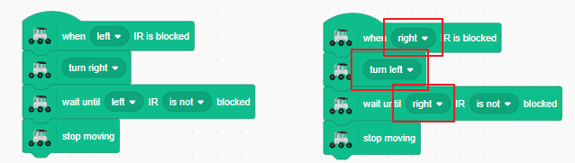

10. Noterai che se entrambi gli eventi IR vengono attivati contemporaneamente, il comportamento potrebbe diventare irregolare. Per prevenire questo, il blocco "ferma altri script nello sprite" sarà utile. Garantisce che venga risposto a un solo evento sensoriale alla volta.

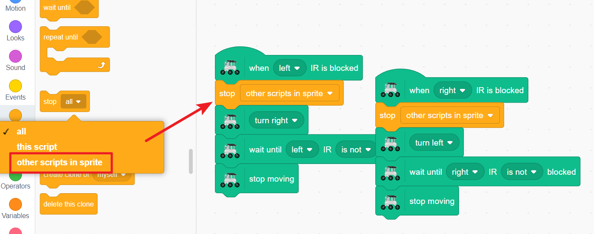

.. note:: Il blocco ferma script e i blocchi con parametri temporali (es., avanti per 1 sec) possono entrare in conflitto in alcuni casi, quindi evita di usarli insieme quando possibile.

11. Ora, il GalaxyRVR girerà a sinistra o a destra quando rileva ostacoli su entrambi i lati. Puoi testarlo attivando entrambi i sensori con la mano per far schivare il GalaxyRVR a sinistra e a destra.

.. raw:: html

     

12. Aggiungi un blocco avanti sotto ciascun blocco di codice in modo che il GalaxyRVR continui a muoversi in avanti dopo aver evitato l'ostacolo.

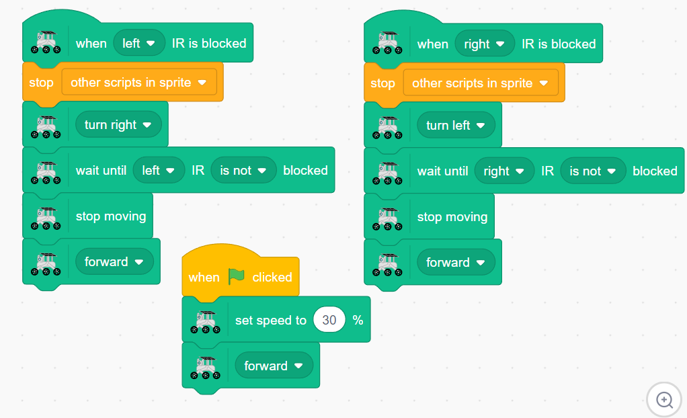

Ora, clicca sulla bandiera verde e il GalaxyRVR si muoverà continuamente in avanti, girando per evitare gli ostacoli e riprendendo il percorso dopo averli schivati.

Blocchi Relativi al Modulo IR
-------------------------------------

Questo è un blocco evento che si attiva quando il sensore IR sinistro rileva un ostacolo. Puoi:

    * Cambiare "sinistro" in "destro" nel menu a tendina

Questo blocco sospende il programma finché il sensore IR sinistro non rileva più un ostacolo, poi continua. Puoi:

    * Cambiare "sinistro" in "destro" nel primo menu a tendina
    * Cambiare "non è" in "è" nel secondo menu a tendina per operare in base alla condizione opposta

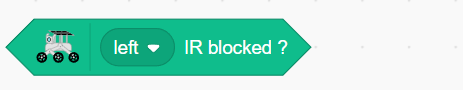

Questo è un blocco condizionale che restituisce TRUE se il sensore IR sinistro rileva un ostacolo, altrimenti FALSE. È comunemente usato in blocchi condizionali come ``se``. Puoi:

    * Cambiare "sinistro" in "destro" nel menu a tendina

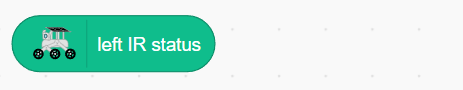

Questo blocco visualizza se il sensore IR sinistro rileva attualmente un ostacolo.

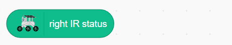

Questo blocco visualizza se il sensore IR destro rileva attualmente un ostacolo.

