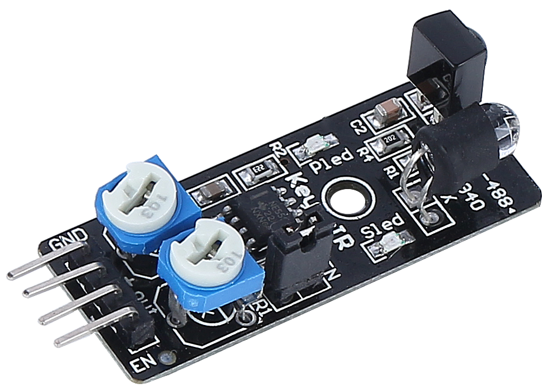

.. note::

    Hello, welcome to the SunFounder Raspberry Pi & Arduino & ESP32 Enthusiasts Community on Facebook! Dive deeper into Raspberry Pi, Arduino, and ESP32 with fellow enthusiasts.

    **Why Join?**

    - **Expert Support**: Solve post-sale issues and technical challenges with help from our community and team.
    - **Learn & Share**: Exchange tips and tutorials to enhance your skills.
    - **Exclusive Previews**: Get early access to new product announcements and sneak peeks.
    - **Special Discounts**: Enjoy exclusive discounts on our newest products.
    - **Festive Promotions and Giveaways**: Take part in giveaways and holiday promotions.

    👉 Ready to explore and create with us? Click [|link_sf_facebook|] and join today!

.. _ir_obstacle:

Lesson 6 IR Obstacle
===========================

Meet your rover's side "eyes" - the Infrared Obstacle Avoidance sensors!

These clever sensors help your GalaxyRVR detect and dodge obstacles on its sides, just like having peripheral vision. Learn how they work and program your rover to navigate around objects automatically.

Get ready to make your Mars Rover a smart obstacle-avoider!

.. raw:: html

   <video width="600" loop autoplay muted>
      <source src="../_static/video/car_ir1.mp4" type="video/mp4">
      Your browser does not support the video tag.
   </video>

Learning Objectives
-------------------------

* Understand the working principles of the Infrared Obstacle Avoidance Module and its application in the Mars rover.
* Learn how to read and apply data from the Infrared Obstacle Avoidance Module in Scratch.
* Create a Mars exploration-themed obstacle avoidance game using the IR module and the Scratch stage.

Meet the Obstacle Avoidance Module
-------------------------------------

Say hello to your GalaxyRVR's new sidekick - the Infrared Obstacle Avoidance Module! This clever little device helps your rover detect and avoid obstacles. Let's see what makes it tick:

**Meet the Four Important Pins:**

* **GND** - The ground connection (completes the circuit)
* **+** - Power input (needs 3.3V to 5V electricity)
* **Out** - Signal output (sends "obstacle detected" messages)
* **EN** - Enable pin (controls when the module is active)

**How It Works - The Invisible Flashlight:**

Think of this module as having an invisible flashlight and special glasses:

.. image:: img/ir_receive.png
    :align: center

1. The transmitter sends out infrared light (invisible to our eyes)
2. When the light hits an obstacle, it bounces back
3. The receiver "sees" the reflected light
4. The module sends a signal: "Obstacle ahead!"

**Fun Facts About Your Sensor:**

* **Detection Range**: 2-40cm (about the length of your pencil case!)
* **Color Matters**: Works best with light-colored objects
* **Dark Objects**: Harder to detect from far away

**Advanced Controls (For Curious Minds):**

* **EN Pin**: The jumper cap keeps the module always active. Remove it if you want to control the module with code.

  .. image:: img/ir_cap.png
      :width: 400
      :align: center

* **Two Adjustments**: 
  
  - One dial controls how far the infrared light travels
  - One dial adjusts the light frequency

  .. image:: img/ir_avoid_pot.png
      :width: 400
      :align: center

Now that you've met your new sidekick, let's connect it to your rover and start programming!

Testing Your Infrared Sensors
------------------------------------------------------------

#. First, :ref:`app_connect`.

2. Let's tune your sensors for perfect performance!

   a. Make sure the infrared components are straight. Gently adjust if needed.

      .. raw:: html

            <video width="600" loop autoplay muted>
                <source src="../_static/video/ir_adjust1.mp4" type="video/mp4">
            </video>

   b. Place an object (like your rover's box) 20cm away. Turn the dial until the indicator light turns on. Test by moving the object closer and farther.

      .. raw:: html

            <video width="600" loop autoplay muted>
                <source src="../_static/video/ir_adjust2.mp4" type="video/mp4">
            </video>

   c. Do the same for the other infrared module.

3. Then, :ref:`app_connect`.

4. Find the "left IR status" and "right IR status" blocks in the GalaxyRVR category and check their boxes.

   .. image:: img/4_ir_statusblock.png

5. The sensor values will now show on your stage.

   .. image:: img/4_ir_statusvalue.png

6. Wave your hand near each infrared sensor and watch the values change!

**What the Values Mean:**

- **True** = Obstacle detected
- **False** = Clear path

Now you're ready to see what your rover can "see"!

Programming Your Rover to Avoid Obstacles
-------------------------------------------------------------

Let's teach your GalaxyRVR to automatically dodge obstacles using its infrared sensors!

#. First, :ref:`app_connect`.

#. Start the program with a green flag block.

   .. image:: img/4_ir_start.png

#. Set a safe speed of 30% for easy testing and debugging.

   .. image:: img/4_ir_speed.png

#. Find the ``when left IR is blocked`` block for left sensor detection.

   .. image:: img/4_ir_when_blocked.png

#. When the left sensor detects an obstacle, make the rover turn right.

   .. image:: img/4_ir_turn_right.png

#. Keep turning right until the left side no longer detects the obstacle.

   .. image:: img/4_ir_wait_until.png

#. Stop moving once the path is clear.

   .. image:: img/4_ir_stop.png

#. Test by triggering the left infrared sensor with your hand. The GalaxyRVR should smartly turn right to avoid it.

#. Duplicate the code by long-pressing the blocks and selecting duplicate from the menu.

   .. image:: img/4_ir_duplicate.png

#. In the duplicated code, swap the left and right sides so it handles right-side obstacles.

   .. image:: img/4_ir_left_right.png

#. To prevent erratic behavior when both sensors are triggered at once, add a "stop other scripts in sprite" block. This ensures only one sensor event is handled at a time.

   .. image:: img/4_ir_stop_script.png
       :width: 800

   .. note:: The stop scripts block can conflict with timed movement blocks, so avoid using them together when possible.

#. Now your GalaxyRVR will turn left or right when obstacles are detected on either side. Test by triggering both sensors with your hands.

#. Add a forward block under each code section so the rover continues moving after avoiding obstacles.

   .. image:: img/4_ir_avoid_move.png
       :width: 800

Now click the green flag! Your GalaxyRVR will move forward continuously, smartly dodging obstacles and resuming its path after avoiding them.

Blocks Related to the IR Module
----------------------------------------

* Event block triggered when the left IR sensor detects an obstacle
  
  - Change "left" to "right" in the dropdown menu

  .. image:: img/block/ir_when.png

* Pauses the program until the left IR sensor no longer detects an obstacle
  
  - Change "left" to "right" for the other sensor
  - Change "is not" to "is" for opposite condition

  .. image:: img/block/ir_wait_until.png

* Conditional block that returns TRUE if left IR sensor detects an obstacle
  
  - Perfect for use with ``if`` statements
  - Change "left" to "right" for the other sensor

  .. image:: img/block/ir_condition.png

* Displays the current detection status of the left IR sensor

  .. image:: img/block/ir_left_value.png

* Displays the current detection status of the right IR sensor

  .. image:: img/block/ir_right_value.png