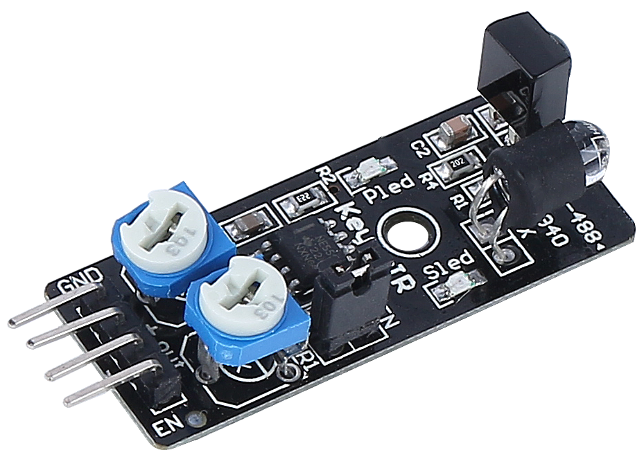

.. include:: /index.rst
   :start-after: start_hello_message
   :end-before: end_hello_message

.. _ir_obstacle:

レッスン6 赤外線障害物回避
===========================

ローバーのサイド「アイ」、赤外線障害物回避センサーをご紹介します！

これらの賢いセンサーは、GalaxyRVRが側面の障害物を検出して回避するのを助けます。まるで周辺視野を持つかのようです。その仕組みを学び、自動的に物体の周りを移動するようにローバーをプログラムしましょう。

マーズローバーをスマートな障害物回避機にする準備をしましょう！

.. raw:: html

   <video width="600" loop autoplay muted>
      <source src="../_static/video/car_ir1.mp4" type="video/mp4">
      お使いのブラウザはこのビデオタグをサポートしていません。
   </video>

学習目標
-------------------------

* 赤外線障害物回避モジュールの動作原理と、マーズローバーでの応用を理解する。
* Scratchで赤外線障害物回避モジュールからのデータを読み取り、適用する方法を学ぶ。
* IRモジュールとScratchステージを使用して、火星探検をテーマにした障害物回避ゲームを作成する。

障害物回避モジュールについて
-------------------------------------

GalaxyRVRの新しい相棒、赤外線障害物回避モジュールをご紹介します！この賢い小さなデバイスは、ローバーが障害物を検出して回避するのを助けます。その仕組みを見てみましょう：

**4つの重要なピン：**

* **GND** - グランド接続（回路を完成させる）
* **+** - 電源入力（3.3V～5Vの電力が必要）
* **Out** - 信号出力（「障害物検出」メッセージを送信）
* **EN** - イネーブルピン（モジュールがアクティブになるタイミングを制御）

**仕組み - 見えない懐中電灯：**

このモジュールは、見えない懐中電灯と特別なメガネを持っていると考えてください：

.. image:: img/ir_receive.png
    :align: center

1. 送信機が赤外線光を送信します（私たちの目には見えません）
2. 光が障害物に当たると、跳ね返ってきます
3. 受信機が反射した光を「見ます」
4. モジュールが信号を送信します：「障害物 ahead！」

**センサーに関する豆知識：**

* **検出範囲** ：2～40cm（筆箱くらいの長さです！）
* **色の影響** ：明るい色の物体に最もよく反応します
* **暗い物体** ：遠くからでは検出が難しい場合があります

**高度な制御（好奇心旺盛な方向け）：**

* **ENピン** ：ジャンパーキャップを付けるとモジュールは常にアクティブになります。コードでモジュールを制御したい場合は取り外してください。

  .. image:: img/ir_cap.png
      :width: 400
      :align: center

* **2つの調整つまみ** ：

  - 1つのつまみは赤外線の飛距離を制御します
  - もう1つのつまみは光の周波数を調整します

  .. image:: img/ir_avoid_pot.png
      :width: 400
      :align: center

新しい相棒について理解できたところで、ローバーに接続してプログラミングを始めましょう！

赤外線センサーをテストする
------------------------------------------------------------

#. まず、:ref:`app_connect` を行います。

2. センサーを最適なパフォーマンスに調整しましょう！

   a. 赤外線コンポーネントがまっすぐであることを確認します。必要に応じて優しく調整します。

      .. raw:: html

            <video width="600" loop autoplay muted>
                <source src="../_static/video/ir_adjust1.mp4" type="video/mp4">
            </video>

   b. 物体（ローバーの箱など）を20cm離して置きます。インジケーターライトが点灯するまでつまみを回します。物体を近づけたり遠ざけたりしてテストします。

      .. raw:: html

            <video width="600" loop autoplay muted>
                <source src="../_static/video/ir_adjust2.mp4" type="video/mp4">
            </video>

   c. もう一方の赤外線モジュールでも同じことを行います。

3. 次に、:ref:`app_connect` を行います。

4. GalaxyRVRカテゴリの「左IRステータス」と「右IRステータス」ブロックを見つけ、チェックボックスをオンにします。

   .. image:: img/4_ir_statusblock.png

5. センサーの値がステージに表示されます。

   .. image:: img/4_ir_statusvalue.png

6. 各赤外線センサーの近くで手を振ると、値が変化するのを確認できます！

**値の意味：**

- **True** = 障害物を検出
- **False** = 経路はクリア

ローバーが何を「見ている」かを確認する準備ができました！

ローバーをプログラムして障害物を回避させる
-------------------------------------------------------------

GalaxyRVRに赤外線センサーを使用して自動的に障害物を回避する方法を教えましょう！

#. まず、:ref:`app_connect` を行います。

#. 緑色の旗ブロックでプログラムを開始します。

   .. image:: img/4_ir_start.png

#. テストとデバッグを容易にするために、安全な速度30%を設定します。

   .. image:: img/4_ir_speed.png

#. 左センサー検出用の ``左IRが遮られたとき`` ブロックを見つけます。

   .. image:: img/4_ir_when_blocked.png

#. 左センサーが障害物を検出したら、ローバーを右折させます。

   .. image:: img/4_ir_turn_right.png

#. 左側が障害物を検出しなくなるまで右折し続けます。

   .. image:: img/4_ir_wait_until.png

#. 経路が確保されたら動きを停止します。

   .. image:: img/4_ir_stop.png

#. 左手で左赤外線センサーをトリガーしてテストします。GalaxyRVRはスマートに右折して回避するはずです。

#. ブロックを長押ししてメニューから「複製」を選択し、コードを複製します。

   .. image:: img/4_ir_duplicate.png

#. 複製したコードで、左右を入れ替えて右側の障害物に対応させます。

   .. image:: img/4_ir_left_right.png

#. 両方のセンサーが同時にトリガーされたときの不安定な動作を防ぐために、「このスプライトの他のスクリプトを止める」ブロックを追加します。これにより、一度に1つのセンサーイベントのみが処理されます。

   .. image:: img/4_ir_stop_script.png
       :width: 800

   .. note:: スクリプト停止ブロックは時間指定移動ブロックと競合する可能性があるため、可能な限り一緒に使用しないでください。

#. これで、GalaxyRVRはどちらかの側で障害物が検出されたときに左折または右折します。両方のセンサーを手でトリガーしてテストします。

#. 各コードセクションの下に前進ブロックを追加して、障害物回避後にローバーが動き続けるようにします。

   .. image:: img/4_ir_avoid_move.png
       :width: 800

これで緑色の旗をクリックします！GalaxyRVRは連続的に前進し、障害物をスマートに回避して、回避後に進路を再開します。

IRモジュール関連ブロック
----------------------------------------

* 左IRセンサーが障害物を検出したときにトリガーされるイベントブロック

  - ドロップダウンメニューで「左」を「右」に変更

  .. image:: img/block/ir_when.png

* 左IRセンサーが障害物を検出しなくなるまでプログラムを一時停止

  - もう一方のセンサー用に「左」を「右」に変更
  - 反対の条件には「ではない」を「である」に変更

  .. image:: img/block/ir_wait_until.png

* 左IRセンサーが障害物を検出した場合にTRUEを返す条件ブロック

  - ``if`` 文での使用に最適
  - もう一方のセンサー用に「左」を「右」に変更

  .. image:: img/block/ir_condition.png

* 左IRセンサーの現在の検出状態を表示

  .. image:: img/block/ir_left_value.png

* 右IRセンサーの現在の検出状態を表示

  .. image:: img/block/ir_right_value.png
