.. note::

    Ciao, benvenuto nella community di SunFounder Raspberry Pi & Arduino & ESP32 Enthusiasts su Facebook! Approfondisci Raspberry Pi, Arduino ed ESP32 insieme agli altri appassionati.

    **Perché unirsi?**

    - **Supporto esperto**: Risolvi i problemi post-vendita e le sfide tecniche con l'aiuto della nostra comunità e del nostro team.
    - **Impara e condividi**: Scambia consigli e tutorial per migliorare le tue competenze.
    - **Anteprime esclusive**: Accedi in anteprima agli annunci di nuovi prodotti e agli sneak peek.
    - **Sconti speciali**: Approfitta di sconti esclusivi sui nostri prodotti più recenti.
    - **Promozioni festive e omaggi**: Partecipa a concorsi e promozioni durante le festività.

    👉 Sei pronto a esplorare e creare con noi? Clicca su [|link_sf_facebook|] e unisciti oggi stesso!

Lezione 7 Animazione di Evasione Ostacoli IR
=====================================================

In precedenza, abbiamo utilizzato il Modulo di Evasione Ostacoli a Infrarossi per fare in modo che il GalaxyRVR evitasse automaticamente gli ostacoli, proprio come in una missione di esplorazione marziana.

In questa attività, combineremo il modulo di evitamento degli ostacoli con uno stage per creare un'animazione di un rover che schiva rocce su Marte.

.. raw:: html

   <video width="600" loop autoplay muted>
      <source src="../_static/video/sc_animate_rock.mp4" type="video/mp4">
      Your browser does not support the video tag.
   </video>

Obiettivi di Apprendimento
-----------------------------

* Approfondire la comprensione del Modulo di Evasione Ostacoli a Infrarossi e della sua applicazione nel rover marziano.
* Imparare a leggere e applicare i dati del Modulo di Evasione Ostacoli a Infrarossi in Scratch.
* Creare un gioco a tema esplorazione marziana utilizzando il modulo IR e il palcoscenico di Scratch.

Materiali
-------------

* Smartphone o tablet
* APP Mammoth Coding
* GalaxyRVR

Creare l'Animazione
-----------------------

1. Per prima cosa, abbiamo bisogno di uno sfondo a tema Marte. Clicca per selezionare uno sfondo.

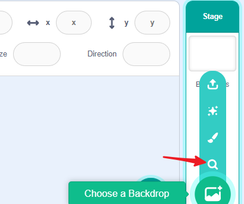

2. Scegli lo sfondo di Marte.

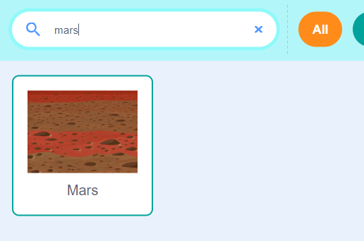

3. Seleziona lo sprite GalaxyRVR dalla libreria e regola la sua dimensione.

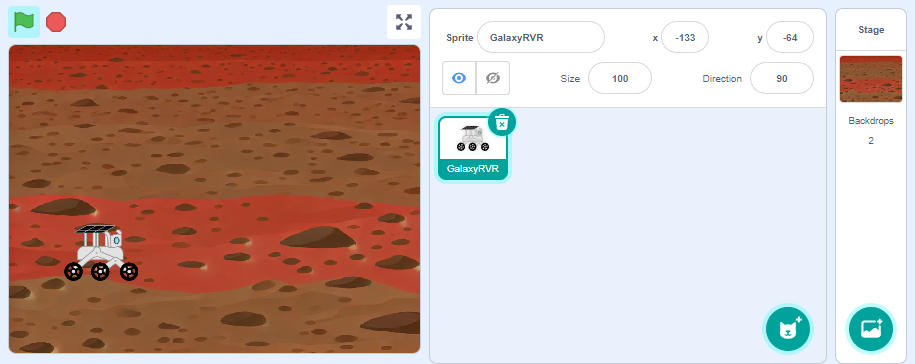

4. Seleziona uno sprite di una roccia dalla libreria e regola la sua dimensione.

.. image:: img/5_animate_rock.png

5. Ora, programmiamo questi due sprite:

**Sprite GalaxyRVR**

Il compito dello sprite GalaxyRVR è muoversi lentamente da sinistra a destra dello schermo. Se tocca una roccia, smette di muoversi.
Durante questo processo, possiamo attivare i due sensori IR sul rover fisico con le nostre mani. Attivare il sensore destro fa muovere lo sprite leggermente verso il basso; attivare il sensore sinistro lo fa muovere verso l'alto.

a. Quando viene cliccata la bandiera verde, lo sprite dovrebbe apparire sull'estrema sinistra dello schermo. Puoi prima spostare lo sprite nella posizione corrispondente sul palcoscenico e i valori di coordinata del blocco nella categoria movimento cambieranno di conseguenza.

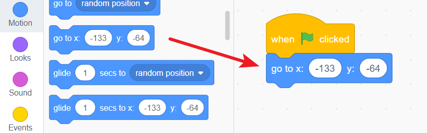

b. Inserisci un blocco per sempre come ciclo principale.

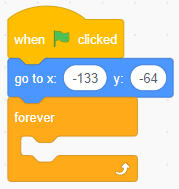

c. Trascina un blocco condizionale per controllare se sta toccando lo sprite della roccia.

.. image:: img/5_animate_touching.png

d. Se non tocca la roccia, lo sprite si muove in avanti.

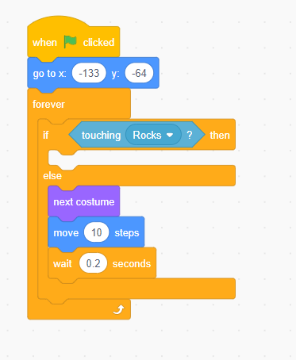

e. Se tocca la roccia, si ferma ed emette un suono.

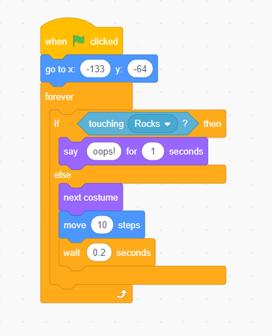

f. Infine, aggiungi due eventi. Quando i sensori IR sinistro o destro rilevano un ostacolo (la tua mano), lo sprite si muove verso l'alto o il basso.

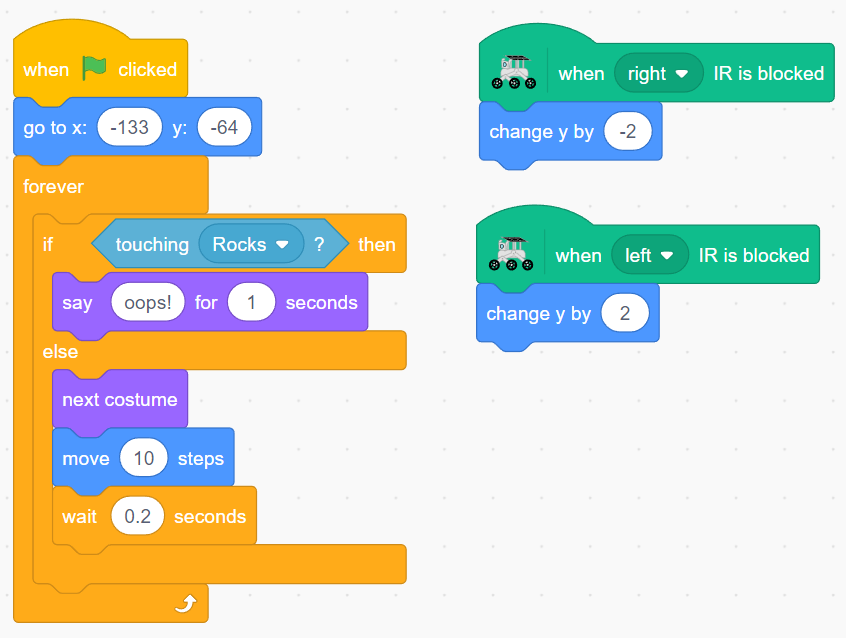

**Sprite Roccia**

Il compito dello sprite Roccia è più semplice. Può rimanere fermo, apparire in posizioni casuali o creare più cloni per aumentare la difficoltà per lo sprite GalaxyRVR.

a. Crea i suoi cloni.

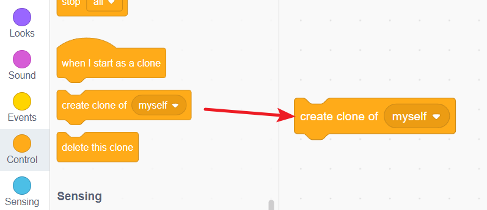

b. Poi spostati in una posizione casuale. Combina questi due blocchi e cliccali. Noterai che nuove rocce appaiono casualmente sul palcoscenico.

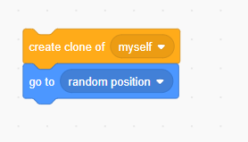

c. Genera dieci rocce casuali.

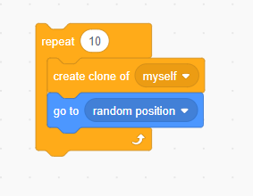

d. Queste azioni avvengono quando viene cliccata la bandiera verde.

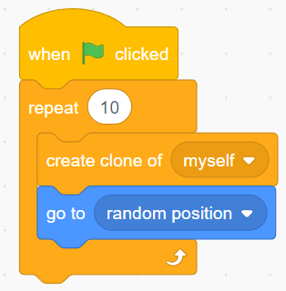

Ora, questo mini-gioco è completo.

Collega GalaxyRVR all'APP (consulta :ref:`app_connet`) e clicca sulla bandiera verde per avviare il gioco.

Vedrai molte rocce generate casualmente sul palcoscenico. Il tuo compito è usare le mani per attivare i due sensori IR, guidando il GalaxyRVR a raggiungere con successo il lato destro del palcoscenico.

