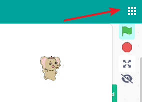
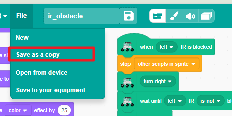
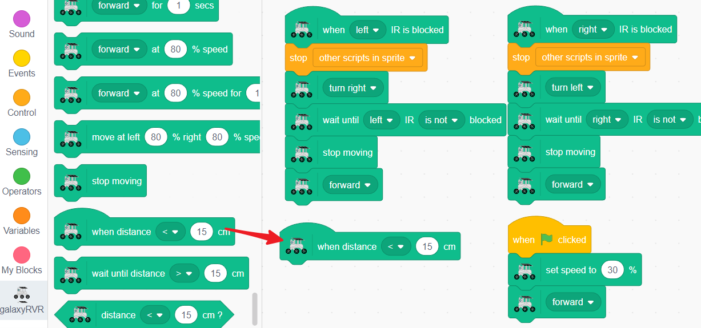
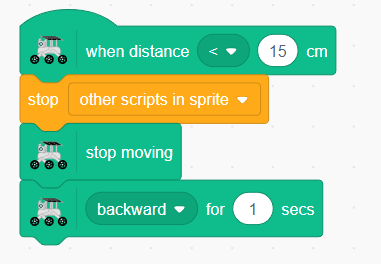
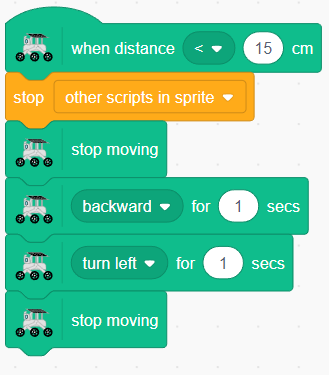
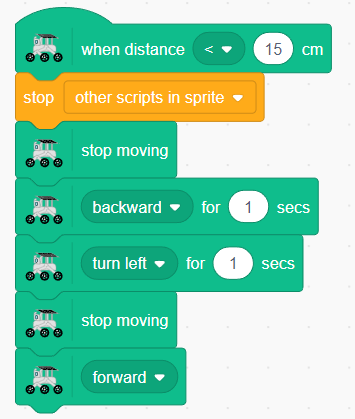

.. note::

    Hello, welcome to the SunFounder Raspberry Pi & Arduino & ESP32 Enthusiasts Community on Facebook! Dive deeper into Raspberry Pi, Arduino, and ESP32 with fellow enthusiasts.

    **Why Join?**

    - **Expert Support**: Solve post-sale issues and technical challenges with help from our community and team.
    - **Learn & Share**: Exchange tips and tutorials to enhance your skills.
    - **Exclusive Previews**: Get early access to new product announcements and sneak peeks.
    - **Special Discounts**: Enjoy exclusive discounts on our newest products.
    - **Festive Promotions and Giveaways**: Take part in giveaways and holiday promotions.

    👉 Ready to explore and create with us? Click [|link_sf_facebook|] and join today!

.. _ir_ultra_avoid:

Lesson 8 Advanced Obstacle Avoidance
==================================================

The obstacle avoidance module, as the name suggests, helps our Rover avoid obstacles. It detects obstacles by transmitting an infrared signal and then receiving the signal reflected back from the object. If there is an obstacle in front of the module, the infrared signal is reflected back, and the module detects it.

Now, adding an ultrasonic sensor to the mix improves this system. Ultrasonic sensors measure distance by sending out a sound wave at a specific frequency and listening for that sound wave to bounce back. By recording the elapsed time between the sound wave being generated and the sound wave bouncing back, it is possible to calculate the distance between the sensor and the object.

Combining these two gives us a reliable, efficient, and versatile obstacle avoidance system!

.. raw:: html

    <video width="600" loop autoplay muted>
        <source src="./_static/video/ultrasonic_ir_avoid.mp4" type="video/mp4">
        Your browser does not support the video tag.
    </video>

Learning Objectives
-------------------------

* Combine ultrasonic and infrared obstacle avoidance modules to enable the basic obstacle avoidance function of the Mars Rover model.
* Learn how to program the Mars Rover model to automatically sense and avoid obstacles.

Materials
-----------

* Smartphone or tablet
* Mammoth Coding APP
* GalaxyRVR

Constructing Advanced Obstacle Avoidance Systems
-----------------------------------------------------------

In previous lessons, we learned the basics of using infrared sensors for obstacle avoidance. We also explored the principles of ultrasonic modules. Now, we will put all these parts together to build an advanced obstacle avoidance system!

Our enhanced Mars Rover will now navigate its surroundings using both ultrasonic and infrared sensors.

1. We can use the code block from :ref:`ir_obstacle` as a template. Open it from your saved projects.

2. Then, save it as a copy.

3. Rename the project and save it.

4. Add distance detection using the ultrasonic sensor. Drag a ``when distance < 15 cm`` block.

5. Similarly, drag a ``stop other scripts in sprite`` block to ensure the GalaxyRVR only responds to one sensor at a time.

.. image:: img/7_avoid_stop.png

6. Move backward until reaching a safe distance.

7. Turn for one second (either left or right).

8. Move forward again.

Now, the IR sensors on both sides and the ultrasonic sensor in the front will work together to form a powerful obstacle avoidance system, ensuring the GalaxyRVR does not collide with any obstacles during its missions.

