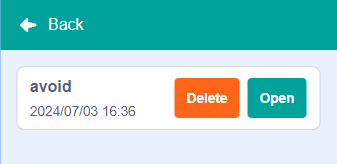
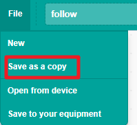
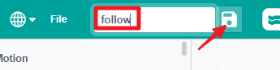
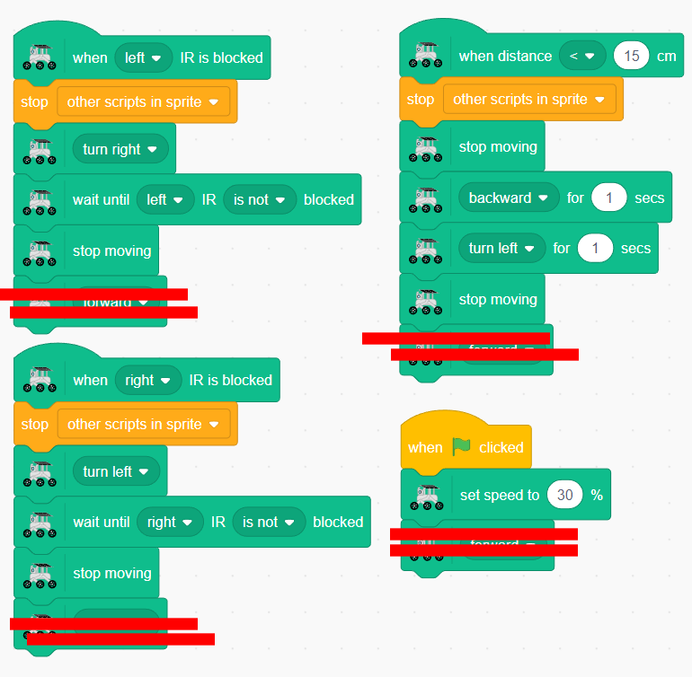
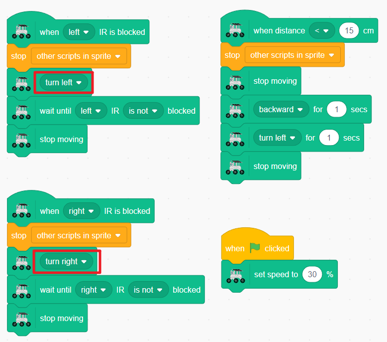
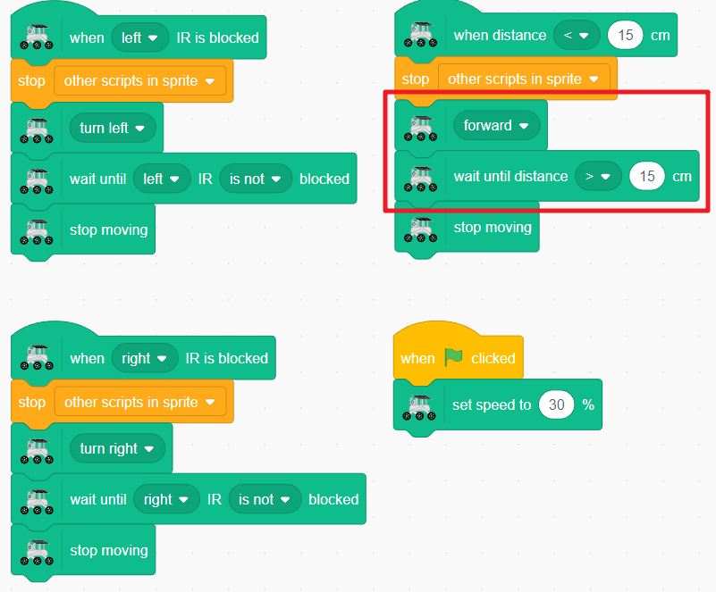

.. note::

    ¡Hola! Bienvenido a la comunidad de entusiastas de SunFounder Raspberry Pi, Arduino y ESP32 en Facebook. Sumérgete en el fascinante mundo de Raspberry Pi, Arduino y ESP32 junto a otros entusiastas.

    **¿Por qué unirse?**

    - **Soporte experto**: Resuelve problemas postventa y desafíos técnicos con la ayuda de nuestra comunidad y equipo.
    - **Aprende y comparte**: Intercambia consejos y tutoriales para mejorar tus habilidades.
    - **Preestrenos exclusivos**: Obtén acceso anticipado a nuevos anuncios de productos y adelantos exclusivos.
    - **Descuentos especiales**: Disfruta de descuentos exclusivos en nuestros productos más recientes.
    - **Promociones festivas y sorteos**: Participa en sorteos y promociones durante las festividades.

    👉 ¿Listo para explorar y crear con nosotros? Haz clic en [|link_sf_facebook|] y únete hoy mismo!

Lección 9 Compañero de Exploración en Marte
===============================================

Con nuestro Rover ya capaz de evitar obstáculos, vamos a mejorarlo aún más haciéndolo seguir objetos. Nuestro objetivo es modificar nuestro código existente para que el Rover se mueva hacia un objeto en movimiento.

¿Te has preguntado cuáles son las diferencias entre un sistema de seguimiento y un sistema de evitación de obstáculos?

La clave es que en un sistema de seguimiento, queremos que nuestro Rover se mueva en respuesta a los objetos detectados, mientras que en un sistema de evitación de obstáculos, buscamos esquivar los objetos detectados.

Objetivos de aprendizaje
---------------------------

* Combinar los módulos de evasión de obstáculos ultrasónico e infrarrojo para implementar la función de seguimiento en el modelo de Rover de Marte.
* Aprender a programar el modelo de Rover para que siga automáticamente a un objetivo.

Materiales
-------------

* Teléfono inteligente o tableta
* APP Mammoth Coding
* GalaxyRVR

Programación del Sistema de Seguimiento Inteligente
-----------------------------------------------------

1. Utiliza el bloque de código de :ref:`ir_ultra_avoid` como plantilla y ábrelo desde el proyecto guardado.

2. Luego, guárdalo como una copia.

3. Renombra el proyecto y guárdalo.

4. Primero, elimina el bloque de avanzar al final de cada bloque de código, ya que el Rover debe detenerse después de cada evento del sensor.

5. A continuación, modifica las direcciones de giro de los dos eventos IR, ya que el GalaxyRVR necesita seguir la dirección del objetivo.

6. Finalmente, ajusta los eventos del sensor ultrasónico. En lugar de retroceder hasta una distancia segura y girar, ahora debe avanzar hasta que el objetivo salga de su rango.

Ahora, el GalaxyRVR se moverá junto a tus pasos. Cuando estés a su lado, girará para enfrentarte. Si estás frente a él, avanzará hacia ti. Si no puede detectarte, se quedará quieto.

