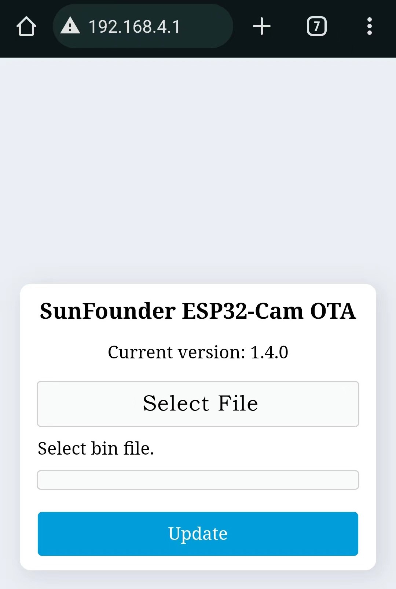
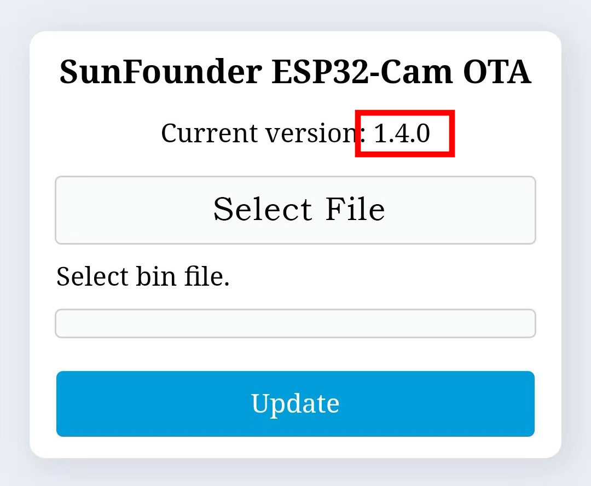
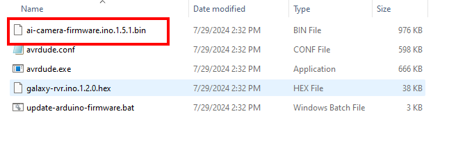
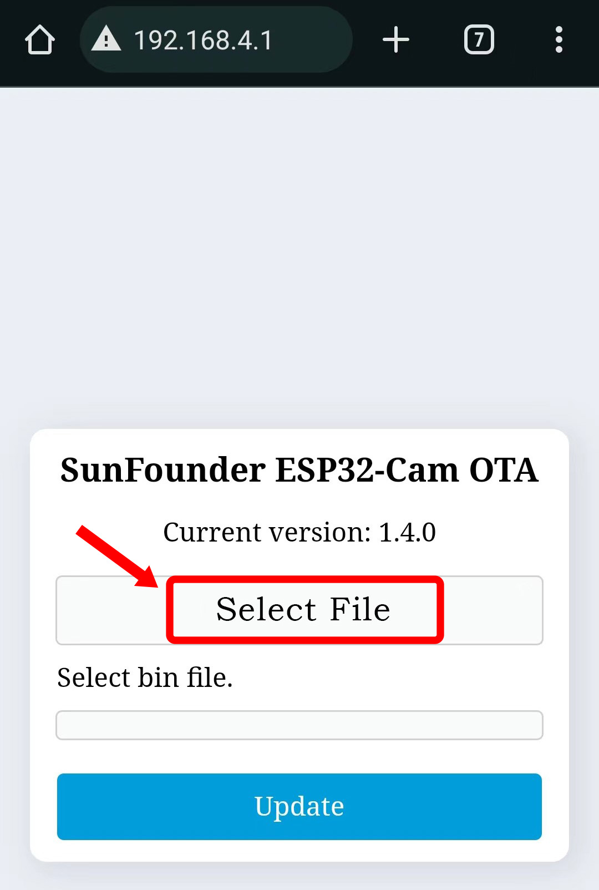
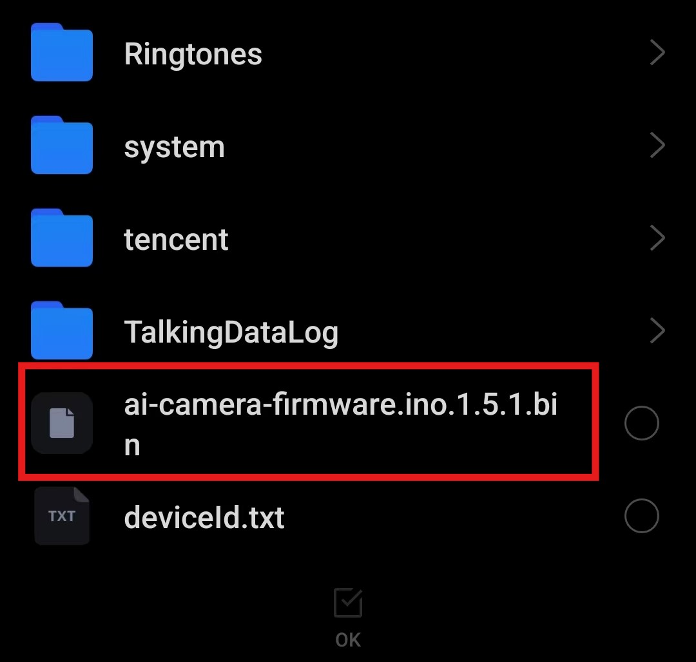
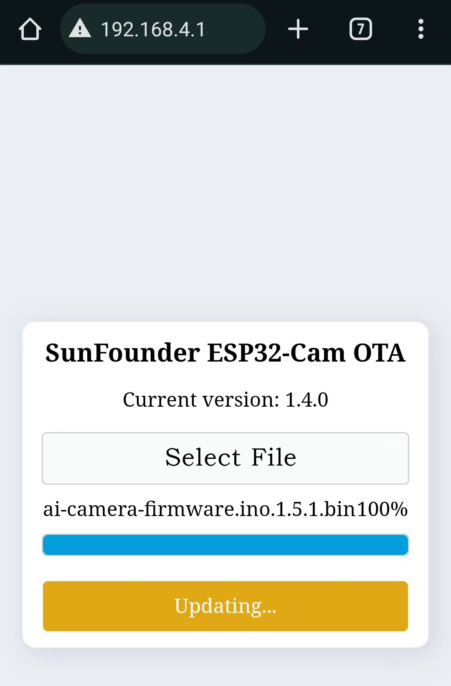

.. note::

    ¡Hola! Bienvenido a la comunidad de entusiastas de SunFounder Raspberry Pi, Arduino y ESP32 en Facebook. Sumérgete en el mundo de Raspberry Pi, Arduino y ESP32 junto a otros entusiastas.

    **¿Por qué unirte?**

    - **Soporte experto**: Resuelve problemas postventa y desafíos técnicos con la ayuda de nuestra comunidad y equipo.
    - **Aprende y comparte**: Intercambia consejos y tutoriales para mejorar tus habilidades.
    - **Avances exclusivos**: Obtén acceso anticipado a nuevos anuncios de productos y adelantos.
    - **Descuentos especiales**: Disfruta de descuentos exclusivos en nuestros productos más recientes.
    - **Promociones festivas y sorteos**: Participa en sorteos y promociones especiales.

    👉 ¿Listo para explorar y crear con nosotros? ¡Haz clic en [|link_sf_facebook|] y únete hoy!

.. _update_firmware:

Actualización del archivo de firmware
========================================

1. Descarga el archivo de firmware.

    * :download:`GalaxyRVR Firmware File <https://github.com/sunfounder/galaxy-rvr/releases/download/1.2.0/galaxy-rvr-1.2.0.zip>`

2. Conecta tus dispositivos móviles (como teléfonos o tabletas) al punto de acceso WiFi emitido por el GalaxyRVR. 
   Normalmente, el SSID es ``GalaxyRVR``, y la contraseña es ``12345678``.

.. image:: img/firmware/SSID.png

.. note:: El modo de conexión predeterminado es **modo AP**. Después de conectarte, es posible que recibas una advertencia de que no hay acceso a internet en esta red. Si es así, selecciona "Permanecer conectado".

    .. image:: img/app/camera_stay.png

3. Navega a http://192.168.4.1 para acceder a la interfaz de actualización de firmware de la cámara ESP32.

4. Verifica el número de versión. Si tu versión es superior a ``1.5.1``, no es necesario realizar ninguna actualización (omite los pasos 5-9). De lo contrario, es necesario realizar una actualización.

5. Transfiere el archivo ``ai-camera-firware.ino.1.5.1.bin`` al dispositivo.

6. Regresa a la interfaz de actualización de firmware. Haz clic para seleccionar el firmware.

7. Selecciona el archivo ``ai-camera-firware.ino.1.5.1.bin`` que acabas de guardar en tu dispositivo móvil, luego haz clic en actualizar.

8. Espera a que la actualización de firmware se complete. Una vez que el número de versión actual muestre 1.5.1, la actualización habrá sido exitosa.

9. Cierra la página.

