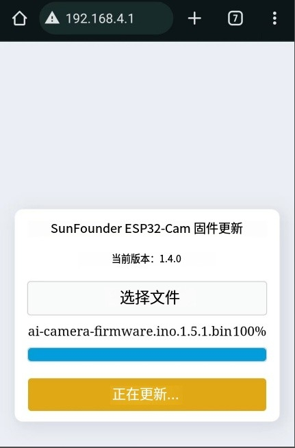

.. _update_firmware:

更新固件文件
======================================

1. 下载固件文件。

    * :download:`GalaxyRVR固件文件 <https://github.com/sunfounder/galaxy-rvr/releases/download/1.2.0/galaxy-rvr-1.2.0.zip>`

2. 将你的移动设备（如手机或平板）连接到GalaxyRVR发出的WiFi热点。
   通常，SSID为 ``GalaxyRVR`` ”，密码为 ``12345678`` 。

.. image:: img/firmware/SSID.png

.. note:: 默认连接模式为**AP模式**。连接后，你可能会收到没有互联网访问的警告。如果是这种情况，请选择“保持连接”。

    .. image:: img/app/camera_stay.png

3. 访问 http://192.168.4.1 以进入ESP32 Cam固件更新界面。

.. image:: img/firmware/OTAUpdate.png

4. 检查版本号。如果你的版本高于 ``1.5.1`` ，则无需更新（跳过步骤5-9）。否则，需要进行升级。

5. 将文件 ``ai-camera-firware.ino.1.5.1.bin`` 传输到设备中。

6. 返回到固件更新界面，点击选择固件。

7. 选择刚才存储在移动设备上的 ``ai-camera-firware.ino.1.5.1.bin`` 文件，然后点击升级。

.. image:: img/firmware/OTASelect.jpg

8. 等待固件升级完成。当当前版本号显示为1.5.1时，表示升级成功。

9. 关闭页面。
